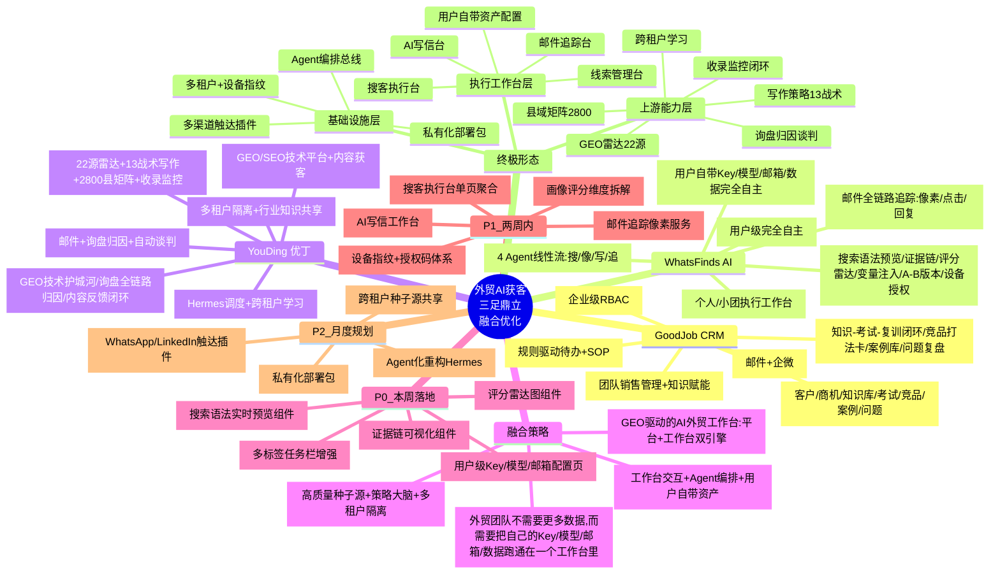
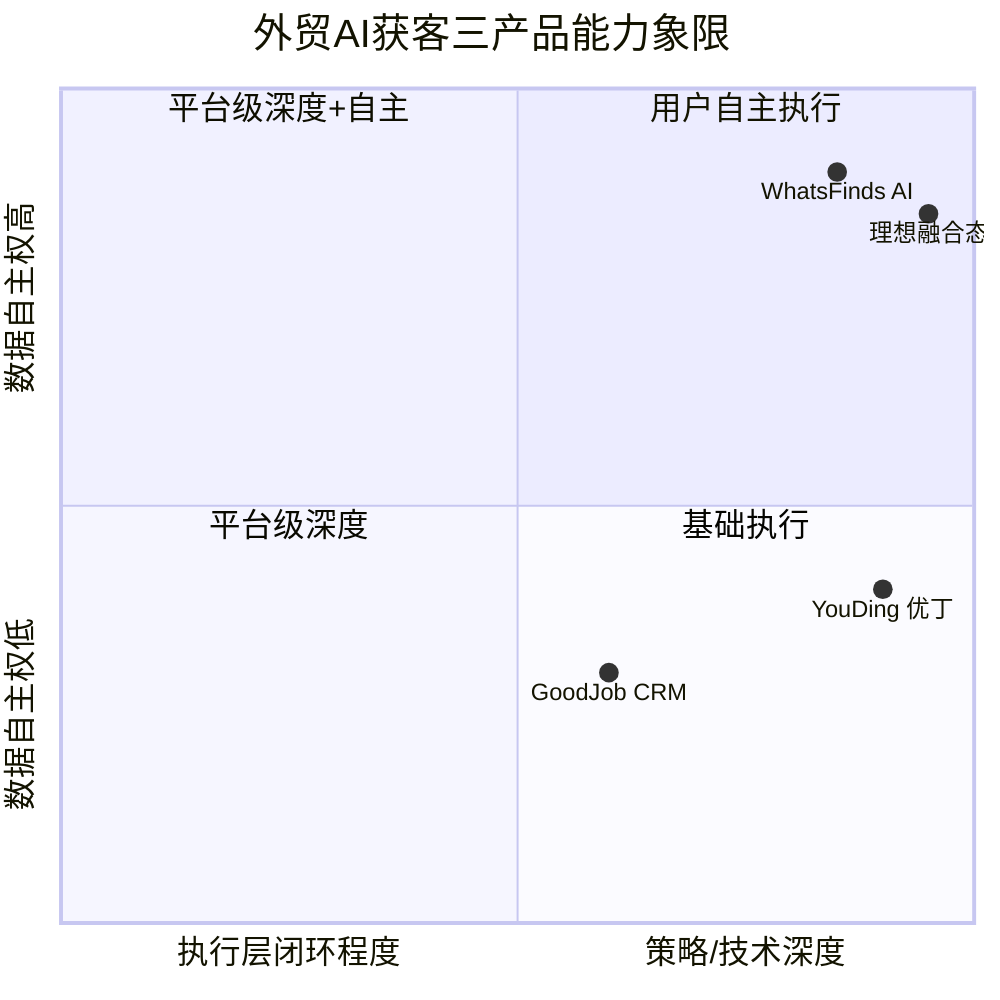
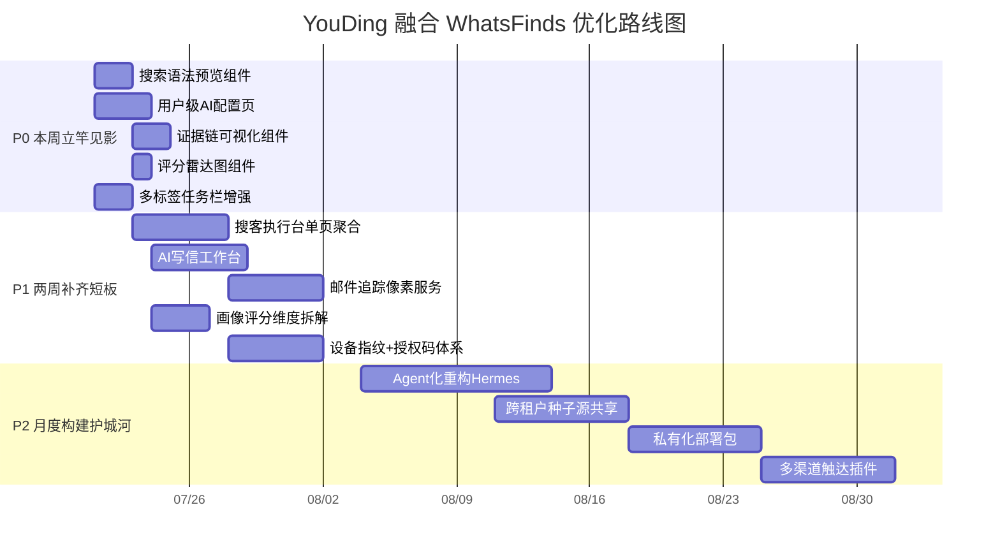
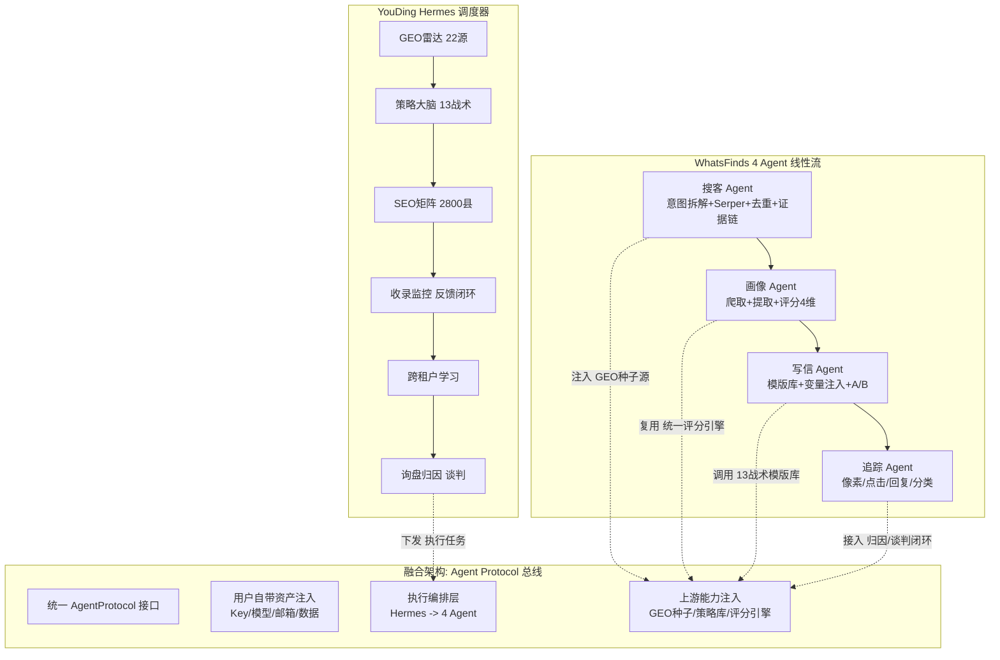
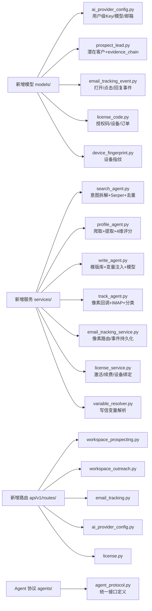

# WhatsFinds AI 与 YouDing 融合优化分析 — 思维导图报告

> 生成时间：2026-07-20 | 基于官网 https://whatsfinds.com/ 与系统结构探索



---

## 📊 核心差异化矩阵 (可视化对比)



---

## 🎯 P0-P2 优化路线图甘特图



---

## 🔄 WhatsFinds 4 Agent 线性流 vs YouDing Hermes 融合架构



---

## 🧩 关键组件清单 (前端新增)

```mermaid
graph TD
    COMP[前端新增组件<br/>frontend/components/whatsfinds/]
    COMP --> UI1[SearchSyntaxPreview.vue<br/>搜索语法实时预览]
    COMP --> UI2[EvidenceChain.vue<br/>证据链时间轴]
    COMP --> UI3[ScoreRadar.vue<br/>评分雷达图 ECharts]
    COMP --> UI4[VariablePicker.vue<br/>写信变量插入器 @唤起]
    COMP --> UI5[OutreachEditor.vue<br/>AI写信工作台 Tiptap]
    COMP --> UI6[EmailVersionTabs.vue<br/>邮件版本对比 Tab]
    COMP --> UI7[EmailPreviewModal.vue<br/>发送前渲染预览]
    COMP --> UI8[TrackingPixelGenerator.vue<br/>像素生成/嵌入]
    COMP --> UI9[DeviceFingerprintBanner.vue<br/>未授权顶栏提示]
    COMP --> UI10[LicenseActivationForm.vue<br/>授权码激活表单]

    PAGE[页面路由新增]
    PAGE --> PG1[/workspace/prospecting<br/>搜客执行台单页]
    PAGE --> PG2[/workspace/outreach<br/>AI写信工作台]
    PAGE --> PG3[/admin/ai-provider-config<br/>用户级AI配置]
    PAGE --> PG4[/system/license<br/>授权/设备管理]
```

---

## 🗄️ 后端模型/服务/路由清单



---

## 💡 一页总结：三大核心行动

| 🎯 **核心洞察** | 📦 **融合产出** | 🚀 **下一步** |
|---|---|---|
| 外贸团队要的是**把自己的 Key/模型/邮箱/数据跑通在一个工作台** | **GEO驱动的 AI 外贸工作台**<br/>平台能力 + 执行工作台 双引擎 | **本周**：P0 五项组件并行开发<br/>**两周**：P1 搜客执行台+写信台+追踪像素<br/>**月度**：P2 Agent化重构+私有化部署 |

---

## 📎 附件引用
- 详细分析文档：[WHATSFINDS_AI_ANALYSIS.md](WHATSFINDS_AI_ANALYSIS.md)
- GoodJob CRM 分析：对话历史中已完成
- YouDing 现状基线：对话历史中 80% 覆盖率分析

---

> **使用说明**：此思维导图报告可直接导入 Notion/Obsidian/XMind 等工具，或用 Mermaid Live Editor 渲染交互式图表。