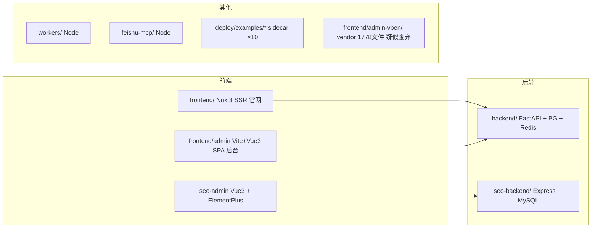

# UJ 轻集料混凝土官网 — 全面详细评估报告

> **评估日期**：2026-07-15
> **评估方式**：交付总监主理人实证核查 + 三视角并行（架构师 / 工程师 / QA）
> **评估对象**：`C:\Users\Administrator.WIN-36O2UQRI3U1\Desktop\上线网站开发完成\上线网站`
> **结论**：**不具备直接上线条件**，需先完成 P0 修复（约 2-3 人周）

---

## 一、TL;DR

| 维度 | 成熟度 | 一句话 |
|------|--------|--------|
| 架构与代码组织 | **2.5 / 5** | 分层骨架尚可但边界失守，双前端+双后端无 monorepo 编排 |
| 依赖与构建/CI | **2 / 5** | 半手工作坊式依赖治理，Python 未硬锁、无 CI、镜像不可复现 |
| 测试与质量门 | **2.5 / 5** | 后端测试给虚假安全感，前端近乎裸奔，无 CI 兜底 |
| 硬锁合规 | ✅ 合规 | 登录入口 + 角色壳双绿（已实跑脚本验证） |

**综合判定**：项目"能跑"，但处于**"能跑但难维护、难安全上线"**的临界点。原扫描报告（`project-codebase-audit/full-scan-report-2026-07-15.md`）存在 **3 处事实错误**（见下），本报告以实证为准。

---

## 二、项目真实形态（纠正原报告 3 处错误）

原报告把项目描述为"Nuxt 3 + FastAPI 单体"，实证表明**实为双前端 + 双后端的多包项目**：

| 误述 | 实证 | 证据 |
|------|------|------|
| 前端是 Nuxt 3 | **双前端**：`frontend/`(Nuxt 3 官网/SSR) + `frontend/admin/`(Vite + Vue 3 SPA 后台) | `frontend/admin/vite.config.ts` 存在；`docker-compose.prod.yml` 用 `./frontend`，`docker-compose.yml` 用 `./frontend/admin` |
| 仅一个 Python 后端 | **双后端**：`backend/`(FastAPI + SQLAlchemy + PG) + `seo-backend/`(Node.js + Express + Sequelize + MySQL) | `seo-backend/package.json` 含 express/sequelize |
| GitHub Actions（推测）有 CI | **完全无 CI**：无 `.github/`、无 `.gitlab-ci.yml`、无 Jenkinsfile | `ls .github` → 不存在 |

**真实架构**：



---

## 三、主理人实证核查（8 项，均带证据）

| # | 核查项 | 结果 | 证据 |
|---|--------|------|------|
| 1 | 登录入口硬锁 LOGIN-LOCK-01 | ✅ 合规 | `verify-login-entry-lock.ps1` → `{"ok":true,"checked_files":4,"legacy_redirects":5}` |
| 2 | 角色壳硬锁 ROLE-SHELL-LOCK-01 | ✅ 合规 | `npm run cert:role-shell-lock`（在 frontend/admin）→ 输出完整 personas/shell_entries |
| 3 | CI/CD | 🔴 缺失 | `.github/` 目录不存在 |
| 4 | 前端测试 | 🔴 近乎裸奔 | 4 测试文件 / 522 源文件 = 0.8%；`package.json` 无 `test` 脚本 |
| 5 | Python 依赖锁定 | 🟠 过半未锁 | `>=` 36 行 / `==` 24 行；无 lockfile / 无 hashes |
| 6 | CORS 默认值 | 🟠 含 localhost | `config.py:33` 默认 `http://localhost:3000,5173,...,https://youding.com` |
| 7 | 14 个 cert:* 认证门 | ⚠️ 全靠手动 | 无 CI 接入，仅本地 `npm run cert:*` |
| 8 | .env / auth.json | ✅ 安全 | `.gitignore` 已忽略；`git ls-files` 无 auth.json |

---

## 四、三视角评估摘要

### 4.1 架构（架构师 高见远 — 2.5/5，详见 `project-codebase-audit/architecture-assessment.md`）

- 后端分层 `api→services→repositories→models` 清晰，但存在**反向 import**（`forum_webhook_service.py`、`plan_gate_service.py` 反向 import app.api）→ P1
- 前端 380 组件按角色壳+功能域组织合理，但 `router/index.ts` **1868 行单文件**需按角色壳拆 → P1
- 后端 `services/` **456 文件过度碎片化**；`routes/__init__.py` 单文件 **105 个 include_router** → P1
- **上帝文件**：`copilot.vue` 2095 行、`seo_matrix.py` 1986 行、`hermes.py` 1784 行 → P0
- **monorepo 形聚神散**：5 子包三套技术栈零编排，vue 双版本（admin ^3.4.21 / seo-admin ^3.4.15）→ P0
- **双后端跨库一致性风险**：PG vs MySQL 分库，docker-compose 未纳入 seo-backend → 影响上线

### 4.2 依赖与构建/CI（工程师 寇豆码 — 2/5）

- 🔴 **Python 无 lockfile**：传递依赖完全未固定，`pip install -r` 每次结果可能不同，镜像不可复现
- 🔴 **`backend/requirements_temp.txt` 已入库**且陈旧冲突（fastapi==0.110.0 / langchain==0.1.10）→ 第二事实来源，极易误用
- 🔴 **`python-jose>=3.4.0` 开放范围**（安全相关包未锁）
- 🔴 **`frontend/admin-vben/` 整套 vendor** git 跟踪 **1778 文件**，docker-compose 未引用 → 疑似废弃迁移残留
- 🟠 sidecar fastapi 下界（>=0.110.0）与主后端（>=0.118.0,<0.140）冲突
- 🟠 基础设施镜像全用 `:latest`（minio/jaeger/prometheus/grafana/nginx）
- 🟠 混用 npm/pnpm，无 `.nvmrc` / `.python-version`
- ✅ 后端 Dockerfile 多阶段 + 非 root + healthcheck；frontend/admin Dockerfile 用 `npm ci`

### 4.3 测试与质量门（QA 严过关 — 2.5/5）

- 后端 **295 测试文件 / 1531 用例**（看似多），但：
  - **e2e 全跳过**（`pytestmark = pytest.mark.skip`，权限实现与预期不一致未修）
  - **5 文件收集失败**（acciowork 模块缺失、3 个 sprint/command_center stale import）
  - **integration/test_api.py 全 skip**（"期望 404 但得到 200"）
  - **193/223 服务无直接测试**（payment/tenant/user/oauth_login/token_service 全裸奔）
  - **无覆盖率度量**（无 pytest-cov / .coveragerc）
- 🔴 **conftest.py 禁用 7 个安全中间件**（CSRF/RateLimit/Security/WAF/IPBlacklist/RequestSize/Performance）→ **安全中间件完全无测试覆盖**
- 🔴 **前端 0.8% 覆盖**：登录流程/路由守卫/Auth Store/角色壳隔离（安全关键）全部零覆盖
- ⚠️ 16+ 个 verify-*/cert 脚本全靠人工记忆执行，无 CI 强制
- ✅ 测试 DB 隔离良好（in-memory SQLite + function scope）；pytest 标记体系完整

---

## 五、综合问题清单（统一优先级）

### 🔴 P0 — 阻塞上线（必须修）

| # | 问题 | 来源 | 修复动作 |
|---|------|------|----------|
| P0-1 | **无 CI/CD** | 三视角共识 | 新建 `.github/workflows/test.yml`：lint→typecheck→pytest(unit)→vitest→cert:gate→docker build，PR 必须全绿 |
| P0-2 | **Python 依赖未硬锁** | 工程师 | `uv pip compile --generate-hashes` 生成 `requirements.lock`，Dockerfile 改 `--no-deps -r requirements.lock` |
| P0-3 | **`requirements_temp.txt` 冲突入库** | 工程师 | `git rm backend/requirements_temp.txt` |
| P0-4 | **前端安全逻辑零测试** | QA | 补 `stores/auth.test.ts`、`router/guard.test.ts`、`useEffectivePlatformRole.test.ts`、登录流程测试 |
| P0-5 | **e2e 全跳过 + 5 文件收集失败** | QA | 修权限实现或删死代码；修/删 acciowork + 3 stale import 测试 |
| P0-6 | **conftest 全局禁用安全中间件** | QA | 拆 fixture 提供 `unauthenticated_client`，新建 test_csrf/rate_limit/waf.py |
| P0-7 | **monorepo 无 workspace + 技术栈双轨** | 架构师 | 评估 seo-backend(Express) 是否纳入或剥离；引入 pnpm workspaces |
| P0-8 | **上帝文件 >1000 行** | 架构师 | 拆分 copilot.vue / seo_matrix.py / hermes.py |

### 🟠 P1 — 上线后两周内

| # | 问题 | 修复动作 |
|---|------|----------|
| P1-1 | `admin-vben/` vendor 1778 文件未用 | 评估删除或转 submodule |
| P1-2 | 193 服务无测试 | 优先补 payment/user/tenant/token/unified_admin_login service 测试 |
| P1-3 | 无覆盖率度量 | 装 pytest-cov，CI 加 `--cov=app --cov-fail-under=40` |
| P1-4 | CORS 默认值含 localhost | 生产环境强制设 `CORS_ORIGINS`，移除默认 localhost |
| P1-5 | `python-jose` 未锁 | 纳入 requirements.lock 精确版本 |
| P1-6 | 基础设施镜像 `:latest` | 固定 digest/版本 |
| P1-7 | 两套 compose 前端来源不一致 | 文档化或统一 |
| P1-8 | 路由 1868 行单文件 | 按角色壳拆 `router/admin.ts`/`client.ts`/`agent.ts` |
| P1-9 | 反向 import / 层间越界 | 修 forum_webhook_service / plan_gate_service import 方向 |
| P1-10 | 无周期依赖安全扫描 | CI 接 pip-audit / npm audit + Dependabot |

### 🟡 P2 — 持续改进

- Mock 偏多（174/295 文件用 Mock），评估关键路径过度 mock
- 替换"文件存在"类弱测试为行为测试
- 前端 Top-20 高频组件补 vitest
- 后端根目录 32 个 test_/check_.py + 9 个 .db 污染，归档清理
- JWT 升级 RS256（企业级多租户更优）
- `_build_check*/`、vite timestamp 残留清理

---

## 六、上线就绪度判定

| 门禁 | 状态 | 说明 |
|------|------|------|
| 硬锁合规 | ✅ 通过 | 登录入口 + 角色壳已验证 |
| CI 自动化门 | 🔴 不通过 | 无 CI，无法拦截破坏 |
| 依赖可复现 | 🔴 不通过 | Python 未硬锁，镜像不可复现 |
| 安全关键测试 | 🔴 不通过 | 前端 0.8% + 后端安全中间件无测试 + e2e 死 |
| 架构一致性 | 🟠 风险 | 双后端跨库一致性无保障 |

**结论：当前不建议直接上线。** 建议完成 P0-1~P0-6 后再做一次回归验证；P0-7/P0-8 可并行排期但属技术债不阻塞首版。

---

## 七、修复路线图（建议）

### 阶段一：上线前（约 2 人周）
1. 建 CI（P0-1）—— 一旦建好，后续所有修复都有自动验证
2. Python 依赖硬锁 + 删 requirements_temp（P0-2/P0-3）
3. 修 e2e + 收集失败 + 前端安全测试（P0-4/P0-5）
4. conftest 安全中间件 fixture 拆分（P0-6）

### 阶段二：上线后两周（约 2 人周）
5. 补核心服务测试 + 覆盖率门（P1-2/P1-3）
6. CORS 生产配置 + jose 锁定 + 镜像固定（P1-4/P1-5/P1-6）
7. 路由拆分 + 反向 import 修复（P1-8/P1-9）

### 阶段三：技术债收敛（持续）
8. monorepo workspace + 技术栈双轨决策（P0-7）
9. 上帝文件拆分（P0-8）
10. admin-vben 清理（P1-1）

---

## 八、附录

- 架构师详细报告：`project-codebase-audit/architecture-assessment.md`
- 原（有误）扫描报告：`project-codebase-audit/full-scan-report-2026-07-15.md`
- 评估团队：software-audit-uj（架构师 高见远 / 工程师 寇豆码 / QA 严过关 / 主理人 齐活林）

**关键证据命令**（可复现）：
```bash
# 硬锁
powershell -File scripts/verify-login-entry-lock.ps1
cd frontend/admin && npm run cert:role-shell-lock
# CI 缺失
ls .github/  # 不存在
# 依赖锁定
grep -c ">=" backend/requirements.txt   # 36
grep -c "==" backend/requirements.txt   # 24
git ls-files backend/requirements_temp.txt  # 已跟踪
# 前端测试
find frontend/admin \( -name "*.spec.ts" -o -name "*.test.ts" -o -name "*.test.mjs" \) -not -path "*/node_modules/*"  # 4 个
# 后端测试
cd backend && python -m pytest tests/ --collect-only -q  # 1531 collected, 5 errors
```
