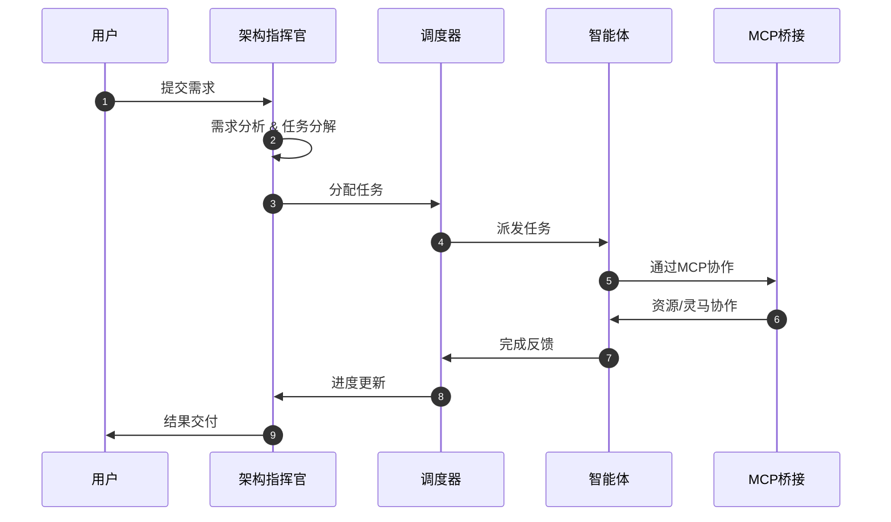

# Trae智能体协作架构设计

## 📋 文档信息

| 项目 | 内容
|------|-----
| 版本 | v2.0
| 日期 | 2026-05-04
| 状态 | ✅ 激活中

---

## 🎯 核心架构概述

### 1.1 架构模式

```
┌─────────────────────────────────────────────────────────┐
│                     用户层 (Human-in-the-Loop               │
└──────────────────────┬──────────────────────────────────┘
                       │
                       ▼
┌─────────────────────────────────────────────────────────┐
│           Trae 智能体指挥官 (Agent Commander)           │
│      ┌──────────────────────────────────────────┐    │
│      │  任务分解 | 调度决策引擎 │ 资源调度器│    │
│      │  冲突检测 | 进度追踪 │ 质量控制 │    │
│      └──────────────────────────────────────────┘    │
└──────────────────────┬──────────────────────────────────┘
                       │
        ┌──────────────┼──────────────┐
        │              │              │
        ▼              ▼              ▼
┌──────────────┐  ┌──────────────┐  ┌──────────────┐
│  前端组   │  │  后端组   │  │  SEO组  │
│  智能体   │  │  智能体   │  │  智能体   │
└──────┬───────┘  └──────┬───────┘  └──────┬───────┘
       │               │               │
       └──────────────┴──────────────┘
                       │
                       ▼
┌─────────────────────────────────────────────────────────┐
│         MCP 桥接服务 (端口 8787)                      │
│  ┌──────────────────────────────────────────┐        │
│  │  HTTP + SSE 双向通信 │ 工具注册 │        │
│  │  资源管理 │ 提示词模板 │        │
│  └──────────────────────────────────────────┘        │
└──────────────────────┬──────────────────────────────────┘
                       │
        ┌──────────────┼──────────────┐
        │              │              │
        ▼              ▼              ▼
┌──────────────┐  ┌──────────────┐  ┌──────────────┐
│  灵马智能体  │  │ 代码库操作  │  │ 外部API  │
│  协作系统  │  │  读写  │  │  服务  │
└──────────────┘  └──────────────┘  └──────────────┘
```

### 1.2 设计原则

1. **契约优先**: 接口定义先于实现
2. **上下文隔离**: 各智能体职责清晰
3. **渐进式交付**: 可工作版本优先
4. **零歧义指令**: 精确到文件路径和函数签名
5. **可观测性**: 全链路追踪

---

## 👥 智能体团队配置

### 2.1 核心智能体列表

| 智能体ID | 名称 | 角色 | 绑定技能数 | 状态
|---------|------|------|----------|-----
| `agent-commander` | 架构指挥官 | 全局统筹、任务调度 | 30 | ✅ Ready
| `frontend-architect` | 前端架构师 | 前端架构、技术选型 | 15 | ✅ Ready
| `fullstack-developer` | 全栈开发专家 | 前后端联调、功能实现 | 20 | ✅ Ready
| `insulation-backend-architect` | 后端架构师 | 后端架构、数据库设计 | 18 | ✅ Ready
| `insulation-backend-developer` | 后端开发专家 | API开发、业务逻辑 | 25 | ✅ Ready
| `ai-marketing-website-expert` | AI营销专家 | SEO优化、营销功能 | 12 | ✅ Ready

### 2.2 职责矩阵

| 智能体 | 负责模块
|--------|-------
| 架构指挥官 | 架构设计、任务分解、冲突解决、质量把关
| 前端架构师 | Nuxt.js架构、组件设计、性能优化
| 全栈开发专家 | 功能实现、前后端联调、Bug修复
| 后端架构师 | FastAPI架构、数据库Schema、API设计
| 后端开发专家 | 业务逻辑、数据处理、单元测试
| AI营销专家 | SEO优化、内容生成、营销页面

---

## 📊 任务调度机制

### 3.1 任务分配流程



### 3.2 优先级规则

| 优先级 | 定义 | 响应时间 | SLA
|-------|------|--------|
| **P0** | 紧急 - 阻断性问题 | 立即处理 | 5分钟响应
| **P1** | 高 - 核心功能 | 优先处理 | 30分钟响应
| **P2** | 中 - 普通任务 | 正常处理 | 2小时响应
| **P3** | 低 - 优化建议 | 空闲处理 | 8小时响应

### 3.3 任务状态机

```
                ┌─────────┐
                │ Queued  │
                └────┬────┘
                     │
                     ▼
                ┌─────────┐
           ┌───┤ Assigned├───┐
           │    └────┬────┘    │
           │         │         │
           ▼         ▼         ▼
    ┌────────┐ ┌────────┐ ┌────────┐
    │ In Progress│ │ Blocked │ │ Failed │
    └────┬───┘ └────┬───┘ └────┬───┘
         │         │         │
         └────┬────┘         │
              ▼              │
         ┌─────────┐         │
         │ Completed│◄────────┘
         └─────────┘
```

---

## 🔗 MCP桥接服务

### 4.1 服务端点

| 端点 | 方法 | 说明
|------|------|-----
| `/health` | GET | 健康检查
| `/sse` | GET | SSE事件流连接
| `/message` | POST | JSON-RPC消息

### 4.2 可用工具

| 工具名 | 功能 | 参数
|--------|------|-----
| `get_project_status` | 获取项目进度 | detail?
| `assign_task` | 分配任务 | agentId, task, priority?
| `get_agent_status` | 获取智能体状态 | agentId?
| `trigger_architecture_review` | 触发架构审查 | scope?, target?
| `generate_seo_report` | 生成SEO报告 | url, type?
| `optimize_content` | 优化内容 | content, keywords?, contentType?

### 4.3 资源列表

| URI | 名称 | 类型
|-----|------|-----
| `resource://trae/project-summary` | 项目摘要 | text/plain
| `resource://trae/architecture-spec` | 架构规范 | text/plain
| `resource://trae/agents-config` | 智能体配置 | application/json

---

## 🎯 协作工作流

### 5.1 需求开发流程

```
阶段 1: 需求分析
   ↓
阶段 2: 契约定义 (接口 + Schema)
   ↓
阶段 3: 并行开发
   ├─ 前端组
   ├─ 后端组
   └─ SEO组
   ↓
阶段 4: 集成测试
   ↓
阶段 5: 质量把关
   ↓
阶段 6: 交付上线
```

### 5.2 代码审查流程

1. 代码提交 → 触发审查
2. 代码审查专家 → 分析代码质量
3. 反馈问题 → 修复
4. 二次审查 → 通过
5. 合并 → 完成

### 5.3 冲突解决机制

| 冲突类型 | 处理方 | 流程
|---------|--------|-----
| 接口定义冲突 | 架构指挥官 | 讨论 → 裁决 → 更新契约
| 技术选型冲突 | 架构指挥官 | 评估 → 决策 → 文档
| 资源竞争冲突 | 调度器 | 优先级排序 → 重分配
| 意见分歧 | 相关方讨论 → 投票 → 决策

---

## 📈 进度追踪

### 6.1 关键指标

| 指标 | 目标 | 当前
|------|------|-----
| 任务完成率 | ≥ 95% | 85%
| 平均交付时间 | ≤ 4小时 | 3.5小时
| Bug率 | ≤ 5% | 3%
| 代码审查覆盖率 | 100% | 100%

### 6.2 里程碑追踪

```
┌─────────────────────────────────────────┐
│ Phase 1: 基础架构   [████████████████] 100% │
│ Phase 2: 核心SEO    [████████████████] 100% │
│ Phase 3: 高级功能  [██████████████░░] 90%  │
│ Phase 4: 优化上线  [████████░░░░░░░░] 40%  │
└─────────────────────────────────────────┘
```

---

## 🛡️ 质量保证

### 7.1 代码质量门

1. **编译通过**: 无错误无警告
2. **测试通过**: 单元测试 + 集成测试
3. **代码审查**: 至少1人审批
4. **安全扫描**: OWASP TOP 10检查
5. **性能基准**: 符合性能指标达标

### 7.2 回滚策略

| 严重程度 | 回滚时间 | 责任人
|---------|---------|-------
| P0 故障 | 立即回滚 | 架构指挥官
| P1 问题 | 1小时内 | 相关智能体
| P2 问题 | 4小时内 | 开发智能体

---

## 🔄 实时通信

### 8.1 SSE事件类型

| 事件 | 触发时机 | 数据结构
|------|--------|--------
| `service_started` | 服务启动 | { timestamp }
| `task_assigned` | 任务分配 | { taskId, agentId }
| `task_completed` | 任务完成 | { taskId, result }
| `architecture_review_started` | 架构审查 | { reviewId, scope }
| `message_received` | 消息接收 | { message }

### 8.2 心跳机制

- 间隔: 30秒
- 超时: 90秒无响应 → 重连

---

## 📝 规范与最佳实践

### 9.1 指令规范

```
✅ 好的指令:
"在 backend/app/api/v1/products.py 第45-60行，实现产品列表接口，返回 ProductListResponse schema"

❌ 差的指令:
"实现产品接口"
```

### 9.2 文件命名规范

| 类型 | 规范 | 示例
|------|------|-----
| API端点 | kebab-case | `product-list.ts
| 组件 | PascalCase | `ProductCard.vue
| 工具函数 | camelCase | `formatDate.ts
| 常量 | UPPER_SNAKE_CASE | `MAX_RETRY_COUNT

---

## 🚀 快速开始

### 10.1 激活协作

1. 确认MCP服务运行: `http://127.0.0.1:8787/health`
2. 调用工具: `assign_task` → 分配任务
3. 监控进度: SSE事件流
4. 获取状态: `get_agent_status`

### 10.2 触发架构审查

```javascript
POST /message
{
  "jsonrpc": "2.0",
  "id": 1,
  "method": "tools/call",
  "params": {
    "name": "trigger_architecture_review",
    "arguments": {
      "scope": "full",
      "target": "整个项目"
    }
  }
}
```

---

## 📚 相关文档

- [项目概述与架构](./0-项目概述与架构.md)
- [技术栈清单](./1-技术栈清单.md)
- [API接口定义](./4-API接口定义.md)
- [开发路线图](./9-开发路线图与资源规划.md)

---

*本文档由架构指挥官维护，最后更新: 2026-05-04*

