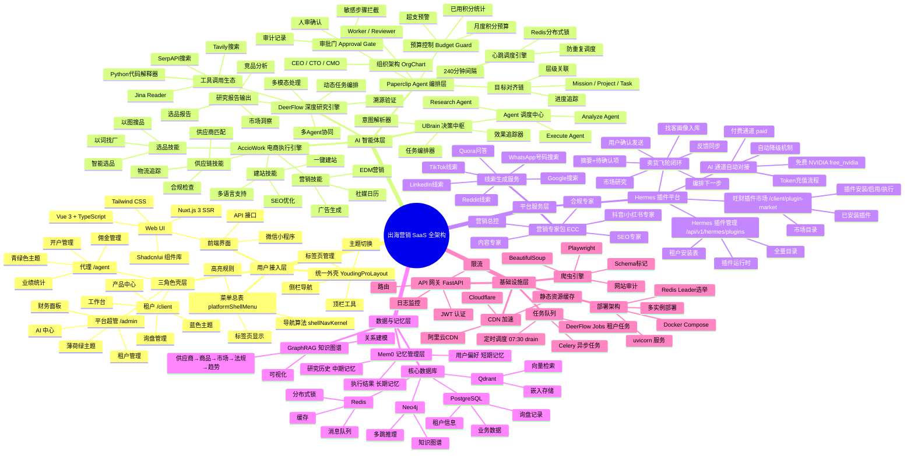

# 出海营销 SaaS · 全架构思维导图

> **版本**: v2.0
> **日期**: 2026-07-20
> **说明**: 整合 Admin 外壳四层模型、UBrain 超级智能体、Hermes 插件平台、Paperclip Agent 编排的完整架构视图

---

## 架构思维导图



---

## 架构分层说明

### 第一层：用户接入层
负责用户与系统的交互入口，包含前端界面、三角色壳层和统一外壳框架。核心原则是「菜单只认一份总表」，避免导航错乱。

### 第二层：AI 智能体层
系统的智能核心，包含四个引擎：
- **UBrain**：决策中枢，负责意图解析和任务编排
- **DeerFlow**：深度研究引擎，基于 LangGraph 多 Agent 协作
- **AccioWork**：电商执行引擎，提供 39+ 专业技能包
- **Paperclip**：Agent 编排层，管理组织架构、心跳调度、预算控制

### 第三层：平台服务层
支撑业务运行的核心服务，包括：
- **Hermes**：插件平台和卖货飞轮闭环
- **ECC**：营销专家包（约 12 个角色 prompt）
- **线索生成**：多渠道外贸线索获取

### 第四层：数据与记忆层
负责数据存储和智能记忆：
- **核心数据库**：PostgreSQL、Redis、Qdrant、Neo4j
- **Mem0 记忆**：短期/中期/长期记忆管理
- **GraphRAG**：知识图谱构建与推理

### 第五层：基础设施层
系统运行的基础支撑：
- **API 网关**：FastAPI 认证、限流、路由
- **任务队列**：Celery、DeerFlow Jobs
- **爬虫引擎**：Playwright、BeautifulSoup
- **CDN 加速**：静态资源分发
- **部署架构**：Docker Compose 多实例

---

## 关键数据流

### 研究 → 执行闭环
```
用户需求 → UBrain意图解析 → DeerFlow深度研究 → 研究报告
    ↓
UBrain指令生成 → AccioWork电商执行 → 效果回流 → 优化研究模型
```

### 卖货飞轮
```
① 市场研究 → ② 找客画像入库 → ③ 编排下一步 → ④ 返回副驾待确认
    ↓
⑤ 用户确认发送 → ⑥ 反馈同步 → ⑦ 下一轮循环
```

### AI 通道对接
```
注册开通 → provision_tenant_ai_connect(nvidia)
    ↓
选择大模型平台 → 写入ai_connect → 降级免费NVIDIA
    ↓
Token充值成功 → apply_token_addon → 接通所选平台
```

---

## 技术选型汇总

| 层级 | 技术 | 用途 |
|------|------|------|
| 前端 | Nuxt 3 + Vue 3 + Vite | SSR/SPA 双模式 |
| 后端 | FastAPI + Python 3.11 | API 网关 |
| ORM | SQLAlchemy | 数据库操作 |
| 验证 | Pydantic | 数据验证 |
| 缓存 | Redis 7.2.4 | 缓存/队列/锁 |
| 向量 | Qdrant | 向量检索 |
| 图谱 | Neo4j | 知识图谱 |
| 工作流 | LangGraph | 多 Agent 编排 |
| 爬虫 | Playwright | 浏览器自动化 |
| 队列 | Celery | 异步任务 |
| 组件 | Ant Design Vue 4.x | 后台 UI |
| 样式 | Tailwind CSS | 样式框架 |

---

## 图标映射

| 架构组件 | 图标名称 | 图标组件 |
|----------|----------|----------|
| UBrain | BrainOutlined | ExperimentOutlined |
| DeerFlow | ClusterOutlined | CloudServerOutlined |
| AccioWork | CarryOutOutlined | CarryOutOutlined |
| Paperclip | ApartmentOutlined | TeamOutlined |
| Hermes | RocketOutlined | RocketOutlined |
| 旺财 | TrophyOutlined | TrophyOutlined |
| AI 引擎 | ApiOutlined | ApiOutlined |
| 数据库 | DatabaseOutlined | DatabaseOutlined |
| 缓存 | CloudOutlined | CloudOutlined |
| 爬虫 | SpiderOutlined | BugOutlined |
| 调度器 | CalendarOutlined | CalendarOutlined |
| 飞轮 | SyncOutlined | SyncOutlined |

---

## 相关文档

- [Admin 架构从零说明](ADMIN-ARCHITECTURE-从零说明.md)
- [UBrain 超级智能体架构](UBRAIN_SUPER_AGENT_ARCHITECTURE.md)
- [Hermes 飞轮架构](HERMES-FLYWHEEL-ARCHITECTURE-v1.md)
- [项目概述与架构](0-项目概述与架构.md)
- [图标映射常量](/frontend/admin/src/constants/antIconMap.ts)
- [图标目录常量](/frontend/admin/src/constants/iconCatalog.ts)