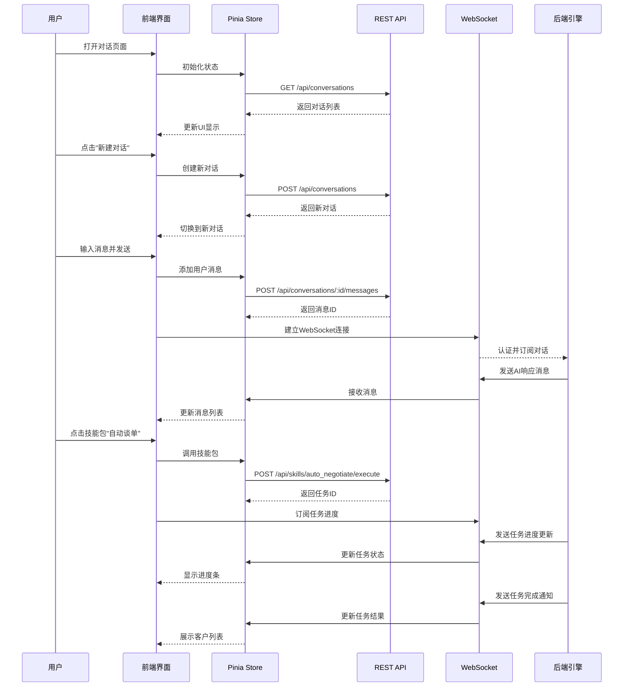
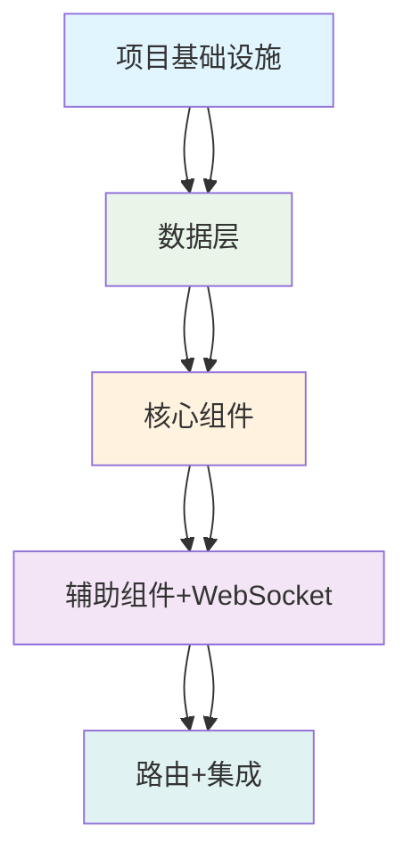

# UBrain超级智能体前端平台 - 系统架构设计

## 设计概述

本文档描述UBrain超级智能体前端平台的系统架构设计，基于现有Vue 3 + Ant Design Vue + Tailwind CSS技术栈，实现类似豆包的三栏对话界面，集成AccioWork技能包和实时通信功能。

## Part A: 系统设计

### 1. 实施难点与技术选型

#### 核心技术挑战
1. **实时WebSocket通信**：需要处理连接管理、消息序列化、断线重连、消息去重
2. **技能包动态集成**：8个AccioWork技能包的统一展示和调用机制
3. **多轮对话状态管理**：前后端协同的对话上下文记忆和状态同步
4. **任务进度可视化**：长时间任务的实时状态更新和进度展示
5. **富文本消息渲染**：支持文本、卡片、进度条、结果展示等多种消息类型

#### 技术选型与理由
| 技术/框架 | 选择 | 理由 |
|-----------|------|------|
| **前端框架** | Vue 3 + TypeScript | 现有技术栈，支持Composition API，类型安全 |
| **UI组件库** | Ant Design Vue 4.x | 现有技术栈，丰富的组件生态，设计规范统一 |
| **CSS框架** | Tailwind CSS | 现有技术栈，实用优先，快速开发 |
| **状态管理** | Pinia | 现有技术栈，Vue官方推荐，TypeScript友好 |
| **HTTP客户端** | Axios | 现有技术栈，支持拦截器、取消请求等特性 |
| **WebSocket库** | Socket.io-client 4.x | 自动重连、断线处理、二进制数据支持 |
| **图表库** | ECharts | 现有技术栈，适合数据分析和可视化 |
| **工具库** | Lodash | 现有技术栈，防抖、节流等实用函数 |
| **构建工具** | Vite | 现有技术栈，快速的开发服务器和构建 |

#### 架构模式
采用**组件化架构 + 状态驱动设计**：
- **组件层次**：布局组件 → 页面组件 → 业务组件 → 基础组件
- **数据流**：单向数据流，通过Pinia store管理全局状态
- **通信模式**：RESTful API + WebSocket实时通信

### 2. 文件结构设计

```
frontend/admin/src/
├── api/                          # API接口层
│   ├── ubrain/                   # UBrain相关API
│   │   ├── conversation.ts       # 对话相关API
│   │   ├── skill.ts             # 技能包API
│   │   ├── task.ts              # 任务管理API
│   │   └── invitation.ts        # 邀请系统API
│   └── index.ts                 # API导出
├── components/                   # 组件目录
│   ├── layout/                  # 布局组件
│   │   ├── MainLayout.vue       # 主布局（三栏）
│   │   ├── Sidebar.vue          # 左侧栏
│   │   ├── Header.vue           # 顶部导航
│   │   └── ContentArea.vue      # 内容区域
│   ├── conversation/            # 对话组件
│   │   ├── ConversationList.vue # 对话列表
│   │   ├── MessageList.vue      # 消息列表
│   │   ├── MessageItem.vue      # 单个消息
│   │   ├── MessageInput.vue     # 输入区域
│   │   └── SkillQuickBar.vue    # 技能包快捷栏
│   ├── skill/                   # 技能包组件
│   │   ├── SkillCard.vue        # 技能包卡片
│   │   ├── SkillGrid.vue        # 技能包网格展示
│   │   └── SkillDetail.vue      # 技能包详情
│   ├── task/                    # 任务组件
│   │   ├── TaskProgress.vue     # 任务进度条
│   │   ├── TaskStatus.vue       # 任务状态展示
│   │   └── TaskResult.vue       # 任务结果展示
│   └── common/                  # 通用组件
│       ├── WebSocketStatus.vue  # WebSocket状态指示器
│       ├── LoadingSpinner.vue   # 加载动画
│       └── ErrorMessage.vue     # 错误提示
├── composables/                 # 组合式函数
│   ├── useWebSocket.ts          # WebSocket管理
│   ├── useConversation.ts       # 对话管理
│   ├── useSkill.ts             # 技能包管理
│   └── useTask.ts              # 任务管理
├── stores/                      # Pinia状态管理
│   ├── conversation.ts          # 对话状态
│   ├── skill.ts                # 技能包状态
│   ├── task.ts                 # 任务状态
│   ├── user.ts                 # 用户状态
│   └── websocket.ts            # WebSocket状态
├── types/                       # TypeScript类型定义
│   ├── conversation.ts          # 对话相关类型
│   ├── skill.ts                # 技能包类型
│   ├── task.ts                 # 任务类型
│   ├── api.ts                  # API响应类型
│   └── websocket.ts            # WebSocket消息类型
├── utils/                       # 工具函数
│   ├── websocket.ts            # WebSocket工具函数
│   ├── messageParser.ts        # 消息解析工具
│   ├── dateFormatter.ts        # 日期格式化
│   └── skillMapper.ts          # 技能包映射
├── views/                       # 页面视图
│   ├── Home.vue                # 首页/对话页面
│   ├── SkillCenter.vue         # 技能中心
│   ├── Invitation.vue          # 邀请页面
│   └── Analytics.vue           # 数据分析页面
├── router/                      # 路由配置
│   └── index.ts                # 路由定义
└── styles/                      # 样式文件
    ├── conversation.scss        # 对话相关样式
    ├── skill.scss              # 技能包样式
    └── theme.scss              # 主题样式
```

### 3. 数据结构和接口设计

#### 核心数据结构

```typescript
// 对话相关类型
interface Conversation {
  id: string;
  title: string;
  createdAt: Date;
  updatedAt: Date;
  messageCount: number;
  lastMessage?: Message;
}

interface Message {
  id: string;
  conversationId: string;
  role: 'user' | 'assistant' | 'system';
  content: string;
  type: 'text' | 'skill_card' | 'task_progress' | 'result_card';
  timestamp: Date;
  metadata?: MessageMetadata;
}

interface MessageMetadata {
  skillId?: string;
  taskId?: string;
  progress?: number;
  result?: any;
}

// 技能包相关类型
interface Skill {
  id: string;
  name: string;
  description: string;
  icon: string;
  category: 'accio_work' | 'deer_flow';
  isCore: boolean;
  parameters?: SkillParameter[];
}

interface SkillParameter {
  name: string;
  type: 'string' | 'number' | 'boolean' | 'file';
  required: boolean;
  description: string;
  defaultValue?: any;
}

// 任务相关类型
interface Task {
  id: string;
  skillId: string;
  status: 'pending' | 'running' | 'completed' | 'failed';
  progress: number;
  startTime: Date;
  endTime?: Date;
  result?: TaskResult;
  error?: string;
}

interface TaskResult {
  type: 'customer_list' | 'email_draft' | 'research_report' | 'analysis';
  data: any;
  summary?: string;
}

// WebSocket消息类型
interface WebSocketMessage {
  type: 'conversation' | 'task_update' | 'system' | 'heartbeat';
  payload: any;
  timestamp: Date;
  messageId?: string;
}
```

#### API接口设计

##### 对话相关API
```typescript
// 获取对话列表
GET /api/conversations
Response: { conversations: Conversation[] }

// 获取单个对话详情
GET /api/conversations/:id
Response: { conversation: Conversation, messages: Message[] }

// 创建新对话
POST /api/conversations
Request: { title?: string }
Response: { conversation: Conversation }

// 发送消息
POST /api/conversations/:id/messages
Request: { content: string, type?: string, metadata?: any }
Response: { message: Message }

// 删除对话
DELETE /api/conversations/:id
Response: { success: boolean }
```

##### 技能包相关API
```typescript
// 获取所有技能包
GET /api/skills
Response: { skills: Skill[] }

// 获取技能包详情
GET /api/skills/:id
Response: { skill: Skill, parameters: SkillParameter[] }

// 调用技能包
POST /api/skills/:id/execute
Request: { parameters: Record<string, any> }
Response: { taskId: string }
```

##### 任务相关API
```typescript
// 获取任务状态
GET /api/tasks/:id
Response: { task: Task }

// 取消任务
POST /api/tasks/:id/cancel
Response: { success: boolean }

// 获取任务结果
GET /api/tasks/:id/result
Response: { result: TaskResult }
```

##### 邀请系统API
```typescript
// 生成邀请码
POST /api/invitations/generate
Response: { code: string, link: string }

// 获取邀请统计
GET /api/invitations/stats
Response: { totalInvited: number, totalEarnings: number, invitations: Invitation[] }
```

#### WebSocket事件格式

```typescript
// 连接建立后发送认证
{
  type: 'auth',
  payload: { token: 'JWT_TOKEN' }
}

// 接收对话消息
{
  type: 'conversation',
  payload: {
    conversationId: 'conv_123',
    message: {
      id: 'msg_456',
      role: 'assistant',
      content: '消息内容',
      type: 'text',
      timestamp: '2024-01-01T00:00:00Z'
    }
  }
}

// 接收任务进度更新
{
  type: 'task_update',
  payload: {
    taskId: 'task_789',
    status: 'running',
    progress: 45,
    message: '正在搜索潜在客户...',
    estimatedTime: 120
  }
}

// 接收任务完成通知
{
  type: 'task_complete',
  payload: {
    taskId: 'task_789',
    status: 'completed',
    result: {
      type: 'customer_list',
      data: [...],
      summary: '找到15个潜在客户'
    }
  }
}

// 心跳检测
{
  type: 'heartbeat',
  payload: { timestamp: '2024-01-01T00:00:00Z' }
}
```

### 4. 程序调用流程



### 5. 待明确事项

1. **技术集成细节**：
   - DeerFlow引擎和AccioWork引擎的具体API接口规范？
   - WebSocket通信协议的具体格式和事件类型定义？
   - 是否有现成的前端设计系统或组件库可复用？

2. **业务逻辑**：
   - 技能包的调用权限如何控制？是否按用户套餐分级？
   - 自动谈单的邮件发送是否需要集成第三方邮件服务？
   - 客户邀请系统的佣金比例和结算周期如何设定？

3. **用户体验**：
   - 对话界面的加载状态和错误处理如何设计？
   - 长时间任务（如深度研究）如何避免用户等待焦虑？
   - 是否需要离线模式或PWA支持？

4. **性能与扩展**：
   - 预计同时在线用户数和并发对话数？
   - 前端缓存策略（对话历史、用户偏好等）？
   - 未来是否需要支持插件市场或第三方技能包？

## Part B: 任务分解

### 6. 依赖包列表

```json
{
  "dependencies": {
    "socket.io-client": "^4.7.4",
    "highlight.js": "^11.9.0",
    "markdown-it": "^14.0.0",
    "@vueuse/core": "^10.7.2"
  },
  "devDependencies": {
    "@types/markdown-it": "^13.0.7"
  }
}
```

### 7. 任务列表（按实现顺序）

#### T01: 项目基础设施（配置文件 + 入口文件 + 依赖声明）
- **任务名称**: 项目基础设施搭建
- **源文件**:
  - `package.json` (更新依赖)
  - `vite.config.ts` (配置WebSocket代理)
  - `src/types/` (所有类型定义文件)
  - `src/stores/` (所有状态管理文件)
  - `src/utils/websocket.ts` (WebSocket工具函数)
- **依赖**: 无
- **优先级**: P0

#### T02: 数据层（类型定义 + 状态管理 + 数据配置）
- **任务名称**: 数据层实现
- **源文件**:
  - `src/types/conversation.ts`
  - `src/types/skill.ts`
  - `src/types/task.ts`
  - `src/types/api.ts`
  - `src/types/websocket.ts`
  - `src/stores/conversation.ts`
  - `src/stores/skill.ts`
  - `src/stores/task.ts`
  - `src/stores/user.ts`
  - `src/stores/websocket.ts`
  - `src/api/ubrain/conversation.ts`
  - `src/api/ubrain/skill.ts`
  - `src/api/ubrain/task.ts`
  - `src/api/ubrain/invitation.ts`
- **依赖**: T01
- **优先级**: P0

#### T03: 核心组件（主要业务组件 + 页面组件）
- **任务名称**: 核心对话界面实现
- **源文件**:
  - `src/components/layout/MainLayout.vue`
  - `src/components/layout/Sidebar.vue`
  - `src/components/layout/Header.vue`
  - `src/components/layout/ContentArea.vue`
  - `src/components/conversation/ConversationList.vue`
  - `src/components/conversation/MessageList.vue`
  - `src/components/conversation/MessageItem.vue`
  - `src/components/conversation/MessageInput.vue`
  - `src/components/skill/SkillCard.vue`
  - `src/components/skill/SkillGrid.vue`
  - `src/components/task/TaskProgress.vue`
  - `src/views/Home.vue`
- **依赖**: T02
- **优先级**: P0

#### T04: 辅助组件 + WebSocket集成（次要UI组件 + 实时通信）
- **任务名称**: 辅助功能与实时通信
- **源文件**:
  - `src/components/common/WebSocketStatus.vue`
  - `src/components/common/LoadingSpinner.vue`
  - `src/components/common/ErrorMessage.vue`
  - `src/components/skill/SkillDetail.vue`
  - `src/components/task/TaskStatus.vue`
  - `src/components/task/TaskResult.vue`
  - `src/composables/useWebSocket.ts`
  - `src/composables/useConversation.ts`
  - `src/composables/useSkill.ts`
  - `src/composables/useTask.ts`
  - `src/views/SkillCenter.vue`
- **依赖**: T03
- **优先级**: P1

#### T05: 路由 + 集成 + 最终调试（路由配置 + 组件集成 + 邀请系统）
- **任务名称**: 路由集成与邀请系统
- **源文件**:
  - `src/router/index.ts` (更新路由)
  - `src/views/Invitation.vue`
  - `src/views/Analytics.vue`
  - `src/styles/conversation.scss`
  - `src/styles/skill.scss`
  - `src/styles/theme.scss`
  - `src/App.vue` (更新)
  - `src/main.ts` (更新)
- **依赖**: T04
- **优先级**: P1

### 8. 共享知识

1. **API响应格式**：所有API响应使用统一格式 `{code: number, data: any, message: string}`
2. **WebSocket认证**：连接建立后需发送JWT token进行认证，使用Pinia store中的token
3. **时间格式**：所有日期时间使用ISO 8601格式存储和传输
4. **状态管理**：使用Pinia进行状态管理，遵循Vue 3 Composition API风格
5. **组件命名**：使用PascalCase命名组件，文件名与组件名一致
6. **类型定义**：所有复杂数据结构必须在`src/types/`目录下定义类型
7. **API封装**：所有API调用通过`src/api/`目录下的模块进行封装
8. **WebSocket事件**：统一的事件类型定义，支持对话消息、任务更新、系统通知
9. **错误处理**：统一的错误处理机制，包括网络错误、业务错误、WebSocket断线重连
10. **性能优化**：对话列表虚拟滚动，消息懒加载，图片懒加载

### 9. 任务依赖图



## 附录

### 序列图文件
- 位置: `docs/sequence-diagram.mermaid`
- 内容: 主要交互流程的序列图

### 类图文件
- 位置: `docs/class-diagram.mermaid`
- 内容: 核心数据结构和类的类图

### 设计原则
1. **简单性**：保持设计简单，避免过度工程化
2. **模块化**：高内聚低耦合，便于维护和扩展
3. **实用性**：设计要便于工程师高效实现
4. **可测试性**：组件可独立测试，状态管理可预测

### 参考资料
- Vue 3官方文档: https://vuejs.org/
- Ant Design Vue: https://antdv.com/
- Pinia状态管理: https://pinia.vuejs.org/
- Socket.io客户端: https://socket.io/docs/v4/client-initialization/
- Tailwind CSS: https://tailwindcss.com/
