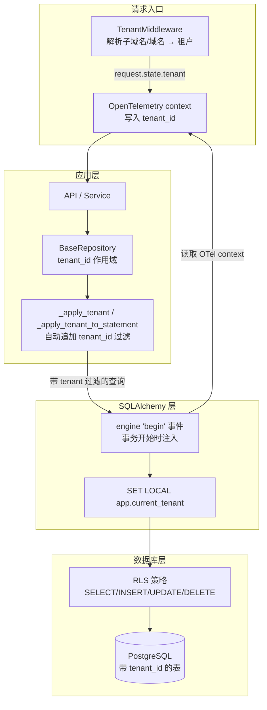

# 租户隔离与 RLS 试点 — 设计文档

- 文档类型：软件设计文档（合并：HLD + 模块设计 + 影响与迁移）
- 系统阶段：Brownfield（既有系统缺陷修复）
- 读者：后端工程师、设计评审人、架构师
- 上游依据：架构审计发现（逆向既有代码，无 PRD）
- 日期：2026-09-02

---

## 1 设计概述

### 1.1 目的与范围

本文档描述主体项目（上线网站开发完成）租户隔离缺陷的修复设计。修复目标有两个：在应用层让 Repository 的数据访问强制带上租户边界，在数据库层让 Row Level Security（RLS）机制真正可用并可按试点表启用。

范围覆盖三个模块的改动：`app/core/repository.py`（租户作用域）、`app/core/security/rls.py`（RLS 策略部署）、`app/core/database.py`（租户上下文注入），以及配置项与启动挂载。不在范围内：修改全部既有调用方逐个传 `tenant_id`（这是后续增量工作，见第 8 节）、非 PG 数据库的租户隔离、已独立的权限与认证体系。

### 1.2 上游需求追溯

本次修复没有上游 PRD，需求来自架构审计。审计发现三处必须处理的缺陷：

| 审计发现 | 对应设计目标 | 证据 |
|---|---|---|
| Repository 层所有查询/写/删/聚合未强制 `tenant_id` 过滤，存在跨租户越权读取写入风险 | 应用层租户作用域（第 3.1 节） | `[Data-backed]`（审计结果） |
| `rls.py` 使用 `CREATE POLICY IF NOT EXISTS`，PostgreSQL 不支持该子句，部署必然失败 | RLS 策略幂等化（第 3.2 节） | `[Data-backed]`（审计结果） |
| `database.py` 在 connect/checkout 事件把裸 DBAPI 连接传给要求 SQLAlchemy Connection 的注入函数，异常被吞掉，注入从未生效 | 事务 begin 级注入（第 3.3 节） | `[Data-backed]`（审计结果） |

### 1.3 设计目标与约束

功能目标：任何经过 `BaseRepository` 的数据访问，在实例绑定 `tenant_id` 时自动收敛到该租户；RLS 策略能以幂等方式部署，且能按试点表小范围启用。

非功能约束：默认行为零回归——未传 `tenant_id` 的既有调用保持原语义，不因本次修复而报错或过滤；生产环境不额外打日志；启用 RLS 必须显式配置，避免未注入租户的路径把表读写过滤为空 `[Expert judgment]`。

### 1.4 术语表

| 术语 | 含义 |
|---|---|
| 租户作用域（tenant scope） | Repository 实例绑定的 `tenant_id`，所有访问自动追加该租户过滤 |
| 租户表 | 拥有 `tenant_id` 列的表，数据按租户隔离 |
| RLS | PostgreSQL Row Level Security，行级安全策略 |
| `SET LOCAL` | PostgreSQL 事务级会话变量设置，事务结束自动失效 |
| FORCE ROW LEVEL SECURITY | 让表属主也受 RLS 约束；默认只约束其他角色 |

---

## 2 系统架构

### 2.1 架构总览

租户隔离采用双防御层：应用层的 Repository 作用域负责把查询收敛到当前租户，数据库层的 RLS 策略负责即使绕过应用层也无法读到其他租户的数据。二者服务于同一个目标：把"租户边界"从业务代码下沉到数据访问与存储两层，而不是依赖每个业务函数自觉过滤。

### 2.2 架构图

图 1 租户隔离双防御层架构。请求经 `TenantMiddleware` 解析出租户写入请求状态与 OpenTelemetry context；应用层 `BaseRepository` 在构建查询时追加 `tenant_id` 过滤；SQLAlchemy 在每个事务 `begin` 时读取当前租户，通过 `SET LOCAL` 设置会话变量；数据库层 RLS 策略依据该变量过滤行。

### 2.3 组件职责与边界

| 组件 | 拥有的职责 | 明确不负责 |
|---|---|---|
| `TenantMiddleware` | 从请求 Host 解析租户，写入 `request.state` 与 OTel context | 不校验权限、不决定能否访问 |
| `BaseRepository` | 统一数据访问，对租户表追加租户过滤 | 不解析请求、不替代 RLS |
| `database.py` 事件监听 | 在事务 begin 时注入租户上下文 | 不主动开启 RLS 策略 |
| `rls.py` | 创建/禁用/查询 RLS 策略 | 不管理业务查询 |

### 2.4 关键数据流

一次带租户的读写请求：`TenantMiddleware` 解析租户 → 业务代码实例化 `BaseRepository(db, tenant_id=...)` → 查询方法调用 `_apply_tenant` 追加过滤 → SQLAlchemy 开始事务触发 `begin` 事件 → 事件从 OTel context 读租户并 `SET LOCAL` → 语句执行，RLS 策略二次校验。

### 2.5 技术选型与理由

| 选择 | 理由 | 证据 |
|---|---|---|
| 应用层租户作用域 + 数据库层 RLS 双保险 | 单靠应用层，漏过滤即越权；单靠 RLS，无法在应用层暴露未注入路径。两层覆盖不同故障模式 | `[Expert judgment]` |
| 事务 `begin` 事件作为注入点 | 连接池复用下 connect/checkout 时点没有所属请求也无事务；`begin` 事件拿到的是该事务的 Connection，且此时请求中间件已写入租户 | `[Expert judgment]` |
| `SET LOCAL`（事务级）而非 `SET`（会话级） | 事务结束自动失效，池化复用不会串租户 | `[Expert judgment]` |
| 试点表配置门控、默认 `force=False` | 未注入租户的路径（迁移/后台任务）在表属主角色下天然旁路 RLS，避免误锁；小范围试点验证后再扩大 | `[Expert judgment]` |

---

## 3 模块设计

### 3.1 BaseRepository 租户作用域（app/core/repository.py）

职责：让所有经过基类的数据访问在绑定租户时自动收敛。

实现上有三条接入路径，覆盖读写删三类操作：

| 接入点 | 覆盖的方法 | 行为 |
|---|---|---|
| `_apply_tenant(query)` | `get_by_id`、`get_all`、`find_by`、`find_one_by`、`count_by`、`exists`、`aggregate`、`summary` | 追加 `WHERE tenant_id = 绑定值` |
| `_apply_tenant_to_statement(stmt)` | `update_where`、`delete_where` | 追加 `WHERE` 到 Core Update/Delete 语句 |
| `_bind_tenant_on_create(kwargs)` | `create`、`bulk_create` | 写入时自动补齐 `tenant_id`，防止乘机写入他租户 |

间接接入：`update` 与 `delete` 内部调用 `get_by_id`，因此同样被租户过滤覆盖。

未绑定租户访问租户表时，非生产环境记录 `[TENANT][unscoped]` 告警但不阻断；生产环境不处理。这样做的目的是暴露"哪些路径没有带租户边界"，作为后续逐条修复的清单，而不是在未确认所有路径安全前直接拒绝访问造成回归 `[Expert judgment]`。

依赖方向：`BaseRepository` 仅依赖 SQLAlchemy 与 `app.core.cache`（延迟 import settings），无循环依赖。

已知边界：具体子类中绕过基类自行写查询的方法（如 `ProspectLeadRepository.get_hot_leads`、`get_by_status`、`get_funnel_stats`、`EmailOutreachRepository.get_pending`、`get_stats`）不受基类作用域约束。这些是后续必须显式处理的清单项，见第 8 节 `[Data-backed]`。

### 3.2 RLS 策略模块（app/core/security/rls.py）

职责：在 PostgreSQL 上幂等部署租户隔离策略。

关键设计决策：

| 决策 | 内容 |
|---|---|
| 幂等策略创建 | PostgreSQL 不支持 `CREATE POLICY IF NOT EXISTS`；改为先查 `pg_policies` 判断策略是否已存在，存在则跳过 |
| 双连接形态兼容 | `set_tenant_context` / `clear_tenant_context` / `_policy_exists` 同时接受 SQLAlchemy `Connection` 与裸 DBAPI 连接（psycopg2 占位符为 `%s`），由 `_exec` 统一分派 |
| 试点过滤 | `setup_rls_policies(engine, pilot_tables=[...], force=False)`：`pilot_tables` 非空时仅处理指定表 |
| `force` 默认关闭 | 不执行 `FORCE ROW LEVEL SECURITY`，表属主按 PG 语义旁路 RLS，避免后台/迁移读写被空租户过滤锁死 |
| 每表四策略 | SELECT（USING）、INSERT（WITH CHECK）、UPDATE（WITH CHECK）、DELETE（USING），策略名 `tenant_isolation_<table>_<kind>` |

配套的 `disable_rls_policies`（禁用全部 RLS）与 `get_rls_status`（查询启用状态）用于维护与调试。

`_create_table_rls_policies` 对单表执行的 SQL 序列（幂等）：`ENABLE ROW LEVEL SECURITY` →（可选）`FORCE ROW LEVEL SECURITY` → 逐策略判断存在性后 `CREATE POLICY`。

### 3.3 事务级租户注入（app/core/database.py）

职责：在每次事务开始时，把当前请求的租户写入该事务的连接上下文。

实现为 SQLAlchemy `engine` 的 `begin` 事件监听：回调收到该事务的 `Connection`（可参数绑定），从 `opentelemetry_config.get_tenant_from_context()` 读取当前租户，非空则调用 `set_tenant_context(conn, tenant_id)` 执行 `SET LOCAL app.current_tenant`。

选取 `begin` 事件的原因：连接是池化复用的，`connect`/`checkout` 时点既没有所属请求也没有事务；而 `begin` 事件在事务启动时触发，此时 `TenantMiddleware` 已在请求入口把租户写入 OTel context，读取即可得到当前请求的租户。事务结束 `SET LOCAL` 自动失效，连接归还池子时不会残留上一条请求的租户 `[Expert judgment]`。

非 PostgreSQL 方言下直接返回，不产生任何开销。注入失败只告警不阻断事务。

### 3.4 配置与启动挂载

`app/core/config.py` 新增两个字段：

| 字段 | 默认值 | 说明 |
|---|---|---|
| `RLS_PILOT_ENABLED` | `False` | 是否在启动时挂载试点表 RLS 策略 |
| `RLS_PILOT_TABLES` | `""` | 逗号分隔的试点表名（不含 schema） |

`app/main.py` 在 `_lifespan_init_core` 中调用 `mount_rls_pilot_if_enabled()`：仅当 `RLS_PILOT_ENABLED` 为真、数据库为 PostgreSQL、且 `RLS_PILOT_TABLES` 非空时，调用 `setup_rls_policies(engine, pilot_tables=..., force=False)`。任一前置不满足则跳过并记日志，不阻断启动。

---

## 4 接口设计

### 4.1 BaseRepository 契约变更

| 接口 | 变更 | 说明 |
|---|---|---|
| `BaseRepository.__init__(db, tenant_id=None)` | 新增参数 | `tenant_id` 可选；设置后所有访问自动收敛到该租户 |
| 全部查询/写/删/聚合方法 | 行为变更 | 内部自动追加租户过滤，签名不变 |

既有的 `get_repository(repo_class, db)` 工厂签名不变（暂不传 `tenant_id`，由调用方按需改为显式构造）。所有既有调用方无需改动即可保持原行为，这是零回归的基础 `[Expert judgment]`。

### 4.2 RLS 模块接口

| 函数 | 签名 | 说明 |
|---|---|---|
| `set_tenant_context` | `(conn, tenant_id: str) -> None` | 设置事务级租户上下文；空租户跳过 |
| `clear_tenant_context` | `(conn) -> None` | 清空上下文 |
| `setup_rls_policies` | `(engine, pilot_tables=None, force=False) -> {"enabled": [...], "skipped": [...]}` | 幂等部署；非 PG 直接返回空 |
| `disable_rls_policies` | `(engine) -> list[str]` | 禁用全部 RLS |
| `get_rls_status` | `(engine) -> list[dict]` | 返回每张租户表的 RLS 启用状态 |

### 4.3 配置接口

环境变量 `RLS_PILOT_ENABLED`（布尔）、`RLS_PILOT_TABLES`（逗号分隔表名）。示例：`RLS_PILOT_ENABLED=true`、`RLS_PILOT_TABLES=mcp_servers`。

---

## 5 数据设计

### 5.1 涉及的数据

本次修复不新增或变更任何表结构，只依赖既有带 `tenant_id` 列的表。RLS 发现逻辑通过 `information_schema.columns` 查询所有含 `tenant_id` 列且非系统 schema 的表。

### 5.2 RLS 策略命名与作用

每张试点表创建四个策略，命名 `tenant_isolation_<table>_using / _check / _update / _delete`，表达式统一为 `tenant_id = current_setting('app.current_tenant', true)`。`current_setting` 第二个参数 `true` 表示变量未设置时返回 NULL 而非报错；此时 `tenant_id = NULL` 恒为 FALSE，行被过滤。这一语义正是"未注入租户即读不到任何行"的机制来源，也是 `force=False` 必须作为默认值的原因 `[Expert judgment]`。

### 5.3 一致性规则

写入策略使用 `WITH CHECK` 而非仅 `USING`，保证 INSERT/UPDATE 的目标行 `tenant_id` 必须与会话租户一致，防止把数据写进其他租户。

---

## 6 非功能设计

### 6.1 安全

本次改动本身就是安全加固：应用层过滤降低跨租户越权读写的发生概率，数据库层 RLS 提供兜底强制。`force=False` 与试点表门控避免了在租户注入覆盖不全时造成可用性事故（见 6.3）。

### 6.2 性能

`begin` 事件仅执行一条 `SET LOCAL`，开销可忽略；非 PG 方言直接短路。应用层租户过滤是既有的索引友好条件（`tenant_id` 通常有索引），不引入额外查询 `[Expert judgment]`。

### 6.3 可用性与回归

零回归策略体现在三处：未传租户的调用保持原语义（仅告警不阻断）；RLS 默认关闭，需显式开启；`force=False` 使表属主旁路 RLS。三者叠加，默认部署下既有的 SQLite/未配置场景行为完全不变 `[Expert judgment]`。

### 6.4 可观测性

非生产环境的 `[TENANT][unscoped]` 告警用于暴露未绑定租户的访问路径；RLS 部署结果（enabled/skipped 表清单）写入启动日志。

---

## 7 影响与迁移

### 7.1 变更影响

| 变更 | 影响面 |
|---|---|
| `BaseRepository` 新增 `tenant_id` 参数与自动过滤 | 所有继承基类的仓库；既有调用零影响（参数可选） |
| `rls.py` 幂等化 | 修复部署必然失败的缺陷；`setup_rls_policies` 签名扩展（向后兼容） |
| `database.py` 注入点迁移 | 从无效的 connect/checkout 改为 begin；行为从"从未生效"变为"生效" |
| 新增配置与启动挂载 | 默认关闭，不改变现有启动路径 |

### 7.2 启用序列

启用 RLS 试点分三步，每步可独立验证：

1. 保持默认配置（`RLS_PILOT_ENABLED=false`）部署，确认应用层租户告警日志中无新的未绑定路径（或记录在案的清单项）。
2. 在完整 PG 环境用 `setup_rls_policies(engine, pilot_tables=[...])` 手工试点一张表，用两个租户会话验证互不可见、写入被 `WITH CHECK` 约束。
3. 验证通过后设置 `RLS_PILOT_ENABLED=true`、`RLS_PILOT_TABLES=<试点表>` 让启动自动挂载，观察运行日志确认 enabled 清单符合预期。

### 7.3 回滚

回滚分两级：应用层改动可整体 revert 三个模块文件，回到无租户过滤的状态；RLS 策略可调用 `disable_rls_policies(engine)` 或置 `RLS_PILOT_ENABLED=false` 后重启（策略保留但不再自动挂载新表）。`force` 未开启时回滚无数据风险。

---

## 8 验证与局限

### 8.1 已验证

- 五个改动文件 `py_compile` 通过。
- 既有 registry 验证脚本 58/58 通过（含"租户注入生效"用例），确认核心模块改动未引入回归 `[Data-backed]`。
- 租户作用域逻辑冒烟测试（SQLite 内存库，内联复刻基类逻辑）：租户过滤、create 自动补租户、跨租户删除/批量删除/批量更新拦截、无作用域不阻断、非租户表不受影响，全部符合预期 `[Data-backed]`。

### 8.2 局限与未验证

- 当前运行环境缺 `pydantic`/`redis`，无法 import 完整模块树，租户作用域测试以内联复刻方式验证，未对真实 `BaseRepository` 做集成测试 `[Unverified — requires human review]`。
- 未在真实 PostgreSQL 上执行迁移与 RLS 策略实建，`CREATE POLICY`、`pg_policies` 查询、`SET LOCAL` 行为需在完整 PG 环境实测 `[Unverified — requires human review]`。
- 应用层告警不阻断意味着"未绑定租户的访问"目前只是被暴露，尚未被强制禁止；真正的强制依赖 RLS。
- 具体子类自行写查询的方法（见 3.1 已知边界）不经过基类作用域，需逐条评估并显式补租户过滤或改造为基类方法。

### 8.3 建议的后续步骤

1. 在完整 PG 环境实测 RLS 策略部署与双租户隔离（按 7.2 序列）。
2. 逐条处理 3.1 中绕过基类作用域的具体子类方法。
3. 把 `get_repository` 工厂与调用方逐步迁移到显式传 `tenant_id`，目标状态是"无作用域的租户表访问从告警升级为拒绝"。
4. 全链路（含后台任务/Worker）确认租户注入覆盖后，再评估对试点表开启 `force=True`。
