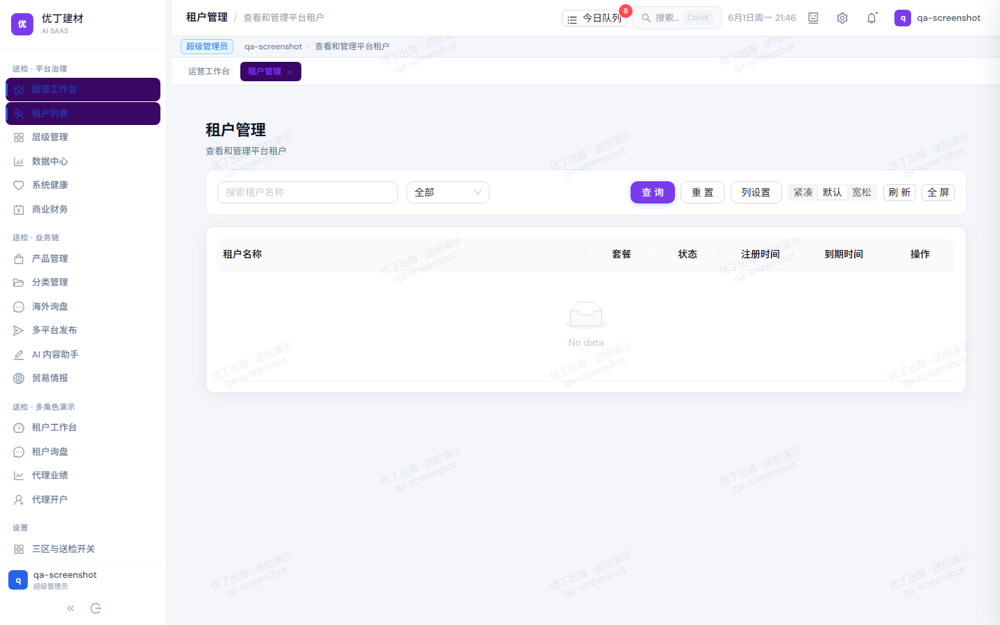

# 第02章 · 租户管理

> **路由**：`/admin/tenants` · **配图**：`cert-02-tenants.png`
> **填写说明**：以下【人类填写区】由经办人手写扩写，每章 500–1300 字。

## 功能概述

【人类填写区：本模块解决什么业务问题】

## 操作步骤

1. 租户列表字段含义
   - 【人类填写区：逐步操作说明】

2. 新建/编辑租户步骤
   - 【人类填写区：逐步操作说明】

3. 状态与套餐说明
   - 【人类填写区：逐步操作说明】

## 界面截图

## 常见问题

【人类填写区】

---
*COMP-03 骨架 · 非 AI 正文*