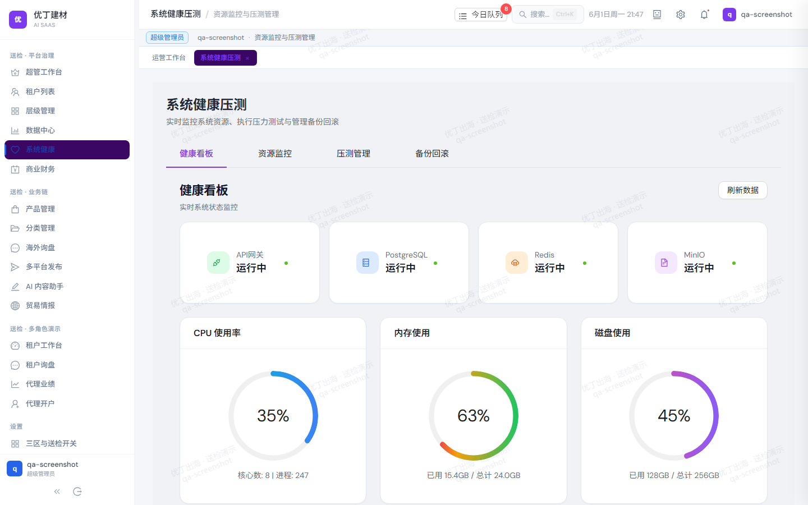

# 第05章 · 系统健康

> **路由**：`/system-health/dashboard` · **配图**：`cert-05-health.png`
> **填写说明**：以下【人类填写区】由经办人手写扩写，每章 500–1300 字。

## 功能概述

【人类填写区：本模块解决什么业务问题】

## 操作步骤

1. 健康指标说明
   - 【人类填写区：逐步操作说明】

2. 告警处理流程
   - 【人类填写区：逐步操作说明】

## 界面截图

## 常见问题

【人类填写区】

---
*COMP-03 骨架 · 非 AI 正文*