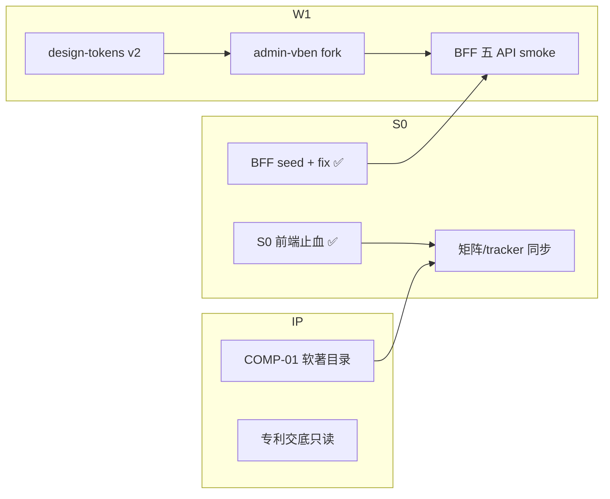

# 夜间开发模式 · 编排 Runbook

> **生效**：2026-06-02 22:00 起  
> **权威**：[`思维导图-优丁SaaS改造全员对齐.md`](./思维导图-优丁SaaS改造全员对齐.md) · [`pm-master-schedule-kpi-20260601.md`](./pm-master-schedule-kpi-20260601.md)  
> **Gate-S0**：2026-06-09

---

## 0. 夜间目标（一条线）

| 泳道 | 今晚必须绿 | 负责人角色 |
|------|------------|------------|
| **阻断** | BFF `menu_adapter` 可 import；三壳 seed 对齐鉴定面 | 后端 |
| **S0 收尾** | 12 截图清单就绪；tracker 状态同步 | PM + 前端 |
| **W1 启动** | `admin-vben` fork；tokens v2；软著目录 | 前端 + 视觉 + 合规 |
| **文档** | PM-02 路由映射；MKT-02 手册目录 | PM + 营销 |

---

## 1. 并行泳道（按思维导图分支）

---

## 2. 任务 ↔ ID 对照（今晚）

| 顺序 | ID | 动作 | 产出路径 |
|------|-----|------|----------|
| 1 | BE-02 | 修复 `_dict_to_route`；扩展 PLATFORM/AGENT/CLIENT seed | `backend/app/api/v1/admin_bff/menu_adapter.py` |
| 2 | PM-07 | 更新 tracker + 总表 S0 ✅ | `docs/ecc-delivery-tracker.md` |
| 3 | FE-01 | fork Vben | `scripts/fork-admin-vben.ps1` → `frontend/admin-vben/` |
| 4 | UX-01 | tokens v2 + icon-map | `frontend/admin/src/styles/design-tokens-v2.scss` |
| 5 | PM-02 | 四支柱 ↔ Top12 映射 | `docs/pm-four-pillars-top12-route-map.md` |
| 6 | MKT-02 | 送检手册目录 | `docs/marketing/cert-handbook-outline-v1.md` |
| 7 | COMP-01 | 软著代码目录 | `docs/compliance/soft-copyright-code-catalog-v1.md` |
| 8 | QA-01 | 三壳 smoke（手动） | 送检脚本 v2 走一遍 |

**不今晚做**：12 张 PNG 截图（需实机 UI 签字）；`pnpm install` 全量（耗时长，明早 CI/本地跑）。

---

## 3. 专家角色值守

| 角色 | 夜间检查点 |
|------|------------|
| **产品经理** | PM-02 映射与思维导图「三壳 IA」一致；Gate-S0 清单 |
| **SaaS 专家** | SAAS-02 seed 与四支柱/五栏/鉴定面一致 |
| **前端** | 现网 `admin` S0 已绿；Vben fork 不破坏现网 |
| **后端** | `/admin-bff/menu/routes` 200；permissions 含 homePath |
| **视觉** | tokens v2 禁 emoji/渐变；Lucide map |
| **合规** | 软著目录 **不含** Vben/Stub/`_ref` |
| **营销** | 手册目录对齐送检 12 步 |

---

## 4. 明早交接（07:00）

1. `python -c "from app.api.v1.admin_bff.menu_adapter import router"` — 0 exit  
2. `docs/ecc-delivery-tracker.md` S0 行 ≥ 80% ✅  
3. `frontend/admin-vben/.youding-fork.json` 存在  
4. Owner 决策项：Brand/Trial/送检窗口（PM-06）

---

## 5. 禁止项（思维导图 · 设计宪法）

- Agent 任何 `/admin/*` 外链  
- 送检侧栏出现实验室（除非 lab 开关 + 非鉴定路径）  
- 软著材料混入 Vue Vben / Naive Admin 源码树  

---

*夜间模式 v1 · 2026-06-02*
