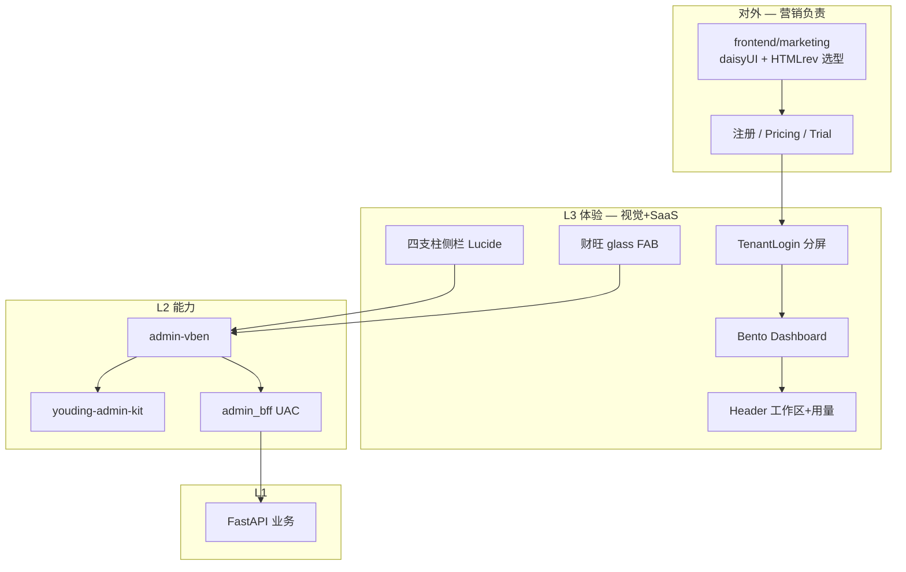
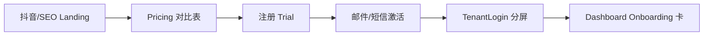

# ECC 全员最优方案 · SaaS 商品化总纲 v1

> **会议**：M3 蜂群终局合议 · **视觉 + 营销必须交付，不许空表态**  
> **指导**：🚀 SaaS 产品策略专家（`saas-product-strategist`）  
> **时间**：2026-06-01  
> **状态**：**全员签字版** — Wave 1 起按本文执行，冲突以 SaaS 专家 L3/L4 否决权为准  

---

## 〇、最优方案一句话

**一套 Vben 壳 + BFF 四支柱菜单 + Bento 激活 Dashboard + 分屏登录与工作区身份 + 三队列 inbox + 内外同源的套餐叙事 + 财旺 glass 副驾** — 90 天内让租户认为「这是正经付费 SaaS」，而不是 234 页功能博物馆。

---

## 一、SaaS 专家 · 总指导（全场约束）

### 1.1 三条铁律

1. **租户不见 Stub** — Hide / Plan Gate / Lab Flag；无产品签字不上线。  
2. **Client 一级菜单永远 ≤5** — 获客 | 发品 | 履约 | 账户 + 财旺悬浮。  
3. **先 L3/L4 再特效** — 未完成激活层 + 四支柱前，禁止全站液态玻璃讨论。

### 1.2 90 天 OKR（与 PRD 对齐，可验收）

| KR | 目标 | 主责 |
|----|------|------|
| KR1 | 7 日内 onboarding 核心 3 步完成率 ≥50% | 产品 + 后端 + 视觉 |
| KR2 | Client 3 次点击到询盘或发内容 | SaaS + 前端 + BFF |
| KR3 | 「找不到功能」工单 ↓30% | 产品 + SaaS |
| KR4 | Dashboard LCP <2.5s | 前端 + 视觉 |
| KR5 | 注册页→登录→Dashboard **视觉与套餐文案同源** | **营销 + 视觉** |

### 1.3 改造顺序（全场不得打乱）

```text
W1  可信+壳     Stub Hide · Vben+BFF · backend 菜单 · emoji 禁
W2  像 SaaS     四支柱 · Bento Dashboard · TenantLogin · Header 工作区 · 三队列
W3  可扩展      Formily 1 页 · Plan Gate · OpenAPI CRUD 生成 · 字典
W3+ 对外        marketing landing · 投流落地与 Admin 同源
```

---

## 二、最优架构（全员共识）



---

## 三、全员最优分工与交付物

### 🚀 SaaS 产品策略专家 · **总指导 / 验收签字**

| 交付 | 截止 |
|------|------|
| `docs/stub-visibility-matrix.md` v1（Hide/PlanGate/Lab/Kill 四级） | W1 D+5 |
| Client 四支柱 ↔ Top12 路由映射表 | W1 D+7 |
| Plan Gate 套餐字段定义（与营销 pricing 对齐） | W2 D+3 |
| 每 Wave 末 **SaaS 五问验收**（见内训附录） | 持续 |

**指导要点**：所有页面先问「新租户 30 秒能否知道下一步」；营销文案与 Admin 套餐名 **必须同一张表**。

---

### 🎨 陈列视觉设计师 · **不装死 — 完整交付包**

#### A. 设计令牌 v2（扩展现有 `design-tokens.scss`）

| Token | 现值 | **最优 v2** | 理由 |
|-------|------|-------------|------|
| `--uj-brand` | `#2563eb` | **保留**，Marketing 同色系 | 已投入，与 trust 蓝一致 |
| `--uj-bg-page` | `#f5f6f8` | `#f8fafc` | 略提亮，Linear 风 |
| `--uj-border` | `#e5e7eb` 实线 | **`transparent` 默认**，用 `shadow-sm` 卡片 | 去「白盒后台味」 |
| `--uj-radius-lg` | 16px | **12px** 卡片 / **16px** 登录面板 | 抖音 Bento 常用 12 |
| 新增 `--uj-glass` | — | `rgba(255,255,255,0.72)` + `blur(12px)` | **仅 FAB/抽屉/Modal** |
| 新增 `--uj-sidebar-indicator` | — | 3px 品牌色左条 active | 替代粗背景块 |
| Icon | emoji | **Lucide Vue** 映射表 20 个 | 四支柱+二级 |

**交付文件**：`frontend/youding-admin-kit/design-tokens/youding-tokens.scss` + `icon-map.ts`  
**截止**：W1 D+7（与 Vben fork 并行）

#### B. Client Dashboard · Bento 线框（必出图）

```text
┌─────────────────────────────────────────────────────────┐
│ Header: [Logo/公司名] [套餐 Pro ▾] [用量 ███░ 72%] [头像] │
├──────────┬──────────────────────────────────────────────┤
│ 获客     │ ┌──────────────┐ ┌──────────────┐ ┌──────────┐ │
│ 发品     │ │ Onboarding   │ │ 未读询盘 12  │ │ 发布中 3 │ │
│ 履约     │ │ 4/6 步 ████░░│ │ 一键处理 →   │ │ 查看 →   │ │
│ 账户     │ └──────────────┘ └──────────────┘ └──────────┘ │
│          │ ┌──────────────────────────────┐ ┌──────────┐ │
│          │ │ 今日待办（Art 精简队列）        │ │ 套餐续费 │ │
│          │ └──────────────────────────────┘ └──────────┘ │
│          │ [次要：7日询盘趋势 — 单条 sparkline 即可]        │
└──────────┴──────────────────────────────────────────────────┘
                                                    [财旺 FAB]
```

**交付**：Figma 或 `docs/design/client-dashboard-bento-spec.md` + 1 张 PNG moodboard  
**截止**：W1 D+5  
**对标**：Linear KPI 密度 + 抖音 Bento 切片（**不要**全站渐变）

#### C. TenantLogin 分屏 spec

| 左 40% | 右 60% |
|--------|--------|
| 优丁 Logo + 一句价值主张 | tenant_code 搜索（Art 链） |
| 3 bullet（获客/发品/出海） | 用户名/密码/验证码 |
| 营销提供的 **客户证言 1 条** | 主按钮「进入工作台」 |
| 背景：品牌 muted 渐变 **仅左侧** | 卡片 `radius-xl` 白底 |

**交付**：`kit/layouts/TenantLogin.vue` 静态稿 + 组件切图说明  
**截止**：W2 D+1

#### D. 财旺 FAB · 轻 glass 规范

- 64px 圆，右下角 24px 边距；`--uj-glass` + `shadow-lg`  
- hover 微 scale(1.05)；**不挡** Dashboard 主 CTA  
- 展开为右侧 420px 抽屉（非全屏），与 Copilot 抖音范式一致  

**截止**：W2 D+10

#### E. 视觉 weekly（强制）

| 周 | 输出 |
|----|------|
| W1 | tokens v2 + Dashboard moodboard |
| W2 | TenantLogin + Header 工作区组件稿 |
| W3 | Plan Gate 升级页 + 空状态 3 套（询盘/产品/onboarding） |
| W4 | marketing 与 Admin 对照走查 1 次 |

---

### 📣 营销网站专家 · **不装死 — 漏斗与文案包**

#### A. 套餐命名表（Admin / 官网 / 销售 **唯一源**）

| 套餐 ID | 对外名 | 一句话 | Admin 徽章色 |
|---------|--------|--------|--------------|
| `trial` | **体验版** | 7 天试用，核心 3 步 | gray |
| `starter` | **启航版** | 单站+基础发布 | blue |
| `pro` | **专业版** | 多平台+IM+SEO | brand |
| `enterprise` | **企业版** | 白标+审计+专属 | violet |

**交付**：`docs/marketing/plan-copy-deck.md`  
**截止**：W1 D+3（SaaS 专家 + 产品联签）

#### B. 注册 → 开通 → 登录 **同源漏斗**



| 触点 | 营销交付 | 视觉对齐 |
|------|----------|----------|
| Landing | HTMLrev 短名单 **2 套**：Tailwind SaaS + Astro 官网 | 主色 `#2563eb`、字体 PingFang/system |
| Pricing | 与上表四档一致，**功能打勾矩阵** | 与 Plan Gate 页同表 |
| 注册页 | Trial CTA 文案 + 隐私/条款链 | 左叙事与 TenantLogin **同 bullet** |
| 投流素材 | 3 条 15s 脚本：**Dashboard Bento / 询盘 inbox / 财旺问一句** | 用 W2 真实截图，不用 stock |

**交付路径**：`frontend/marketing/` 骨架 + `docs/marketing/funnel-spec.md`  
**截止**：Landing 骨架 W3 D+1；Pricing 文案 W1 D+5

#### C. SEO / 话术禁区（营销签字）

- ❌ 对外称「拖拽低代码建站」— drag-module 未生产  
- ✅ 可说「AI 辅助出海」「询盘一体」「多平台发布」  
- ✅ Formily 试点上线后改口「可视化站点配置（专业版）」

#### D. 营销 weekly（强制）

| 周 | 输出 |
|----|------|
| W1 | plan-copy-deck + Pricing 矩阵 |
| W2 | 注册页文案 + TenantLogin 左侧 bullet |
| W3 | Landing 首屏 HTML + 投流脚本 3 条 |
| W4 | 官网与 Admin 套餐名走查报告 |

---

### 🎖 架构指挥官

- Wave 并行：**W1-2 BFF ∥ W1-1 Vben ∥ 视觉 tokens ∥ 营销 copy deck**  
- 冲突仲裁：L4/L3 SaaS 专家；L2 以前端+后端；L1 不动 FastAPI 业务  
- 每周一 15min ECC standup：视觉/营销 **必须报交付物**，无交付=红灯  

---

### 🧱 前端架构师

| 最优方案 | 细节 |
|----------|------|
| fork | `_ref/vue-vben-admin-full` → `admin-vben` |
| 5 API + `accessMode: backend` | 见 99 汇总 §五 |
| tokens | ConfigProvider 读 `youding-tokens.scss` |
| kit 引用 | Dashboard 三组件 W2 接入 |
| 禁止 | emoji 菜单、第二 UI 库 |

---

### 🗄 后端架构师 + 🔒 安全专家

| 最优方案 | 细节 |
|----------|------|
| W1 | tenant search、user.info.tenant、login token 对齐、captcha stub |
| W1 | CLIENT_SEED 四支柱 6 项过渡 → W2 完整 4+二级 |
| W2 | `onboarding_steps[]`、`plan_usage{}` 进 user/info |
| W1 | menu component 白名单 + **planGate 服务端校验** |
| W3 | `/admin-bff/dict/plan_features` |

---

### 📋 产品经理

- Stub 矩阵与 SaaS 专家 **共笔**，W1 D+5  v1  
- Top12 只映射四支柱二级，**不增一级**  
- onboarding 6 步与 Dashboard 卡 **逐步可点**  

---

### 🔧 后台页面搭建

- W2  Art 734 行 → kit；**三队列页先出**：未读询盘 / 发布进行中 / 待履约  
- 列表密度跟视觉 `conventions/table.md`  

---

### 🔍 代码审查

- PR 检查：`hideInMenu` Stub、无 emoji、无 tenant 可见 `/templates`  
- 营销文案与 `plan-copy-deck` 不一致 → 拒 merge  

---

### 📝 方案文档专家

- 本文 + plan-copy-deck + bento-spec sync `出海计/docs`  
- 维护 `docs/ecc-delivery-tracker.md` 每周更新  

---

## 四、三轨最优合并（产品 + 换皮 + 营销）

| 轨 | W1 | W2 | W3 |
|----|----|----|-----|
| **A 产品** | Stub Hide · 主链 API | onboarding 数据真驱动 | Formily site-editor |
| **B 体验** | Vben+BFF · tokens v2 | Bento · Login · Header · 三队列 | Plan Gate 页 |
| **C 营销** | plan-copy-deck | 注册同源 · Login 左文案 | Landing · 投流实拍 |

**关键**：W2 营销必须用 **W2 真实 Dashboard 截图** 做素材，禁止长期 stock 图 — SaaS 专家硬性要求。

---

## 五、视觉 × 营销 × SaaS 联动表（不许断链）

| 元素 | SaaS 定义 | 视觉稿 | 营销文案 | 后端字段 |
|------|-----------|--------|----------|----------|
| 套餐名 | 四档统一 | Header 徽章色 | Pricing 表 | `plan_id` |
| 价值主张 | 30 秒读懂 | Login 左 bullet | Landing H1 | — |
| 用量 | 续费触发 | Header 进度条 | 「80% 提醒」邮件 | `plan_usage` |
| 升级 | Plan Gate | 升级页 mock | Pricing CTA | `planGate` meta |
| Onboarding | KR1 | Bento 第一格 | 注册邮件「第 1 步」 | `onboarding_steps` |

---

## 六、最优方案 vs 现网 — 改什么一览

| 现网 | 最优 | 谁干 |
|------|------|------|
| emoji 16 项菜单 | 四支柱 Lucide | BFF + 视觉 icon-map |
| 无 Dashboard 叙事 | Bento 6 格 | 视觉 spec + kit 组件 |
| 普通 login | TenantLogin 分屏 | 视觉 + kit + 营销 bullet |
| 无 Header 身份 | 公司名+套餐+用量 | 视觉 + BFF |
| 80+ Stub 可见 | Hide 矩阵 | 产品 + SaaS |
| 官网与 Admin 套餐脱节 | plan-copy-deck | **营销主笔** |
| drag-module 低代码宣传 | 改口 + Formily W3 | 营销 + SaaS |
| kit 108 行 table | Art 734 行 | 后台搭建 W2 |

---

## 七、会议决议（立即执行）

| ID | 决议 | 主责 | deadline |
|----|------|------|----------|
| **O1** | 本文档为 **90 天唯一最优方案** | 架构指挥官 | 立即 |
| **O2** | 视觉交付 tokens v2 + Bento moodboard | 视觉设计师 | W1 D+5 |
| **O3** | 营销交付 plan-copy-deck + Pricing | 营销专家 | W1 D+5 |
| **O4** | SaaS 交付 stub 矩阵 + 路由映射 | SaaS 专家 | W1 D+7 |
| **O5** | 前端 W1-1/W1-3 + 后端 W1-2 | 前后端 | W1 末 |
| **O6** | 建立 `ecc-delivery-tracker.md` 周报 | 文档专家 | W1 D+2 |
| **O7** | 无 W1 视觉/营销交付 → ECC 红灯，架构指挥官 escalate Owner | 全员 | 持续 |

---

## 八、SaaS 专家终局签字语

> 最优方案不是「再选一个更好看的模板」，而是 **同一套商品叙事从抖音落地页流到 Login 左栏，再流到 Dashboard 第一格，再流到 Header 用量条**。  
> 视觉和营销不是「后期美化」，是 **L3/L4 的核心开发**；W1 就要交稿，W2 就要进截图投流。  
> 工程团队 fork Vben 的同时，**tokens 和 copy deck 必须已经在仓库里** — 否则又是换皮不换商品。

---

## 相关文档

- [ecc-saas-expert-training-20260601.md](./ecc-saas-expert-training-20260601.md)  
- [ecc-round4-meeting-minutes-saas-composite-20260601.md](./ecc-round4-meeting-minutes-saas-composite-20260601.md)  
- [98-efficiency-paradigms-by-vendor.md](./open-source-audit/98-efficiency-paradigms-by-vendor.md)  
- [99-synthesis-for-uac.md](./open-source-audit/99-synthesis-for-uac.md)  

---

*2026-06-01 · ECC 全员最优方案 v1 · 视觉营销强制交付版*
