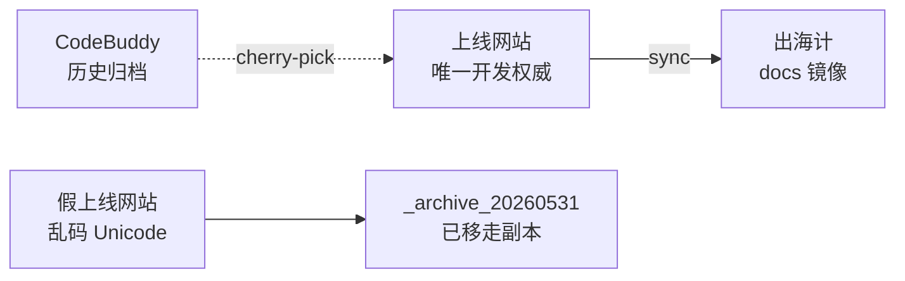
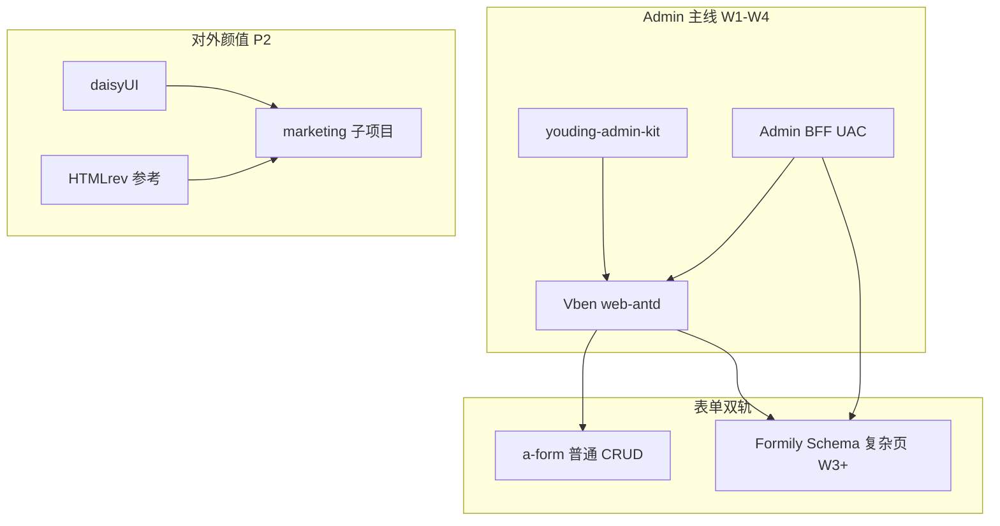

# ECC 专家组 · 第二轮联席会议纪要

> **会议模式**：M3 蜂群合议（决策 + 汇总，非 M4 七阶段全量）  
> **时间**：2026-05-31  
> **议题**：汇总迄今全部文档与决策 — 仓库治理、Admin 换皮、安全、清理、开源选型扩展（daisyUI / Formily / HTMLrev）  
> **项目**：`Desktop/上线网站` · FastAPI + Vue3 Admin · 234 路由 · 四壳（Client / Platform / Agent / Ops）  
> **主持**：架构指挥官（`architecture-commander`）

---

## 一、会议资料清单（已全部纳入本次合议）

| 文档 | 路径 | 本会用途 |
|------|------|----------|
| 源码仓说明 | `docs/SOURCE-REPO.md` | 定「唯一开发权威仓」 |
| 百家组装蓝图 UAC 1.0 | `docs/youding-admin-composite-blueprint.md` | 8 套抽取矩阵 + BFF 契约 |
| 安全加固 | `docs/youding-admin-security.md` | 六层纵深 + 模板供应链风险 |
| 换皮总 PRD | `docs/youding-admin-overhaul-prd.md` | OKR、三轨并行、不做什么 |
| 任务分配板 | `docs/youding-admin-overhaul-tasks.md` | Wave 0–4 + ECC 角色 |
| 桌面全盘扫描 | `docs/桌面项目全盘扫描报告.md` | 24 项目目录 + 混淆风险 |
| 清理日志 | `docs/desktop-cleanup-log-20260531.md` | 已执行 / 待办 / Unicode 假仓 |
| 扫描数据 | `results/desktop-project-scan.json` | 机器可读索引 |
| 前端 kit | `frontend/youding-admin-kit/MANIFEST.md` | Art/Soybean 抽取落地 |
| Admin BFF | `backend/app/api/v1/admin_bff/` | UAC 登录/用户/菜单适配 |
| 四壳治理 | `docs/四壳信息架构与菜单治理.md` | 菜单与壳隔离 |
| 未开发清单 | `未开发任务清单.md` | 主链 vs Stub |

**口头合议延伸（本会写入定案）**：

- 开源模板 8+2 套对比（Vben / Art / Edge / Soybean / Better / Pure / Naive / Element / RuoYi-Soybean）
- 新增三项：[daisyUI](https://github.com/saadeghi/daisyui) · [Formily](https://github.com/alibaba/formily) · [HTMLrev](https://htmlrev.com/)

---

## 二、与会 ECC 角色与职责

| 角色 | 智能体 ID | 本会发言要点 |
|------|-----------|--------------|
| 🎖 架构指挥官 | `architecture-commander` | 主持、拍板、三轨优先级 |
| 🎨 陈列视觉设计师 | `display-visual-designer` | 「丑」根因、Landing/Client 颜值 |
| 🧱 前端架构师 | `frontend-architect` | Vben 底座、Formily/daisyUI 边界 |
| 🔧 后台页面搭建 | `backend-page-builder` | Wave 2 Top12、表格 kit |
| 🗄 后端架构师 | `insulation-backend-architect` | BFF、FastAPI 不动、Schema API |
| 🔒 后端安全专家 | `insulation-backend-security-expert` | shell 参数、tenant 枚举、Token |
| 📋 产品经理 | `insulation-material-product-manager` | Client P0、Stub 隐藏、送检 |
| 📅 项目经理 | `insulation-digital-project-manager` | Wave 工期、清理风险、待办 |
| 🔍 代码审查专家 | `insulation-code-review-expert` | 假仓 Unicode、归档完整性 |
| 📣 营销网站专家 | `ai-marketing-website-expert` | HTMLrev、对外官网、SEO |
| 📝 方案文档专家 | `solution-document-writer` | 文档权威链、出海计同步 |

---

## 三、第一轮 · 现状共识（全员无异议）

### 3.1 产品阶段

- **「初步功能刚写完」**：可演示、**未产品化**；234 路由中大量 Stub / 实验室页。
- **主问题**：租户/超管/代理 **壳层无设计系统**（emoji 菜单、白盒边框），不像付费 SaaS。
- **技术债**：部分 router 未挂载、主链 API 未全 200；换皮须与 **轨 A 产品接线** 并行。

### 3.2 仓库与桌面治理（SOURCE-REPO + 扫描 + 清理）



| 路径 | 角色 | 状态 |
|------|------|------|
| `Desktop/上线网站`（U+4E0A…） | **唯一写代码、送检、换 Vben** | ✅ 保留 ~5100 文件 |
| `Desktop/出海计` | Obsidian + docs 镜像 | ✅ 保留 |
| `UJ/website CodeBuddy` | 历史总仓 ~36 万净文件 | ✅ 保留，禁止整仓 IDE |
| `_archive_20260531/` | 假仓 + wang-zhan 快照 | ✅ 已移入 |
| `UJ/整合好的` ~9 万文件 | 旧整合快照 | ⏸ **待夜间归档** |
| `Desktop/汇总` | 早期 PM 报告 | ✅ 保留，**非现状权威** |

**代码审查专家强调**：曾有两个 Unicode 不同、显示相似的「上线网站」目录 — 假仓已归档；脚本与 IDE **必须**指向真仓 UTF-8 路径。

### 3.3 文档权威顺序（产品经理 + 文档专家）

```text
上线网站/docs  >  出海计/docs（镜像）  >  汇总/开发文档（历史对照）
```

`出海计` 若仍从 CodeBuddy 同步的旧叙事，**以 `上线网站/docs` 为准覆盖**。

---

## 四、第二轮 · 技术战略定案（回顾 + 不变）

| 项 | 定案 | 来源文档 |
|----|------|----------|
| Admin 唯一底座 | **Vue Vben Admin 5 · `@vben/web-antd`** | PRD · 蓝图 · 第一轮 ECC |
| 不选 Art Design 整库 | Element Plus 与 270+ `a-form/a-table` 冲突 | Art / Edge 评估 |
| 抽取包 | **`youding-admin-kit`** | 蓝图 MANIFEST |
| 后端 | **FastAPI 业务 API 不动** | PRD |
| 统一契约 | **UAC BFF** `/api/v1/admin-bff/*` | 蓝图 · 已实现 auth/user/menu |
| 四壳 | Client / Platform / Agent / Ops，**一套 Vben + shell 分菜单** | 四壳文档 |
| 助手 | **财旺 UBrain 悬浮**，非菜单项 | PRD |
| 安全 | 六层纵深；前端权限不替代 API | security.md |

### 4.1 百家组装矩阵（8 套 — 只借不整库）

| 源仓库 | 借什么 | 不借什么 |
|--------|--------|----------|
| Vben | Layout、权限、动态路由、主题 | duplicate 第二工程长期并行 |
| Art / Edge | 表格 UX、搜索条、统计卡、authList、登录 UX | Element 组件 |
| Soybean | API 分层、路由模块化 | UnoCSS 全量 |
| Pure | Mock、移动侧栏 | 独立 Pure 工程 |
| Better | OpenAPI → CRUD 生成思路 | Better 页面模板 |
| Naive | Client 登录/Dashboard 视觉 | Naive 组件库 |
| Element Admin | 守卫 + meta 白名单 | Vue2 主分支 |
| RuoYi-Soybean | 字典/审计/日志能力清单 | Java 后端 |

---

## 五、第三轮 · 新增三项合议（daisyUI / Formily / HTMLrev）

### 5.1 daisyUI — [github.com/saadeghi/daisyui](https://github.com/saadeghi/daisyui)

| 专家 | 意见 |
|------|------|
| 前端架构师 | 项目已有 Tailwind 3.4，接入成本低；**不得进入 Vben 主 Layout** |
| 视觉设计师 | 适合 landing、活动页、助手浮层装饰 |
| 架构指挥官 | **P2**，不挡 Wave 1 |

**定案**：UAC 扩展 — **仅 marketing / landing / FAB chrome**；Admin 主界面仍 Ant Design Vue。

### 5.2 Formily — [formilyjs.org](https://formilyjs.org/) / [alibaba/formily](https://github.com/alibaba/formily)

| 专家 | 意见 |
|------|------|
| 后端架构师 | JSON Schema 驱动表单 ↔ BFF 字典/OpenAPI 输出天然契合 |
| 前端架构师 | Vue3 用 `@formily/antdv-x3`；**2023 后维护偏弱**，不可全站替换 `a-form` |
| 产品经理 | `site-editor` / SEO Schema 配置 ROI 最高 |
| 后台页面搭建 | 与 W3 **T-BE-11 CRUD 生成器** 绑定 |

**定案**：**P1 局部采用** — 先 1 个 Schema 重页面试点；与 Better 生成器同 Wave（W3–W4）；不全站迁移。

### 5.3 HTMLrev — [htmlrev.com](https://htmlrev.com/)

| 专家 | 意见 |
|------|------|
| 营销网站专家 | Vue Admin 区全是 Vuetify，**不能当后台壳** |
| 视觉设计师 | Tailwind SaaS Landing、Astro 模板可作 **对外官网 moodboard** |
| 项目经理 | 0.5–1 人日挑模板即可，不进代码主线 |

**定案**：**设计资源站**，非第 10 个代码仓库；优先 Tailwind/Astro landing，不选 Vuetify Admin。

### 5.4 更新后的技术分层图



---

## 六、第四轮 · 安全专项（安全专家 + 后端架构师）

### 6.1 已落地

- BFF **shell** 由 JWT role 推导，禁止 query 越权到 platform（见 security.md 与 `menu_adapter`）。

### 6.2 Wave 1 必做（T-BE-01 / T-SEC-01）

| 项 | 说明 |
|----|------|
| tenant/search 防枚举 | 限流 + 模糊结果脱敏 |
| captcha 或加强 bruteforce | Edge 契约 stub 不可上生产 |
| 动态路由 component **白名单** | 防菜单 JSON 注入任意 import |
| Token | 短 access + refresh；评估 httpOnly cookie |
| 依赖 | `pnpm audit` / pip audit 进 CI |
| 演示账号 | Vben `vben/123456` **生产禁用** |

### 6.3 四壳 E2E（T-QA-01）

- 代理 JWT **不得**看到 platform 菜单；shell 与 menu API 双重校验。

---

## 七、第五轮 · 产品与客户价值（产品经理 + 营销）

### 7.1 OKR（90 天草案 — PRD 第二节）

- **O**：租户与内部团队认为「这是正经 SaaS」。
- **KR**：onboarding 3 步完成率、Client 菜单 ≤5、支持工单 ↓30%、Dashboard LCP < 2.5s。

### 7.2 用户优先级（不变）

```text
P0 Client 租户 → P1 新注册 onboarding → P2 Agent → P3 Platform → P4 Ops
```

### 7.3 核心旅程（必须先通）

```text
注册/登录 → 套餐 → Dashboard → onboarding 卡 → 询盘/发品/账户 → 财旺
```

**原则**：有真实数据的页才换皮；Stub **隐藏或统一下线页**（T-PM-02、T-FE-22）。

---

## 八、第六轮 · 执行计划（项目经理拍板）

### 8.1 三轨并行（PRD 第六节）

| 轨 | 内容 | Wave |
|----|------|------|
| **A 产品完善** | 主链接线、Stub 矩阵、onboarding 数据 | W0–W2 |
| **B 体验换皮** | Vben、TenantShell、Dashboard、Top12 | W1–W4 |
| **C 治理安全** | BFF 加固、四壳 E2E、送检/开源声明 | W1–W4 |

### 8.2 近期里程碑

| 阶段 | 时间 | 交付 |
|------|------|------|
| **W0** | 本周 | T-PM-01~06、T-ARCH-01；清理假仓 ✅ |
| **W1** | 第 2–3 周 | `admin-vben` clone + BFF 登录 + Client 动态菜单 |
| **W2** | 第 4–6 周 | TenantShell、Dashboard、Top12、登录分屏 |
| **W3** | 第 7–10 周 | Platform/Agent、Stub 隐藏、审计、**Formily 试点 1 页** |
| **W4** | 第 11–12 周 | 生产切换、回滚演练、OKR 复盘 |

### 8.3 任务板状态（2026-05-31）

- Wave 0–4 表内任务：**均为 `todo`**（蓝图/BFF/kit 骨架已写入仓库，未计为任务 done）。
- 清理：**部分 done**（见 `desktop-cleanup-log-20260531.md`）。

---

## 九、第七轮 · 各专家最终发言摘要

### 🎖 架构指挥官

> 唯一底座 Vben + 唯一开发仓 `上线网站` + 唯一契约 UAC BFF。daisyUI/HTMLrev 不进 Admin；Formily 只服务 Schema 重页。三轨并行，禁止 234 页大爆炸迁移。

### 🎨 陈列视觉设计师

> 「丑」在缺设计系统，不在 Ant Design 本身。Client 先 Dashboard + 登录分屏；对外页用 HTMLrev + daisyUI 补第一印象。

### 🧱 前端架构师

> Wave 1 只 clone `web-antd` 并接 BFF；`youding-admin-kit` 随 Client 页迁入。Formily 试点选 `tenants/site-editor` 或 `seo/schema-markup` 之一。

### 🗄 后端架构师

> 业务 API 零破坏；BFF 继续扩字典/审计。Formily 需要 Schema 存储与版本 API — 列入 W3。

### 🔒 后端安全专家

> 模板供应链 + 前端权限幻觉是最大误用风险。shell 修复是正确方向；Wave 1 必须完成 tenant 枚举与 component 白名单。

### 📋 产品经理

> Client P0 不变。Stub 矩阵和送检影响（T-PM-05）是 **blocked 项**，需 Project Owner 书面答复后才能定 W4 切换日。

### 📅 项目经理

> `整合好的` 归档安排夜间 robocopy；不回滚已归档假仓。W1 人力焦点：2 前端 + 1 后端 + 0.5 视觉，其余 Wave 2 再扩。

### 🔍 代码审查专家

> 清理采用「移动归档」正确。建议 `scan-desktop-projects.py` 每月跑一遍；`SOURCE-REPO.md` 增加 Unicode 假仓警示段。

### 📣 营销网站专家

> HTMLrev 短名单：Tailwind SaaS landing → 租户注册页；AstroWind → 公司官网。与 Admin 换皮分仓库或 `frontend/marketing`。

### 📝 方案文档专家

> 本会纪要 + 六份核心 doc 应 sync 至 `出海计/docs`；`汇总` 内 docx **标注过期**，勿再当进度来源。

---

## 十、会议决议（Action Items）

| # | 决议 | 负责 | 优先级 |
|---|------|------|--------|
| R1 | **开发、送检、换 Vben 仅认** `Desktop/上线网站` | 全员 | P0 |
| R2 | Wave 1 启动：`frontend/admin-vben` + BFF 登录/菜单 | 前端/后端架构师 | P0 |
| R3 | 完成 Stub 可见性矩阵 + Top30 路由数据 | 产品经理 | P0 |
| R4 | BFF P1 安全：tenant 枚举、captcha/限流、component 白名单 | 安全 + 后端 | P0 |
| R5 | 夜间归档 `UJ/整合好的` → `_archive_20260531` | 项目经理 | P1 |
| R6 | Formily **1 页试点**（site-editor 或 schema-markup） | 全栈 + 后端 | P1 · W3 |
| R7 | daisyUI + HTMLrev → `frontend/marketing` 或 kit Landing 皮 | 视觉 + 营销 | P2 |
| R8 | sync docs 至出海计；更新扫描报告「假仓已归档」 | 文档专家 | P1 |
| R9 | 产出 `OPEN-SOURCE-NOTICES.md`（Vben + kit + Formily + daisyUI） | 产品经理 · 合规 | P1 |
| R10 | 10 分钟回滚 runbook（双 admin 并行） | DevOps | P1 · W1 |

---

## 十一、仍待 Project Owner 确认（Blocked）

| 问题 | 影响 |
|------|------|
| Project Owner 正式署名 | PRD、送检材料 |
| **送检**：换 Client 壳是否触发手册/UI 重拍 | W4 切换窗口 |
| 旧 `frontend/admin` **下线日** 与只读备份策略 | T-OPS-02 |
| 生产回滚 **SLA 窗口**（如 10 分钟） | T-OPS-01/03 |
| Brand Tier：统一壳 vs Logo+主色 vs 白标登录 | T-PM-04、T-UX-02 |

---

## 十二、相关链接速查

| 类型 | URL |
|------|-----|
| 底座 | https://github.com/vbenjs/vue-vben-admin |
| Art 参考 | https://github.com/Daymychen/art-design-pro |
| Edge 参考 | https://github.com/ChnMig/art-design-pro-edge |
| RuoYi 能力清单 | https://github.com/m-xlsea/ruoyi-plus-soybean |
| Tailwind 组件 | https://github.com/saadeghi/daisyui |
| 动态表单 | https://github.com/alibaba/formily · https://formilyjs.org/ |
| Formily AntDV Vue3 | https://github.com/formilyjs/antdv-x3 |
| 模板聚合 | https://htmlrev.com/ |

---

## 十三、会后同步

```powershell
# 文档同步至出海计（若脚本可用）
powershell -ExecutionPolicy Bypass -File "C:\Users\97907\Desktop\上线网站\scripts\sync-to-chuhaiji-kb.ps1"
```

**下次会议触发条件**（第三轮 ECC）：

1. Wave 1 完成：`admin-vben` 登录 + Client 菜单跑通  
2. T-PM-05 送检结论书面化  
3. Formily 试点页选定并 spike 完成  

---

*本纪要由 ECC 专家组 M3 合议生成 · 2026-05-31 · 对应仓库 `docs/ecc-round2-meeting-minutes-20260531.md`*
