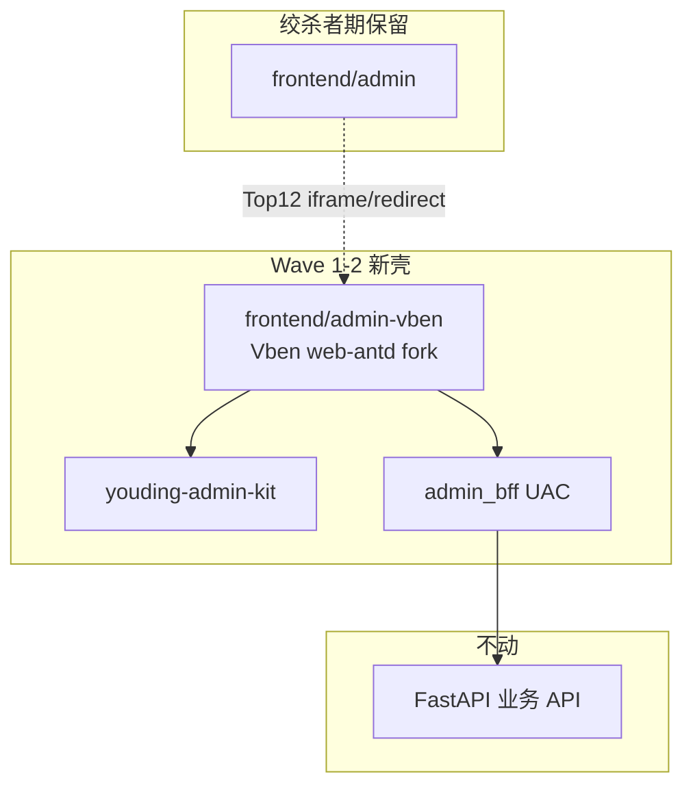

# ECC 专家组 · 第三轮联席会议纪要

> **会议模式**：M3 蜂群合议（Phase 0 收官 → Wave 1 启动授权）  
> **时间**：2026-06-01  
> **议题**：依据 [99-synthesis-for-uac.md](./open-source-audit/99-synthesis-for-uac.md) 评审 Phase 0 深读成果，拍板「集百家所长」执行顺序与禁区  
> **项目**：`Desktop/上线网站` · FastAPI + Vue3 Admin · 234 路由 · 四壳（Client / Platform / Agent / Ops）  
> **主持**：架构指挥官（`architecture-commander`）

---

## 一、会议资料清单（本轮唯一权威输入）

| 文档 | 路径 | 本会用途 |
|------|------|----------|
| **百家汇总 v1（编码门禁）** | `docs/open-source-audit/99-synthesis-for-uac.md` | **主议程 · Wave 1 解锁依据** |
| Phase 0 进度 | `docs/open-source-audit/PHASE0-STATUS.md` | 克隆/深读完成度 |
| Vben 深读 | `docs/open-source-audit/01-vben-web-antd.md` | 壳 + 5 处 API 接线 |
| Art Edge 深读 | `docs/open-source-audit/02-art-design-pro-edge.md` | useTable / 列拖拽 |
| Soybean 深读 | `docs/open-source-audit/03-soybean-admin.md` | API 分层规范 |
| Better 深读 | `docs/open-source-audit/06-vue-admin-better.md` | CRUD 生成器模式 |
| 现网诊断 | `docs/open-source-audit/10-youding-admin-current.md` | 234 路由 / 0 BFF |
| BFF 诊断 | `docs/open-source-audit/11-youding-admin-bff.md` | 6 端点 / bug 清单 |
| kit 差距 | `docs/open-source-audit/12-youding-admin-kit-gap.md` | 108 行 vs Art 734 行 |
| Formily 结构 | `docs/open-source-audit/13-formily-antdv-x3.md` | W3 试点边界 |
| 第二轮 ECC | `docs/ecc-round2-meeting-minutes-20260531.md` | 战略定案延续 |
| 本地镜像 | `_ref/`（12 库） | 只读参考，禁止改 `_ref/` |

**口头合议结论**：第二轮 ECC 定案（Vben 唯一壳、BFF UAC、Formily/daisyUI/HTMLrev 边界）**不变**；本轮在 Phase 0 深读证据上 **批准 Wave 1 启动**。

---

## 二、与会 ECC 角色与职责

| 角色 | 智能体 ID | 本轮发言要点 |
|------|-----------|--------------|
| 🎖 架构指挥官 | `architecture-commander` | 12 库已镜像；唯一壳 = Vben；99 汇总 v1 批准 Wave 1 |
| 🧱 前端架构师 | `frontend-architect` | guard/access/auth 链已本地验证；5 处 API + `backend` 模式 |
| 🔧 后台页面搭建 | `backend-page-builder` | Top12 绞杀者迁移；Art table 逻辑 Wave 2 必移植 |
| 🗄 后端架构师 | `insulation-backend-architect` | BFF 修 agent home + 四壳 seed；业务 FastAPI 不动 |
| 🔒 后端安全专家 | `insulation-backend-security-expert` | shell JWT、component 白名单；Vben demo 账号生产禁用 |
| 📋 产品经理 | `insulation-material-product-manager` | Client Top12 先迁；Stub 隐藏；主链 > 实验室 |
| 🎨 陈列视觉设计师 | `display-visual-designer` | Naive/HTMLrev/daisyUI 仅 landing/登录皮 |
| 📅 项目经理 | `insulation-digital-project-manager` | W1-1→W1-3→W1-4 串行；双 admin 回滚与 W1-4 同步 |
| 🔍 代码审查专家 | `insulation-code-review-expert` | kit 未达「集百家」；禁止宣称表格已完成 |
| 📣 营销网站专家 | `ai-marketing-website-expert` | HTMLrev moodboard → `frontend/marketing` |
| 📝 方案文档专家 | `solution-document-writer` | 本纪要 + 99 汇总 sync 出海计 |

---

## 三、Phase 0 验收（对照 99 汇总 §十三）

| 验收项 | 标准 | 状态 |
|--------|------|------|
| 12 库 clone 至 `_ref/` | 含 `vue-vben-admin-full`（非 sparse） | ✅ |
| 核心深读 | Vben / Art / Soybean / Better / Formily / 现网 / BFF | ✅ 7/12 |
| 可选补读 | Element / Naive / Pure / RuoYi / daisyUI | ⏳ **非阻塞** |
| 编码门禁文档 | `99-synthesis-for-uac.md` v1 | ✅ |
| `frontend/admin-vben` | 尚未创建 | ⏳ Wave 1 |

**决议**：Phase 0 **通过** · Wave 1 **授权启动**（建议执行顺序：W1-2 BFF 修复 → W1-1 fork → W1-3 接线 → W1-4 E2E）。

---

## 四、深读共识（99 汇总 §二–§三）

### 4.1 12 源库角色定案

| 源 | 对优丁角色 | 抽取度 |
|----|------------|--------|
| **Vben 5 web-antd** | **唯一 Admin 壳** | 整库 fork → `frontend/admin-vben` |
| **Art Edge** | 表格 / 登录 / 列拖拽 | 逻辑 → `youding-admin-kit` |
| **Soybean** | API 分层 / refresh | 逻辑 only |
| **Better** | CRUD 三件套模式 | 模式 → `gen-crud-from-openapi.mjs`（W3） |
| **Formily antdv-x3** | Schema 复杂表单 | 1 试点页（W3） |
| **Naive / HTMLrev / daisyUI** | 对外颜值 | landing / 登录皮 only |
| **RuoYi-Soybean** | 字典 / 审计清单 | BFF 能力路线图 |
| Element / Pure / Art Pro | 守卫 meta / Mock / 视觉上游 | 参考，不整库 |

### 4.2 现网诊断（全员无异议）

| 发现 | 影响 |
|------|------|
| **234** 叶子路由在 **1** 个文件 | 禁止大爆炸迁移 |
| **0** BFF / **0** kit 引用 | UAC 未接线 |
| Client **emoji 硬编码菜单** | 不像付费 SaaS |
| **~80+** Stub / 实验室路由 | 租户可见 = 掉价 |
| BFF **agent homePath 错误** | 动态路由 404（已文档化修复方向） |
| kit **~108 行** vs Art **734 行** useTable | 表格体验远未到位 |

---

## 五、目标架构（绞杀者 · 99 汇总 §四）

**一句话产品目标**（99 §一）：一套看起来像付费 SaaS 的四壳后台 — Vben 壳 + Art 表格 + Soybean API 规范 + BFF 契约 + kit 抽取层；Formily 管复杂表单；daisyUI/HTMLrev 管对外颜值；**不**混第二 UI 库、**不**换 FastAPI。

---

## 六、Wave 1 技术定案（99 汇总 §五、§九、§十一）

### 6.1 Vben → BFF 必改 5 处

| Vben 文件 | 现默认 | 改为优丁 BFF |
|-----------|--------|--------------|
| `api/core/auth.ts` | `POST /auth/login` | `POST /api/v1/admin-bff/auth/login` |
| `api/core/user.ts` | `GET /user/info` | `GET /api/v1/admin-bff/user/info` |
| `api/core/auth.ts` codes | `GET /auth/codes` | `GET /api/v1/admin-bff/menu/permissions` → `codes` |
| `api/core/menu.ts` | `GET /menu/all` | `GET /api/v1/admin-bff/menu/routes?shell=` |
| `preferences` | `accessMode: frontend` | **`backend`** |

**响应适配**：Vben 期望 `{ code: 0, data: T }` — FastAPI 对齐或 `request.ts` interceptor adapter。

### 6.2 BFF Wave 1 前修复清单

- [x] `resolve_home_path('agent')` → `/agent/performance`（方向已定，实现待验）
- [x] `AGENT_SEED` / `OPS_SEED` 四壳最小菜单（方向已定）
- [ ] `get_user_info` 填充 `tenant`
- [ ] `bff_tenant_search` 接 tenants 表
- [ ] login 响应 `accessToken` 与 Vben 对齐
- [ ] menu `component` 路径白名单

### 6.3 Wave 1 任务切片（ECC 分配）

| ID | 任务 | 负责 | 验收 |
|----|------|------|------|
| **W1-1** | copy `_ref/vue-vben-admin-full` → `frontend/admin-vben` | 前端架构 | `pnpm dev:antd` 可启动 |
| **W1-2** | BFF §6.2 清单 | 后端架构 + 安全 | 单测 / API 文档 |
| **W1-3** | Vben 5 API + `accessMode: backend` | 前端 + 后端 | 全部指向 BFF |
| **W1-4** | 登录 → Layout → Client 动态菜单 smoke | 全栈 | E2E 通过 |
| **W1-5** | Client shell 动态菜单 ≤6 项 smoke | 前端 + 产品 | 截图 / 用例 |
| **W1-6** | 双前端 10 分钟回滚 runbook | DevOps / 项目经理 | 演练记录 |

**执行顺序（项目经理拍板）**：W1-2 → W1-1 → W1-3 → W1-4 → W1-5/W1-6 并行。

---

## 七、Wave 2–3 路线图（本轮只锁定边界，不启动编码）

### P1 — Wave 2（好用 + 颜值）

| 动作 | 源 | 目标 |
|------|-----|------|
| 移植 table 逻辑 | Art `utils/table/*` | `kit/composables/` |
| 列拖拽 UI | Art `art-table-header` | `kit/components/YdTableHeader.vue` |
| 搜索条 | Art `ArtSearchBar` | 扩展 `YdSearchBar.vue` |
| API 规范 | Soybean `service/api` | `admin-vben/src/api/modules/` |
| 水印 / 登录皮 | Art Edge + Naive 参考 | `YdWatermark.vue` · `TenantLogin.vue` |
| **Top12 Client** | 现网 `views/client/*` | 迁入 Vben views |

**Top12 硬清单**：dashboard · products · inquiries · content · seo-matrix/publish · billing · onboarding · tokens · invoices · settings · assistant · login

### P2 — Wave 3（模块化 + 扩展）

- Better → `scripts/gen-crud-from-openapi.mjs`
- Formily 试点 → `tenants/site-editor` 或 SEO schema **二选一**
- RuoYi 字典/审计 → BFF `/dict` `/audit`
- HTMLrev + daisyUI → `frontend/marketing`

---

## 八、禁止清单（ECC 定案 · 99 汇总 §七）

- ❌ Element / Naive **组件库**进 Admin 主壳  
- ❌ 234 路由一次性 rewrite  
- ❌ Java RuoYi 替换 FastAPI  
- ❌ 未 adapter 的 Soybean `0000` 码 / `current/size`  
- ❌ 把 `drag-module` 当生产低代码（无 API）  
- ❌ 继续开发 `_ref/` 内代码  
- ❌ 在 kit 未移植 Art table 前宣称「集百家所长」已完成  

---

## 九、路由迁移策略（234 → 绞杀者 · 99 汇总 §八）

| 阶段 | 范围 | 方式 |
|------|------|------|
| W1 | Platform 空壳 + 登录 | Vben 跑通 BFF |
| W2 | Client **Top12** | 复制 view + BFF 菜单 seed |
| W2 | Stub **隐藏** | `meta.hideInMenu` + 产品矩阵 |
| W3 | Platform 8 主干 | 同上 |
| W4 | 旧 admin redirect | Nginx / 路由别名 |
| 长期 | 实验室 80+ | Feature Flag 关 |

---

## 十、各专家最终发言摘要

### 🎖 架构指挥官

> Phase 0「好饭不怕晚」已兑现：12 库本地、7 份深读、99 汇总 v1 即编码门禁。Wave 1 只 fork + 接线，不碰 234 页。Art/Soybean/Better/Formily 永远是抽取，不是第二壳。

### 🧱 前端架构师

> `_ref/vue-vben-admin-full` 已验证 login → fetchUserInfo → getAccessCodes → push(homePath) 链。W1-3 改 5 处 API 即可；`accessMode: backend` 是切换四壳动态菜单的关键开关。

### 🔧 后台页面搭建

> Wave 2 前禁止批量迁 view。Top12 每页迁入时同步接 kit 表格；Art 734 行 useTable 是 Wave 2 的硬工作量，不是可选优化。

### 🗄 后端架构师

> BFF 六端点骨架在，Wave 1 补 tenant/info/captcha 即可支撑 Vben 登录流。业务 FastAPI 零改动；字典/审计走 W3 RuoYi 清单进 BFF。

### 🔒 后端安全专家

> menu `component` 白名单与 shell JWT 推导是 Wave 1 必做，与 W1-4 同批验收。Vben 内置 demo 账号必须在生产 build 禁用。

### 📋 产品经理

> Client Top12 是 Wave 2 唯一硬清单；Stub 矩阵 W1-6 前需签字。~80+ 实验室页租户不可见，否则送检叙事与 SaaS 定位冲突。

### 🎨 陈列视觉设计师

> Admin 颜值靠 Vben 主题 + Art kit，不靠 Naive 组件。TenantLogin 分屏皮 Wave 2 跟 kit 一起上；对外第一印象仍走 HTMLrev + daisyUI。

### 📅 项目经理

> W1 人力：2 前端 + 1 后端 + 0.5 DevOps。W1-2 与 W1-1 可部分并行（不同人）。`整合好的` 归档仍待夜间 robocopy（延续 R2-5）。

### 🔍 代码审查专家

> 99 汇总诚实标注 kit 108 行 vs Art 734 行 — 好评。Wave 1 PR 只应出现 admin-vben + BFF + 文档，不应夹带 Top12 迁移。

### 📣 营销网站专家

> Wave 3+ 再开 `frontend/marketing`；HTMLrev 短名单不变（Tailwind SaaS landing / AstroWind 官网）。

### 📝 方案文档专家

> 本纪要 + `99-synthesis-for-uac.md` 为 Wave 1 唯一任务来源；override 第二轮 ECC 中「Wave 1 任务均为 todo」的描述 — **现改为 W1-1～W1-6 已分配、可执行**。

---

## 十一、会议决议（Action Items）

| # | 决议 | 负责 | 优先级 |
|---|------|------|--------|
| R3-1 | **Phase 0 通过** · **Wave 1 授权启动** | 架构指挥官 | P0 |
| R3-2 | 执行 W1-2 → W1-1 → W1-3 → W1-4 串行切片 | 前端 + 后端架构师 | P0 |
| R3-3 | BFF：tenant、user.info.tenant、captcha、component 白名单 | 后端 + 安全 | P0 |
| R3-4 | fork `vue-vben-admin-full` → `frontend/admin-vben` | 前端架构师 | P0 |
| R3-5 | Stub 可见性矩阵（产品签字） | 产品经理 | P0 · W1-6 前 |
| R3-6 | 双 admin 10 分钟回滚 runbook + 演练 | DevOps | P1 · 随 W1-4 |
| R3-7 | Wave 2 锁定 Art table + Top12 迁入计划评审 | 后台页面搭建 + 产品 | P1 · W1-4 后 |
| R3-8 | sync 本纪要 + 99 汇总至 `出海计/docs` | 文档专家 | P1 |
| R3-9 | `OPEN-SOURCE-NOTICES.md` 含 Vben + Formily + daisyUI | 产品 · 合规 | P1 |

---

## 十二、仍待 Project Owner 确认（Blocked · 延续 R2）

| 问题 | 影响 |
|------|------|
| **送检**：Client 换壳是否触发手册 / UI 重拍 | W4 切换窗口 |
| 旧 `frontend/admin` **正式下线日** | T-OPS-02 |
| 生产回滚 **SLA 窗口**（如 10 分钟） | W1-6 runbook |
| Brand Tier：统一壳 vs Logo+主色 vs 白标登录 | TenantLogin 设计 |

---

## 十三、下一轮 ECC 触发条件

1. **W1-4** 登录 + Layout + Client 动态菜单 E2E 通过  
2. Formily **试点页**（site-editor vs schema-markup）二选一定案  
3. **Top12 Client** 迁入排期与 Stub 矩阵产品签字  

---

## 十四、相关链接速查

| 类型 | 路径 / URL |
|------|------------|
| 编码门禁 | [99-synthesis-for-uac.md](./open-source-audit/99-synthesis-for-uac.md) |
| Phase 0 状态 | [PHASE0-STATUS.md](./open-source-audit/PHASE0-STATUS.md) |
| 本地 Vben 全量 | `_ref/vue-vben-admin-full` |
| Admin BFF | `backend/app/api/v1/admin_bff/` |
| kit | `frontend/youding-admin-kit/` |
| Vben 上游 | https://github.com/vbenjs/vue-vben-admin |

---

*2026-06-01 · ECC 第三轮 · 依据 99 百家汇总 v1 · Phase 0 收官 · Wave 1 启动*
