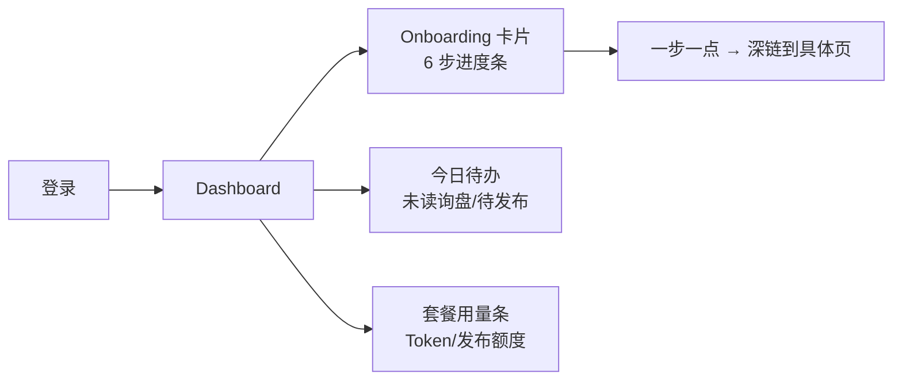
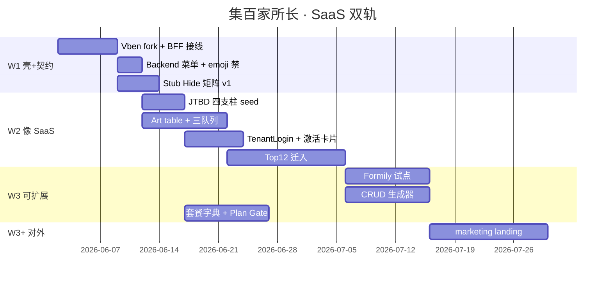

# ECC 专家组 · 第四轮专项合议 — 集百家所长 × SaaS 改造

> **会议模式**：M3 蜂群合议 + **SaaS 专家缺席补位**  
> **时间**：2026-06-01  
> **议题**：在 99 汇总技术组装之上，补齐 **SaaS 产品化视角**，输出可执行的改造方案  
> **依据**：`99-synthesis-for-uac.md` · `youding-admin-overhaul-prd.md` · `四壳信息架构与菜单治理.md` · R3 纪要  
> **主持**：架构指挥官

---

## 一、会议开场 — 角色缺口认定

### 1.1 现状：ECC 有技术、缺 SaaS

| 已有角色 | 覆盖 | **未覆盖的 SaaS 能力** |
|----------|------|------------------------|
| 架构/前后端/安全 | 壳、BFF、权限、绞杀者 | 多租户激活漏斗、套餐边界 UX |
| 产品经理（建材向） | P0 功能清单 | **Jobs-to-be-done 导航**、Trial→Paid |
| 视觉/营销 | Landing、登录皮 | **产品内**用量感知、升级动线 |
| 后台页面搭建 | 表格/CRUD | **空状态=下一步激活** |

**共识**：Phase 0 解决了「从哪抄代码」；**未解决「抄完为什么像 SaaS」**。  
第三轮 ECC 授权了 Wave 1，但若无 SaaS 专家，极易做成 **「Vben 换皮 + 234 页搬家」**，而非 **「付费产品体验」**。

### 1.2 决议：增补 ECC 第十一席

| 项 | 定案 |
|----|------|
| **新角色** | 🚀 **SaaS 产品策略专家**（`saas-product-strategist`） |
| **职责** | 多租户激活、菜单 JTBD 化、套餐/用量 UI、Trial 转化、Stub 产品策略 |
| **与会方式** | 本轮由 **架构指挥官代行 + 产品/视觉/营销三角合议**；下轮起正式入席 |
| **Skill 绑定（建议）** | `feedback-synthesizer` · `behavioral-nudge-engine` · `product-manager` · `ui-design-handoff` |
| **待办** | 写入 `.lingma/agents-config.md` + `agent-skill-map` 增行 |

**临时代行发言原则**：凡涉及「租户会不会觉得专业」「菜单该不该出现」「未完成 setup 怎么催」— **SaaS 席一票否决 Stub 外露**。

---

## 二、集百家所长 — 从「技术抽取」升级为「SaaS 能力矩阵」

> 技术组装见 99 汇总；下表回答：**每一源库为 SaaS 感贡献什么改造**。

| 源库 | 技术抽取（已有） | **SaaS 改造贡献（本轮新增）** | Wave |
|------|------------------|-------------------------------|------|
| **Vben** | Layout、动态路由、主题 | **Backend 菜单** → 按角色/套餐下发，消灭 emoji 硬编码 | W1 |
| **Art Edge** | useTable、列拖拽、搜索条 | **工作队列 UX**（询盘/发布任务=待办 inbox） | W2 |
| **Soybean** | API 分层 | **错误码/刷新** 一致 → 减少「像内部工具」的裸报错 | W1 |
| **Naive Admin** | 登录分屏皮 | **Tenant 品牌位**（Logo/公司名/套餐徽章） | W2 |
| **Better** | CRUD 生成器 | **快速补全 Top12** 标准列表页，统一 SaaS 表格密度 | W3 |
| **Formily** | Schema 复杂表单 | **site-editor / SEO** = 可配置产品能力，非实验室 | W3 |
| **RuoYi-Soybean** | 字典/审计清单 | **套餐字典 + 操作审计** → 企业客户信任感 | W3 |
| **Pure** | Mock/移动侧栏 | Client **移动端侧栏** → 老板手机上看询盘 | W2 |
| **Element Admin** | meta 白名单 | **hideInMenu + planGate** meta 扩展 | W1 |
| **daisyUI / HTMLrev** | Landing | **注册→开通** 对外漏斗与 Admin **视觉同源** | W3+ |

---

## 三、SaaS 改造方案（ECC 拍板 · 六条主线）

### 方案 A · **JTBD 导航重组**（最高优先级 · SaaS 专家主笔）

**问题**：现网 Client 16 项 emoji 菜单 = 功能目录，不是任务导向。  
**对标**：四壳文档「四支柱 + 1 助手」；PRD KR2「一级菜单 ≤5」。

```text
现：📦产品 📧询盘 📝内容 🔍SEO 💰账单 …（16 项）
改：获客 | 发品 | 履约 | 账户  （+ 助手悬浮）
     └─ 二级只在支柱内展开，BFF seed 控制
```

| 动作 | 源 | 落地 |
|------|-----|------|
| BFF Client seed 重写为 4 支柱 | 四壳文档 | `menu_adapter.py` CLIENT_SEED |
| 旧路由 **redirect** 进支柱 | 绞杀者 | W2 Top12 映射表 |
| 菜单 icon 用 Lucide/Remix，**禁 emoji** | Vben 主题 | `preferences` + BFF meta |

**验收**：新租户 3 次点击到「处理第一条询盘」或「发第一条内容」。

---

### 方案 B · **激活层（Activation Layer）** — Dashboard 不是统计壳

**问题**：Dashboard 若无「下一步」，SaaS 激活率归零。  
**百家来源**：Art 统计卡 + Naive 极简 + **SaaS 专家** onboarding checklist。



| 组件 | 源 | kit/Vben 位置 |
|------|-----|---------------|
| `YdOnboardingCard.vue` | Linear/Notion 模式 · SaaS 专家 | `youding-admin-kit` |
| `YdUsageMeter.vue` | Stripe usage 模式 | kit + BFF `/user/info` 扩字段 |
| `YdTodayQueue.vue` | Art 表格精简版 | kit composable |

**BFF 扩展（W2）**：`GET /admin-bff/user/info` 增加 `onboarding_steps[]`、`plan_usage{}`。

**验收**：KR1 — 7 日内完成 onboarding 核心 3 步 ≥ 50%。

---

### 方案 C · **租户身份与登录 SaaS 化**

**问题**：无 tenant_code 搜索、无分屏登录、header 无租户品牌。  
**百家来源**：Art Edge 多租户登录 + Naive 分屏 + Vben preferences。

| 改造 | 说明 |
|------|------|
| `TenantLogin.vue` | 左品牌叙事 + 右表单；tenant_code 模糊搜（BFF 已有端点规划） |
| Header **工作区条** | 公司名 + 套餐名 + 用量迷你条 |
| Brand Tier（blocked） | Tier1 统一壳 / Tier2 Logo+主色 / Tier3 白标 — 需 Owner |

**验收**：登录页与 Dashboard header **同一租户品牌**可见。

---

### 方案 D · **Stub 产品策略 — 看不见 ≠ 删代码**

**问题**：80+ 实验室路由租户可见 = 掉价；全删 = 送检/演示损失。  
**SaaS 专家定案**：

| 策略 | 适用 | 实现 |
|------|------|------|
| **Hide** | 无 API、纯 toast | BFF `hideInMenu: true` + 前端不注册 |
| **Plan Gate** | 有 API 但非本套餐 | meta `planGate: ['pro']` + 升级 CTA 页 |
| **Lab Flag** | 内部演示 | `FEATURE_LAB=1` 仅 platform 角色 |
| **Kill** | 重复/有毒 | 归档 redirect，不进 Vben |

**产出物**：`docs/stub-visibility-matrix.md`（产品签字 · W1-6 前）。

---

### 方案 E · **工作队列统一（Art 表格 SaaS 化）**

**问题**：询盘、发布、订单分散在不同菜单，不像「 inbox 型 SaaS」。  
**百家来源**：Art `useTable` 734 行 + Edge 搜索条。

| 队列 | 首屏列 | 主操作 |
|------|--------|--------|
| 获客队列 | 未读询盘 | 回复 / 转 IM |
| 发布队列 | 进行中任务 | 看进度 / 重试 |
| 履约队列 | 待填单号 | 填物流 |

**落地**：Wave 2 移植 Art table 至 kit 后，**Top12 中 3 页先做队列范式**，其余列表页复用同一 `useYoudingTable`。

**验收**：Client 用户描述为「待办清晰」，而非「找不到在哪个菜单」。

---

### 方案 F · **套餐与商业化触面（Commercial Surface）**

**问题**：billing/tokens  buried 在菜单深处，续费/升级无感知。  
**百家来源**：RuoYi 字典 + SaaS 专家 + Art 统计卡。

| 触面 | 位置 | 行为 |
|------|------|------|
| 用量警告 | Header _meter + Dashboard | 80%/100% 阈值 |
| 升级 CTA | Plan Gate 页 | 对比表 + 一键联系/自助升级 |
| 发票/账单 | 账户支柱二级 | Top12 已有 billing/invoices |

**BFF W3**：`/admin-bff/dict/plan_features` · 套餐功能矩阵。

---

## 四、改造总路线图（技术 × SaaS 双轨）



---

## 五、各专家发言（含 SaaS 代行）

### 🚀 SaaS 产品策略专家（代行 · 架构指挥官）

> 99 汇总回答了「用什么壳」；没回答「租户为何付钱」。**四支柱导航 + 激活卡片 + 用量触面** 三件套比再换一个 UI 库重要。Stub 必须 Plan Gate 或 Hide，禁止租户看到实验室。建议正式设立 `saas-product-strategist` 席，W2 前写入 agents-config。

### 🎖 架构指挥官

> 同意双轨：Wave 1 不挡 SaaS，但 W1 必须 **backend 菜单 + emoji 禁**。方案 A/C/D 与 BFF 同源，不新开微服务。

### 🧱 前端架构师

> `planGate` 作为 BFF meta 扩展字段，Vben guard 读 meta 即可。Activation 组件放 kit，Vben 只引用。Formily 试点仍限 1 页。

### 📋 产品经理

> Top12 不变；**映射进四支柱** 而非平铺 12 个一级菜单。Stub 矩阵我本周出 v1 草案。

### 🎨 视觉设计师

> TenantLogin + Header 工作区条是「像 SaaS」的最低视觉成本；emoji 全量替换 Lucide。HTMLrev 只服务注册漏斗，不进 Admin。

### 🗄 后端架构师

> `user/info` 扩 onboarding + usage 字段 W2 做；不堵 W1 登录。字典/审计走 RuoYi 清单 W3。

### 🔒 安全专家

> Plan Gate 必须服务端校验套餐，不能只靠前端 hide。tenant 枚举 W1 必做。

### 📣 营销网站专家

> 方案 F 的升级 CTA 与对外 pricing 页文案同源，避免 Admin 与官网套餐名不一致。

---

## 六、会议决议

| # | 决议 | 负责 | 优先级 |
|---|------|------|--------|
| R4-1 | **增补 SaaS 产品策略专家** 入 ECC 编席 | 架构指挥官 | P0 |
| R4-2 | 执行 **方案 A** JTBD 四支柱（BFF seed + emoji 禁） | SaaS代行 + 后端 | P0 · W1 末 |
| R4-3 | 执行 **方案 B** 激活层三组件进 kit 路线图 | SaaS代行 + 前端 | P0 · W2 |
| R4-4 | 执行 **方案 C** TenantLogin + Header 工作区 | 视觉 + 前端 | P1 · W2 |
| R4-5 | 执行 **方案 D** Stub 四级策略 + 矩阵文档 | 产品 + SaaS代行 | P0 · W1-6 前 |
| R4-6 | 执行 **方案 E** Art 表格 + 三队列范式 | 后台页面搭建 | P1 · W2 |
| R4-7 | 执行 **方案 F** 用量/升级触面 | SaaS代行 + 后端 | P2 · W3 |
| R4-8 | 99 汇总增 **§十四 SaaS 改造矩阵**（本文压缩版） | 文档专家 | P1 |

---

## 七、与 Wave 1 关系（不推翻 R3）

| R3 任务 | R4 补充 |
|---------|---------|
| W1-1 fork Vben | preferences 禁 emoji 默认 |
| W1-2 BFF 修复 | CLIENT_SEED 按四支柱起草（可先 6 项过渡） |
| W1-3 API 接线 | meta 预留 `planGate` |
| W1-4 E2E | 验收 **动态菜单** 非硬编码 |
| W1-6 Stub 矩阵 | 采用方案 D 四级策略 |

**Wave 1 仍启动**；SaaS 改造 **并行写 seed/矩阵**，不增加 W1 代码量上限。

---

## 八、仍 blocked（需 Project Owner）

- Brand Tier 三档选型（方案 C/F 深度）  
- 自助升级 vs 销售协助升级  
- Trial 天数与 Plan Gate 默认套餐  

---

*2026-06-01 · ECC 第四轮 · 集百家所长 × SaaS 改造专项*
