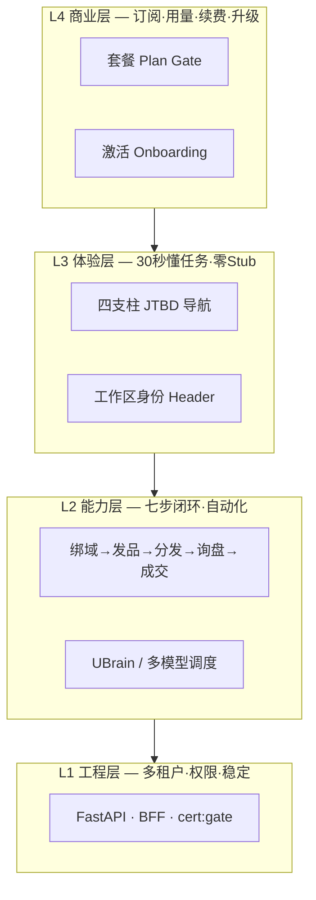

# SaaS 企业价值框架 · 行业痛点 · 最优解与改造对齐

> **签发**：SaaS 产品策略专家（`saas-product-strategist`）× 产品经理  
> **生效**：2026-06-02  
> **读者**：Owner · 销售 · 研发 · 送检/合规 · 代理商务  
> **配套**：[`ecc-saas-expert-training-20260601.md`](./ecc-saas-expert-training-20260601.md) · [`pm-one-shot-ip-ux-masterplan.md`](./pm-one-shot-ip-ux-masterplan.md) · [`marketing/plan-copy-deck.md`](./marketing/plan-copy-deck.md) · [`产品俯视-租户旅程与三轨计费.md`](./产品俯视-租户旅程与三轨计费.md)

---

## 一、改造目的（一句话）

**把「值钱的工程库存」变成「租户按年付费、销售敢按效果报价、送检敢现场演示的订阅商品」。**

百万级 SaaS 卖的不是菜单数量，是 **可量化业务结果 + 可信交付体验 + 可扩展订阅商业**。

---

## 二、优丁服务的行业与客户

| 维度 | 定义 |
|------|------|
| **行业** | 建材 / 轻集料 / 外贸 B2B（工厂、贸易商、区域代理） |
| **客户** | 老板 + 1～3 人运营；要出海获客、要独立站、怕平台封号、怕外包 GEO 停费就断 |
| **竞品形态** | 6980 级 GEO 外包 · 建站公司 · 各平台代运营 · 无闭环的 AI 工具 |
| **产品定位** | **建材 AI 卖货 OS** — 独立域资产 + 多平台矩阵 + 询盘成交闭环 |

---

## 三、行业痛点（租户真实痛，不是功能清单）

### 3.1 七大痛点矩阵

| # | 痛点 | 租户原话（归纳） | 传统解法 | 为何不够 |
|---|------|------------------|----------|----------|
| **P1** | **没有自己的卖货资产** | 「电话来了，网站不是自己的，停费就没了」 | 模板建站、GEO 代发 | 资产在服务商手里，无复利 |
| **P2** | **获客渠道散、人力贵** | 「抖音、百度、外贸平台各搞一套，人不够」 | 雇运营、找代运营 | 成本高、不可复制、难审计 |
| **P3** | **内容生产慢、专业度不够** | 「建材参数复杂，写不出 SEO/多语言」 | 外包文案、ChatGPT 零散用 | 无母版→多平台流水线，质量不稳 |
| **P4** | **线索漏、跟进乱** | 「询盘在微信里，换人就丢」 | Excel、CRM 另买 | 与官网/发布/订单断裂 |
| **P5** | **平台封号/关联风险** | 「多账号一发就关联，不敢铺量」 | 人工换 IP、买指纹浏览器 | 未与发布台、租户体系打通 |
| **P6** | **不知道钱花哪、值不值** | 「年费交了，不知道有没有比 GEO 多来电话」 | 服务商报表、口头承诺 | 不可对账、难续费 |
| **P7** | **多账号/代理/送检合规** | 「下面经销商也要管，政府要验系统」 | 多套系统或 Excel | 无统一多租户 + 审计 + 送检面 |

### 3.2 痛点 → SaaS 必须交付的「结果」（不是功能）

| 痛点 | 租户要的结果 | 可验收指标 |
|------|--------------|------------|
| P1 | 独立域 + 后台数据归自己 | 域名绑定、询盘导出、续费数据保留 |
| P2 | 一篇内容多渠道曝光，回到自己站 | 发布任务完成率、落地页 UV |
| P3 | 专业内容 AI 辅助，人只审核 | Token 消耗/篇、发布成功率 |
| P4 | 询盘进系统、有 inbox | 有效线索数、首次响应时长 |
| P5 | 发布有隔离环境 | 槽位占用、封号率（运营统计） |
| P6 | 12 个月线索可复盘 | 线索成本 =（年费+Token）/ 有效线索 |
| P7 | 超管/代理/租户分权可演示 | 送检脚本 30min、审计日志 |

**SaaS 专家定调**：功能只为 **加快获客 · 提高转化 · 降低运营人力** 存在（见 [`出海计/网站效果论`](./出海计/网站效果论-为何值得比6980GEO贵.md)）。填不出这三格 → 不做。

---

## 四、企业级 SaaS 解决什么？（四层蛋糕）



### 4.1 与「内部管理系统」的本质区别

| 维度 | 内部 ERP/政务 | **优丁目标 SaaS** |
|------|---------------|-------------------|
| 谁付钱 | 项目制/领导批 | **租户月年订阅** |
| 成功标准 | 模块上线数 | **激活·留存·续费·有效线索** |
| 导航 | 功能树 | **任务：获客·发品·履约·账户** |
| 半成品 | 可先上菜单 | **租户绝不可见 Stub** |
| 设计 | 能用就行 | **商品包装的一部分** |

### 4.2 六个「产品部件」（百万 SaaS 共性）

| # | 部件 | 优丁现网 | 改造目标 |
|---|------|----------|----------|
| 1 | 工作区身份 | ❌ | TenantLogin + Header 徽章 |
| 2 | 激活向导 | ❌ | Onboarding 3 步卡 |
| 3 | 任务导航 | ❌ emoji×15 | 四支柱 ≤5 |
| 4 | 工作队列 | ❌ | 询盘/发布/履约 inbox |
| 5 | 用量套餐 | ⚠️ 深埋 | Header 用量条 + Plan Gate |
| 6 | 可信边界 | ❌ 80+ Stub | Hide/Lab/PlanGate 矩阵 |

**North Star**：租户 30 秒内回答 — **今天干什么？店正常吗？套餐够吗？**

---

## 五、百万级 SaaS vs 优丁 — 差在哪里

| 维度 | 百万级 SaaS | 优丁现网 | 差距 |
|------|-------------|----------|------|
| 卖什么 | 可度量 ROI | 234 功能点位 | 卖功能 ≠ 卖结果 |
| 第一印象 | 3 秒像付费产品 | emoji/渐变/Stub | 不像值得年费 |
| 激活 | 7 日 onboarding KPI | 无 | 新户流失 |
| 信任 | 零 beta 外露 | 实验室可进 | 企业不敢用 |
| 角色 | 严格分壳 | Agent→超管 | 信任崩塌 |
| 商业 | Header 用量+升级 | billing  buried | 续费无触面 |
| 效果证明 | 客户成功复盘 | 有能力无产品化报表 | 难支撑 9800+ |

**结论**：L1 工程强（cert:gate 绿）；**L3/L4 未商品化** 是定价与 ARR 瓶颈。

---

## 六、系统「值多少钱」（诚实三档）

### 6.1 档 A · 现网当商品卖（租户视角）

- **可收费**：体验版/极低价试点；**难支撑** 9800～19800 年费叙事  
- **ARR 潜力**：近 **0～极低**（除非绑人工项目制）

### 6.2 档 B · 研发资产 + IP + 送检（公司视角）

| 资产 | 含义 |
|------|------|
| FastAPI 多租户 + 270+ 页 + AI/SEO/询盘主链 | 等价 **数十万～百万级** 定制开发投入 |
| 软著×2 + 发明专利 | 资质/融资加分，非直接现金流 |
| 省级评测 | ToG/企业版入场券 |
| **性质** | **库存价值高，商品价值低** |

### 6.3 档 C · 改造后目标（商品 + ARR）

来源：[`网站效果论`](./出海计/网站效果论-为何值得比6980GEO贵.md) · [`plan-copy-deck`](./marketing/plan-copy-deck.md)

| 套餐 | 年费目标（示意） | 解决痛点 |
|------|------------------|----------|
| 体验版 | 试用/低价 | P1 绑域 + 首询盘 |
| 启航版 | 基础订阅 | P2/P3 5+5 发布 |
| 专业版 | **9800～19800 档** | P1～P6 全链 + IM/SEO |
| 企业版 | 溢价 30%～100% | P7 白标 + 审计 + 送检场景 |

**「系统值百万」在 SaaS 通常指 ARR/估值**：

```text
50 租户 × 专业版 1.5 万/年 ≈ 75 万 ARR
+ Token + IP 槽位 + 企业版 → 向百万 ARR 靠近
```

**前提**：12 个月 **有效线索可复盘**（否则贵不起来）。

---

## 七、最优解（SaaS 专家 + PM + ECC 合议）

### 7.1 战略最优解（一条主线）

```text
不卖「234 功能后台」
卖「比 6980 GEO 更多、可审计的有效电话 + 可续费的独立站资产」
```

**产品形态最优解**：

| 层 | 最优解 | 不做什么 |
|----|--------|----------|
| **商业** | 三轨：SaaS 订阅 + Token + IP 槽位；四档套餐 | 裸卖菜单；实验室对外承诺 |
| **体验** | 四支柱 + Bento Dashboard + 分屏 Login | 234 页大爆炸迁移 |
| **工程** | Vben 唯一壳 + BFF 动态菜单 + kit | 换 Java/RuoYi；第二 UI 库 |
| **智能** | UBrain 副驾减菜单复杂度；Formily 1 页试点 | drag-module 假低代码 |
| **合规** | 软著自研 60 页 + 专利调度 + 送检鉴定面 | Vben 整库当软著主体 |
| **增长** | 呼朋唤友 + 案例脱敏 + 效果复盘表 | 无指标的功能扩张 |

### 7.2 七步卖货闭环（能力最优解）

来自 [`产品俯视-租户旅程与三轨计费.md`](./产品俯视-租户旅程与三轨计费.md)：

```text
绑独立域 → 维护产品 → 统一发布母版 → SEO/GEO/40平台 → 询盘进 inbox → 报价订单 → 物流可查
```

**改造聚焦**：闭环 **前 5 步** 必须在 Client 四支柱 **3 次点击内** 可达；后 2 步 W3+ 完善，不挡送检。

### 7.3 三壳最优解（与送检一致）

| 壳 | 最优 IA | 行业痛点 |
|----|---------|----------|
| **Client** | 工作台·获客·发品·账户 + 财旺 FAB | P1～P6 |
| **Agent** | 首页·客户·开户·佣金·预警；**零超管链** | P7 分销 |
| **Platform** | 运营·商业·治理 ≤12；Lab Feature Flag | P7 送检/治理 |

### 7.4 定价与效果最优解

| 项 | 最优解 |
|----|--------|
| **对外比价** | 6980 GEO **一年线索** vs 优丁 **365 天可导出询盘** |
| **合同附件** | 12 个月效果复盘表（有效线索、来源、响应时效、线索成本） |
| **承诺形态** | 不写「保证 100 电话」；写 **复盘 + 未达基线补执行人天** |
| **套餐唯一源** | [`plan-copy-deck.md`](./marketing/plan-copy-deck.md) — Admin/销售/Landing 同源 |

---

## 八、与本次改造的对齐建议（可执行）

### 8.1 改造优先级（价值驱动，非技术驱动）

| 优先级 | 动作 | 解决的痛点 | 阶段 | 任务 ID |
|--------|------|------------|------|---------|
| **P0** | Stub Hide + Agent 删超管链 | P7 信任 | S0 | FE-03, PM-01 |
| **P0** | 四支柱菜单 + 送检鉴定面 | P6/P7 | S0 | FE-10, SAAS-02 |
| **P1** | Bento Dashboard + onboarding 3 步 | P2/P4 激活 | W2 | FE-07~08 |
| **P1** | TenantLogin + Header 用量 | P1/P6 商业触面 | W2 | FE-09, BE-03 |
| **P1** | 三队列 inbox（询盘/发布/履约） | P4 | W2 | PAGE-02 |
| **P2** | Vben 壳 + tokens | 支撑 9800+ **看起来配得起** | W1–W2 | FE-01, UX-01 |
| **P2** | Plan Gate 服务端校验 | P6 升级收入 | W2 | BE-04, SAAS-03 |
| **P3** | Formily site-editor 试点 | P3 内容配置 | W3 | FE-11 |
| **P3** | 效果复盘导出（询盘 CSV + 来源） | P6 **支撑贵** | W2–W3 | BE 增项 |
| **并行** | 软著 60 页 + 专利 PAT | 资产合规 | W2–S2 | COMP/RZ/PAT |

### 8.2 新增商业价值验收 · SAAS-06

| ID | 任务 | 阶段 | 截止 |
|----|------|------|------|
| **SAAS-06** | **行业痛点 ↔ 产品部件** 对照表签字（本文 §3.1） | S0 | 6/8 |
| **SAAS-07** | **效果复盘表 v1**（有效线索定义 + 导出字段） | W2 | 6/22 |
| **SAAS-08** | 销售/送检 **30s 话术**：卖结果不卖功能（§7.1） | S2 | 7/14 |

**KPI（SA-K5）**：W2 Gate 时抽检 3 名内部角色能 **用一句话说清** 优丁解决的 **3 个行业痛点**（从 P1～P7 中）。

### 8.3 禁止清单（改造期红线）

1. 新功能 PR 必须填「痛点 P1～P7 哪一格」— 填不出不做  
2. 租户路由 **零 Stub 叶子**（代码审查强制）  
3. 对外话术禁用「234 功能」「拖拽低代码」（见 plan-copy-deck §六）  
4. 未完成 Stub 矩阵前，禁止讨论全站液态玻璃  
5. 软著材料 **不含** Vben 整库 / `_ref` / 实验室页  

### 8.4 部门分工（价值改造）

| 部门 | 本次改造贡献的价值 |
|------|-------------------|
| **SaaS** | 痛点↔部件映射；五问/六问验收；效果话术 |
| **PM** | 闭环前 5 步进 Top12；Gate 签字 |
| **FE/UX** | 四支柱 + Bento = **3 秒懂今天干什么** |
| **BE** | onboarding/usage/planGate + 询盘导出 |
| **营销** | copy-deck 与 Admin 零不一致；复盘表进合同附件 |
| **IP/合规** | 软著/专利与 **自研模块** 边界 |
| **销售/代理** | 用 **6980 对比表** 报价，不用功能清单 |

---

## 九、SaaS 六问验收（改造 Gate 用）

在「五问」基础上增加 **第 6 问（商业价值）**：

1. 3 秒能说出这页让我干什么吗？  
2. 侧栏像 Linear/飞书，还是办事系统？  
3. 新用户有没有明确下一步？  
4. 有没有「我的公司 + 套餐用量」？  
5. 有没有点进去是空 toast 的菜单？  
6. **这页帮助租户解决 P1～P7 哪一条痛点？**（说不清 → 不上线）

**任两题否（含第 6 题）→ 不交付租户/不进入送检截图。**

---

## 十、最优解摘要（给 Owner）

| 问题 | 答案 |
|------|------|
| **SaaS 解决什么行业痛？** | 无资产、渠道散、内容慢、线索漏、封号险、效果不可审计、多账号合规难（§3） |
| **企业级 SaaS 长什么样？** | L4 商业 + L3 体验 + L2 七步闭环 + L1 工程，六部件齐全（§4） |
| **和百万 SaaS 差在哪？** | 差 L3/L4 商品化，不是差功能数量（§5） |
| **现在值多少？** | 资产账高、商品账低；改造目标 9800～19800/户 × N（§6） |
| **最优解？** | 卖 **可复盘的有效线索 + 独立站资产**，四支柱 + Bento + 三轨计费（§7） |
| **本次改造干什么？** | 把 L3/L4 抬到与 L1 同级；S0 信任 → W2 激活 → 并行软著专利送检（§8） |

---

## 相关文档

- [pm-one-shot-ip-ux-masterplan.md](./pm-one-shot-ip-ux-masterplan.md)  
- [pm-master-schedule-kpi-20260601.md](./pm-master-schedule-kpi-20260601.md)  
- [ecc-saas-expert-training-20260601.md](./ecc-saas-expert-training-20260601.md)  
- [pm-executive-report-summary-20260601.md](./pm-executive-report-summary-20260601.md)  

---

*2026-06-02 · SaaS 企业价值框架 · 行业痛点 · 最优解 · 改造对齐*
