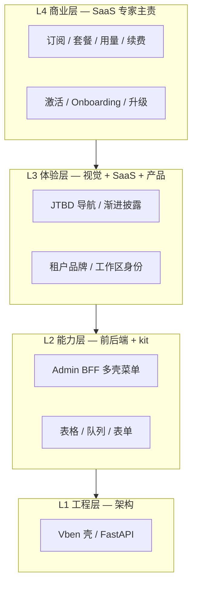

# ECC 内训 · SaaS 产品策略专家主讲

## 《什么是 SaaS？我们离抖音上的「高级感后台」差在哪？》

> **会议类型**：M3 蜂群 · **培训 + 差距合议**（非编码）  
> **主讲**：🚀 SaaS 产品策略专家（`saas-product-strategist`）  
> **听众**：ECC 全员（架构 / 前后端 / 安全 / 产品 / 视觉 / 营销 / 文档 / 代码审查）  
> **时间**：2026-06-01  
> **产出**：团队统一「SaaS 定义」+「视觉/体验差距清单」+ 改造优先级修正

---

## 〇、开场 — 为什么 ECC 必须先听这堂课

**架构指挥官**：Phase 0 我们学会了从 12 个开源库 **抄效率**；R4 我们补了 **SaaS 改造六方案**。但团队里仍有人把 SaaS 理解成「多租户的 CRUD 后台」。今天 SaaS 专家要把 **定义讲透**，并对标抖音上客户已经见过的 **高级感设计**，说明优丁 **差在哪里、先改什么**。

**SaaS 专家**：你们做的不是「给内部员工用的管理系统」，而是 **租户每月付钱、不满意就换** 的产品。租户在手机抖音里看过 Linear、Notion、飞书、各种 AI 后台切片——**他们的审美已经被教育过了**。我们若仍像 2018 年的 Element 后台，不是「丑」这么简单，是 **不像值得付费的商品**。

---

## 一、第一课 · 什么是 SaaS 系统？（给 ECC 的统一定义）

### 1.1 一句话

> **SaaS（Software as a Service）** = 通过互联网按订阅使用软件；**一套代码服务多租户**；价值来自 **持续激活、留存、扩展付费**，而不是「功能堆满」。

### 1.2 和「普通后台 / 内部系统」的本质区别

| 维度 | 内部管理系统（ERP/政务） | **SaaS 产品（优丁目标）** |
|------|--------------------------|---------------------------|
| **谁付钱** | 组织一次性或项目制 | **租户按月/年订阅** |
| **谁评判** | 领导验收功能清单 | **租户 10 秒决定「专不专业」** |
| **成功指标** | 模块上线数量 | **激活率、留存、续费、NPS** |
| **架构** | 单租户或弱隔离 | **强多租户 + 套餐边界** |
| **导航逻辑** | 功能目录（模块树） | **任务导向（我今天该干什么）** |
| **未完成的功能** | 可先上菜单占位 | **绝不能给租户看到 Stub** |
| **设计** | 能用就行 | **是商品包装的一部分** |
| **升级路径** | 发版说明 | **产品内 Plan Gate + 升级 CTA** |

### 1.3 SaaS 产品的「四层蛋糕」（ECC 分工对照）



**SaaS 专家强调**：ECC 过去 80% 时间在 **L1–L2**（Vben、Art、BFF）。租户付钱买的是 **L3–L4**。只做 L1–L2 = **把 SaaS 做成「能登录的多租户后台」**，不是 SaaS 商品。

### 1.4 优丁 SaaS 的「North Star」（全员对齐）

来自 PRD 与四壳文档，合并为 **一条用户问题**：

> **租户老板登录后 30 秒内能回答：「我今天该干什么？我的店运转正常吗？套餐还够用吗？」**

答不出 → 不是 SaaS，是功能博物馆。

### 1.5 多租户 SaaS 必有的 6 个「产品部件」（不是技术模块）

| # | 部件 | 租户感知 | 优丁现网 |
|---|------|----------|----------|
| 1 | **工作区身份** | 这是「我的公司」 | ❌ 无 tenant 品牌/header |
| 2 | **激活向导** | 新号知道下一步 | ❌ 无统一 onboarding 卡 |
| 3 | **任务导航** | 按工作找功能 | ❌ emoji 功能目录 16 项 |
| 4 | **用量/套餐触面** | 知道额度与续费 | ⚠️ billing  buried 在菜单深处 |
| 5 | **工作队列** | 待办 inbox 感 | ❌ 询盘/发布分散 |
| 6 | **可信边界** | 看不到半成品 | ❌ 80+ Stub 可进 |

---

## 二、第二课 · 抖音上「火热的后台设计」是什么？（审美教育）

> **说明**：抖音/B 站设计区 2025–2026 高频出现的 **B 端/SaaS 切片**，代表 **租户已被教育的审美**，不是让我们追特效，而是追 **信噪比与商品感**。

### 2.1 抖音热榜设计范式（归纳 8 类）

| 范式 | 典型参考 | 核心特征 | 抖音为什么火 |
|------|----------|----------|--------------|
| **① Linear / Notion 风** | Linear, Notion, Attio | 大留白、弱边框、**间距分组**、Inter/系统字体、灰阶层次 | 「干净 = 贵」 |
| **② Bento 宫格 Dashboard** | Apple、各类 AI 产品切片 | KPI **卡片栅格**、一屏回答「状态如何」 | 3 秒读懂，适合短视频展示 |
| **③ 液态玻璃 / 轻玻璃** | Apple WWDC 后大量跟拍 | 半透明层、blur、**Z 轴深度**、浮层不丢上下文 | 「2026 高级感」标签 |
| **④ 深色专业座舱** | Vercel、Stripe Dashboard 暗黑 | 深灰底（非纯黑）、高对比 KPI、彩色只给 **可点击/告警** | 显得「专业工具」 |
| **⑤ 分屏品牌登录** | 多数新 SaaS 切片 | 左 **品牌叙事/插画**，右表单；tenant 搜索 | 像产品不像后台 |
| **⑥ AI Copilot 副驾** | 各类「AI 后台」视频 | **悬浮助手 / 右侧 Copilot**，对话代替找菜单 | 降低学习成本 |
| **⑦ 骨架屏 + 微动效** | shadcn 教程切片 | 加载先出结构、hover 轻反馈、无 spin 干等 | 「跟手、快」 |
| **⑧ 移动摘要视图** | 老板手机看数据 | 手机只 3 指标 + 「查看详情」链桌面 |  B2B 老板不看 PC |

**SaaS 专家**：抖音上的火，**80% 是 L3 体验层 + 信息架构**，不是 3D 炫技。很多视频标题写「高级感后台」，本质是：**少、清、有主次、像付费产品**。

### 2.2 2026 B 端技术审美默认（与设计社区一致）

| 项 | 现状默认 | 对优丁含义 |
|----|----------|------------|
| 组件语言 | **shadcn/ui + Tailwind** 语义化（Vben 5 已走这条） | fork Vben 是对的，**要配好 tokens 密度** |
| 图表 | 少而准；**变化趋势 > 装饰** | Dashboard 不要 47 个 widget |
| 表格 | **高密度但可读**；列设置/筛选 | Art useTable 方向对 |
| 空状态 | **文案 + 一步 CTA**（去 onboarding 第几步） | 不是「暂无数据」完事 |
| 暗黑 | 可选，但 **tokens 要统一** | Client 可先 light 精品，Platform 可 dark |

### 2.3 「高级感」公式（SaaS 专家给出，ECC 可验收）

```text
高级感 ≠ 特效多
高级感 = 信息架构清晰 + 视觉噪音少 + 主次分明 + 加载跟手 + 像「有人设计过」
```

**固定六段式 Dashboard 蓝图**（Stripe/Linear 共性，抖音教程常抄）：

```text
[侧栏导航] → [顶栏工作区] → [KPI 条 / Bento] → [今日主任务] → [次要图表/表] → [设置入口]
```

缺一段就「像半成品」；**堆满**则「像内部 BI」。

---

## 三、第三课 · 优丁现网 vs 抖音热设计 — 差距矩阵

### 3.1 总览评分（SaaS 专家主观 · 10 分制）

| 维度 | 抖音热 SaaS 期望 | 优丁现网 | 分差 |
|------|------------------|----------|------|
| 信息架构 | 任务/运营实体 | 功能目录 + 234 路由 | **-4** |
| 视觉层次 | 间距 + 灰阶 + 弱边框 | 白盒线框、emoji 图标 | **-3** |
| Dashboard | Bento + 今日待办 + onboarding | 统计壳/分散页 | **-4** |
| 登录 | 分屏品牌 + tenant | 普通表单页 | **-3** |
| 加载体验 | 骨架屏 | 不统一 | **-2** |
| AI 副驾 | 悬浮 Copilot（财旺） | ✅ 有 UBrain 概念 | **-1**（未产品化） |
| 移动 | 摘要视图 | 弱 | **-3** |
| 可信感 | 无 Stub | 80+ 实验室 | **-5** |
| 套餐感 | Header 用量条 | 深埋菜单 | **-3** |

**结论**：最大 gap **不是**「没用液态玻璃」，而是 **Stub 外露 + 无任务导航 + 无激活层**；视觉 gap 是 **emoji + 线框密度 + 无主屏叙事**。

### 3.2 逐项对照（讲解用）

#### ① 导航 — 抖音：4–5 项任务柱；优丁：16 emoji 功能

```text
抖音切片常见：Home · Inbox · Projects · Billing · Settings
优丁 Client：📦📧📝🔍💰…（功能堆砌）
```

**差在哪**：租户大脑模型是 **「获客/发品/履约/账户」**，不是 SEO 矩阵实验室。

#### ② Dashboard — 抖音：Bento + 一条 onboarding；优丁：无统一首屏

**差在哪**：新租户登录后 **不知道第二步点哪** → 激活率崩。

#### ③ 视觉 — 抖音：间距分组；优丁：边框卡片堆叠

**差在哪**：线框多 = **2018 管理后台**；抖音用户觉得「土」。

#### ④ 登录 — 抖音：左故事右登录；优丁：单页表单

**差在哪**：没有 **「这是正规 SaaS 公司」** 的第一印象。

#### ⑤ 液态玻璃 — 抖音：常用于浮层/Copilot；优丁：无层次

**差在哪**：不是必须全站玻璃；**财旺浮层 + 抽屉** 可用轻 glass 做 Z 轴，**侧栏主界面仍要干净**。

#### ⑥ AI 后台 — 抖音：AI 是入口；优丁：财旺在但菜单仍 234 项

**差在哪**：AI 应是 **减菜单复杂度** 的副驾，不是第 17 个菜单。

#### ⑦ 轻代码 — 抖音：Formily/Schema 切片；优丁：drag-module 内存玩具

**差在哪**：对外不能叫低代码；**Formily + BFF Schema** 才是真。

---

## 四、第四课 · ECC 团队该怎么改？（SaaS 专家修正路线图）

### 4.1 先改「像 SaaS」，再追「像抖音」（顺序不能反）

| 阶段 | 改什么 | 抖音范式 | Wave |
|------|--------|----------|------|
| **① 可信** | Stub Hide、Lab Flag | 火的设计 **没有** 半成品菜单 | W1 |
| **② 架构** | 四支柱 JTBD 菜单 | 侧栏 ≤5 | W1–W2 |
| **③ 激活** | Onboarding 卡 + 今日队列 | Bento 第一格永远是「下一步」 | W2 |
| **④ 身份** | TenantLogin + Header 工作区 | 分屏登录 + 顶栏 workspace | W2 |
| **⑤ 视觉 tokens** | 去 emoji、弱边框、间距分组 | Linear 风 | W2 |
| **⑥ 副驾** | 财旺 glass 浮层 + 减菜单 | AI Copilot 范式 | W2 |
| **⑦ 可选特效** | 浮层轻 glass、骨架屏 | 液态玻璃 **仅浮层** | W2–W3 |
| **⑧ 移动** | Client 3 指标摘要 | 抖音「手机看板」 | W3 |

**SaaS 专家红线**：**未完成 ①②③ 前，全员禁止讨论「要不要全站液态玻璃」** — 那是 lipstick on pig。

### 4.2 百家开源 vs 抖音审美 — 怎么对应

| 抖音审美需求 | 向谁借 | ECC 负责 |
|--------------|--------|----------|
| 壳 + 侧栏密度 | Vben + shadcn | 前端架构 |
| 表格/inbox | Art Edge | 后台页面搭建 |
| 登录分屏 | Naive 布局参考 | 视觉 + kit |
| 复杂配置页 | **Formily** | 全栈 W3 |
| 错误/刷新跟手 | Soybean | 前端 W1 |
| 对外 landing | daisyUI + HTMLrev | 营销 |
| 套餐/字典 | RuoYi 清单 | 后端 W3 |

### 4.3 给视觉设计师的抖音对标 brief（SaaS 专家下发）

1. **Client Dashboard** 参考：Bento 4 格 — onboarding 进度 / 未读询盘 / 发布进行中 / 套餐用量  
2. **登录** 参考：左 3 bullet 价值主张 + 右表单（Naive 分屏，非 Naive 组件）  
3. **侧栏**：Lucide 线图标，**禁 emoji**；active 态一条细 indicator，不用粗边框  
4. **财旺 FAB**：轻 glass + 阴影，不挡主 CTA  
5. **禁止**：全站渐变背景、3D 图表、装饰性阴影堆叠（抖音 **反面教材** 也很多）

---

## 五、ECC 圆桌 · 听完后各角色 1 分钟表态

| 角色 | 表态摘要 |
|------|----------|
| 🎖 架构指挥官 | 同意 L4 优先；Wave 1 不挡，但 seed 按四支柱；玻璃仅浮层 |
| 🧱 前端架构师 | Vben/shadcn 与 Linear 风同路；W2 做 tokens 扩展，不全站重写 |
| 🎨 视觉设计师 | 出 Client Dashboard moodboard 1 张（Bento+分屏登录），对标抖音切片但不抄特效 |
| 📋 产品经理 | Stub 矩阵本周 v1；Top12 映射进四支柱，不增加一级菜单 |
| 🗄 后端架构师 | `user/info` 扩 onboarding_steps、plan_usage — W2 必做 |
| 🔒 安全专家 | Plan Gate 必须服务端校验套餐，不能只 hide 菜单 |
| 🔧 后台页面搭建 | Art 表格做成三队列 = 抖音「inbox 待办」切片 |
| 📣 营销专家 | 官网 pricing 与 Admin 套餐名一致，否则抖音投流落地断层 |
| 🔍 代码审查 | 验收加一条：**租户路由无 Stub 叶子** |
| 📝 文档专家 | 本内训 sync 出海计；PRD 增「SaaS 定义」链到本文 |

---

## 六、SaaS 专家三句结语（给 ECC）

1. **SaaS 不是多租户 CRUD**，是 **订阅 + 激活 + 信任 + 续费**；菜单里露出实验室 = 破坏信任。  
2. **抖音火的不是特效**，是 **3 秒读懂、像 Linear、像付费产品**；我们差在 **任务架构和 Stub**，其次才是视觉。  
3. **改造顺序**：Hide Stub → 四支柱 → 激活 Dashboard → 登录/Header 身份 → tokens → 财旺 glass → 再谈 Optional 特效。

---

## 七、会议决议

| # | 决议 | 负责 | 时间 |
|---|------|------|------|
| T1 | ECC 全员以本文 **§1.3 四层蛋糕** 分工，L3/L4 与 L1/L2 并行 | 架构指挥官 | 立即 |
| T2 | 视觉出 **Client Dashboard + Login** moodboard（对标 §2.1 ①②⑤） | 视觉设计师 | 3 日内 |
| T3 | Stub 矩阵 v1 + **租户零 Stub 可见** 签字 | 产品 + SaaS 专家 | W1-6 前 |
| T4 | BFF `user/info` 设计 onboarding + usage 字段 | 后端 | W2 前 |
| T5 | 禁止 W1 讨论全站液态玻璃；**仅财旺/抽屉可 glass** | 全员 | 立即 |

---

## 八、附录 · 给非设计同学的「抖音切片自检 5 问」

截图一张 Client 页，自问：

1. **3 秒**能说出这页让我干什么吗？  
2. 侧栏像 **Notion/Linear** 还是像 **政府办事系统**？  
3. 有没有 **至少一处** 告诉新用户下一步？  
4. 有没有 **套餐/用量** 或「我的公司」身份？  
5. 有没有 **点进去是空 toast** 的菜单？（有 = 非 SaaS）

五题任两题否 → **不上线给租户**。

---

## 相关文档

- [**ecc-saas-enterprise-value-framework.md**](./ecc-saas-enterprise-value-framework.md) — 行业痛点 · 估值三档 · 最优解 · 改造对齐  
- [ecc-round4-meeting-minutes-saas-composite-20260601.md](./ecc-round4-meeting-minutes-saas-composite-20260601.md)  
- [98-efficiency-paradigms-by-vendor.md](./open-source-audit/98-efficiency-paradigms-by-vendor.md)  
- [youding-admin-overhaul-prd.md](./youding-admin-overhaul-prd.md)  
- [四壳信息架构与菜单治理.md](./四壳信息架构与菜单治理.md)  

---

*2026-06-01 · SaaS 专家 ECC 内训 · 定义 + 抖音审美差距 + 改造顺序*
