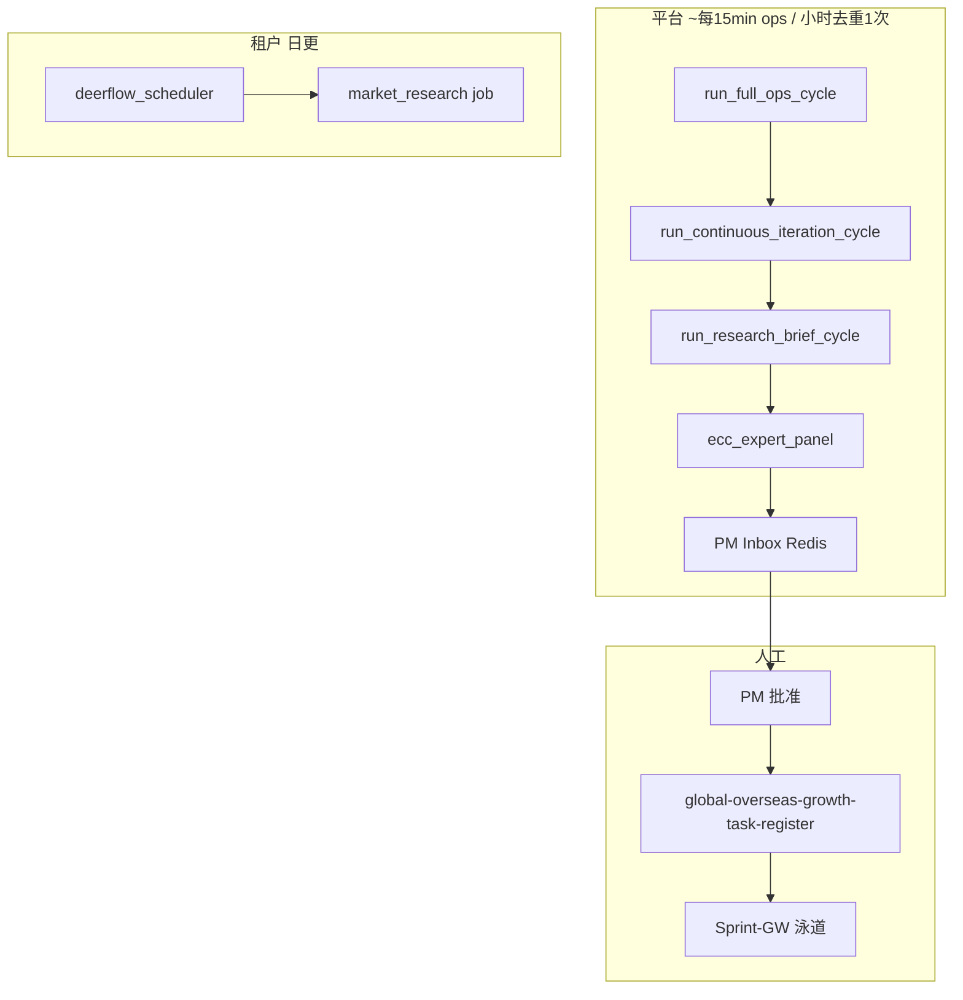

# Hermes 持续迭代宪章（宪法 × DeerFlow × 研究员 × 营销 × 各部门）

> 版本 2026-06-02 · 任务 GW-R-AGENT-01 / GW-R-AGENT-02  
> 代码：`research_brief_service.py` · `hermes_continuous_iteration_service.py`

## 1. 目标

在 **不污染生产、不死循环、不幻觉落地** 的前提下，让平台 7×24 **不断迭代** 出海 B2B SaaS：

- **Hermes 宪法** — 白名单动作边界  
- **DeerFlow 定时** — 租户 **日更** `market_research`  
- **外贸研究员** — 平台 **小时** ResearchBrief（只读信号）  
- **营销专家 / b2b_trade_experts** — 按 lane 路由建议  
- **各部门** — ECC 八席 + PM + Sprint-GW 泳道  

## 2. 分层（L1–L5）

| 层 | 动作 | 自动？ | 输出 |
|----|------|--------|------|
| L1 采集 | 巡站快照、GW P0、DeerFlow 快照 | 是（只读） | signals |
| L2 简报 | `compose_research_brief` | 是 | ResearchBrief JSON |
| L3 门控 | `ecc_expert_panel.review_candidate` | 是（只评不改） | pass/warn/fail |
| L4 路由 | `route_departments` | 是（建议） | 营销/销售/研究/PM |
| L5 落地 | PM Inbox → 登记册 → 研发 Lane | **否** | 人批后 GW-* 任务 |

### 明确禁止（与 maintenance_constitution 一致）

- 自动 merge / 改配置 / 发信 / 发帖  
- 小时循环 **重复入队** DeerFlow（租户日更由 `deerflow_scheduler` 负责）  
- ECC fail 项自动进登记册  

## 3. 调度关系

- **Hermes 巡站调度**（默认 15min）：`run_full_ops_cycle` 末尾挂载 `continuous_iteration`（`include_deerflow_drain=False`，避免与 ops drain 重复）。  
- **DeerFlow**：`DEERFLOW_SCHEDULE_HOUR` 日更入队；iteration 片仅 **可选** `run_deerflow_pending_only` 消化队列。  
- **小时去重**：Redis `hermes:continuous_iteration:hour:YYYYMMDDHH`。

## 4. ResearchBrief 字段

见 `research_brief_service.compose_research_brief`：

- `brief_id`, `topic_key`, `lane`, `finding`, `evidence[]`  
- `impact`, `confidence`, `suggested_tasks[]`  
- `forbidden_auto_actions[]`, `constitution_version`  

24 个 `HOURLY_TOPICS` 按 UTC 小时轮换，覆盖 GEO、outbound、矩阵、UTM、询盘、竞品等。

## 5. 部门路由

| seat | 触发 lane | B2B 专家 | 典型 action |
|------|-----------|----------|-------------|
| marketing | GW-G/S/P | expert_matrix, expert_ads | 内容/投放假设 |
| sales | GW-L | expert_letter, expert_negotiate | 调整 outbound playbook |
| research | GW-R | expert_research | 延伸 DeerFlow 简报 |
| product | GW-G/PM | expert_site, expert_eva | 建站/找客缺口 |
| ecc | 高 impact / fail | 八席 roster | 人工 triage |
| pm | 全部 | PM-07 | inbox 批准 |

营销侧 **social_agents_reference**（TikTok/LinkedIn/SEO 等）在 backlog 中映射到 GW-S/GW-G；路由 note 指向 `docs/global-overseas-growth-agent-backlog.md`。

## 6. API（运维 Admin）

| 方法 | 路径 | 说明 |
|------|------|------|
| GET | `/api/v1/hermes/ops/continuous-iteration` | 状态 + inbox 预览 |
| POST | `/api/v1/hermes/ops/continuous-iteration/run` | 手动跑一轮（`force` 忽略小时去重） |
| POST | `/api/v1/hermes/ops/run` | 全套 ops（含 iteration 片） |

## 7. 配置

| 变量 | 默认 | 说明 |
|------|------|------|
| `HERMES_CONTINUOUS_ITERATION_ENABLED` | production/development 开 | 总开关 |
| `HERMES_OPS_AUTOPILOT_ENABLED` | production 开 | ops 循环含 iteration |
| `DEERFLOW_SCHEDULE_AUTO_ENQUEUE_ENABLED` | 显式开 | 租户日更入队 |

## 8. 验收（GW-R-AGENT-01/02）

- [x] ResearchBrief JSON + 小时 worker + Redis Inbox  
- [x] Brief 经 `review_candidate`（allow_llm=False 默认）  
- [x] 部门路由含营销/销售/研究/PM  
- [x] 挂接 `run_full_ops_cycle`  
- [ ] Admin UI  inbox 批准写回登记册（S2 / 前端 Lane）  
- [ ] 租户侧「本周建议 + CTA」（SaaS 专家否决 Stub）  

## 9. 与 Eva / 迈富时 差异

我们强在 **工作流包装 + 垂直建材 + 违宪防护**；弱在 **实名线索库 + 真实 SMTP 全托管**。迭代循环补的是 **运营节奏与 PM 门控**，不是买数据或自动乱发信。

---

父文档：`docs/global-overseas-growth-agent-backlog.md` · 登记册：`docs/global-overseas-growth-task-register.json`
