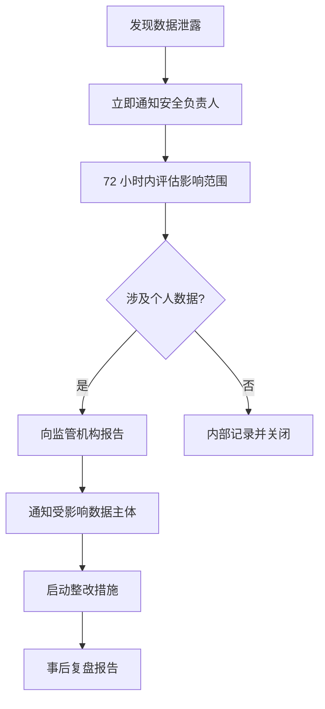

# 优丁建材国际订单采集系统 — 跨境数据合规文档

## 概述

本文档覆盖优丁建材国际订单采集系统涉及的主要数据保护法规合规要求，包括 GDPR（欧盟）、CCPA（美国加州）和《中华人民共和国个人信息保护法》（PIPL）。所有运营团队和开发人员必须遵守本文档中的规定。

---

## 1. GDPR 合规要点（欧盟）

### 1.1 合法性基础

根据 GDPR 第 6 条，数据处理必须至少满足以下一项合法性基础：

| 处理场景 | 合法性基础 | 说明 |
|----------|------------|------|
| 公开 B2B 信息采集（公司名、地址、电话、邮箱） | 合法利益（Legitimate Interest） | 采集公开商业信息用于商业合作邀约 |
| 个人数据采集（姓名、职位、私人联系方式） | 同意（Consent） | 需在网站上提供明确的 Opt-in 声明 |
| 数据处理和存储 | 合同履行（Contract Necessity） | 处理订单数据以履行与客户之间的合同 |

**实施要求：**

- 必须完成 Legitimate Interest Assessment (LIA) 文档
- 在首次数据采集页面展示明确的数据处理声明
- 提供清晰的 Opt-out 机制

### 1.2 数据最小化原则（GDPR 第 5 条）

仅采集系统运营所必需的数据字段：

| 允许采集 | 不建议采集 |
|----------|------------|
| 公司法定名称 | 个人身份证号 |
| 公开商业地址 | 银行账号/信用卡信息 |
| 公司联系电话 | 政治/宗教观点 |
| 公开邮箱（info@、contact@ 等） | 健康状况数据 |
| 公开产品/报价信息 | 生物特征数据 |
| 与订单直接相关的商业信息 | 儿童数据 |

### 1.3 加密要求

```
传输加密：TLS 1.3（强制）
存储加密：AES-256-GCM（强制）
密钥管理：密钥与数据分离存储
          密钥每 90 天轮换一次
          密钥访问需双人审批
```

### 1.4 数据保留期限

| 数据类型 | 保留期限 | 到期处理 |
|----------|----------|----------|
| 有效订单数据 | 合同结束后 + 6 年（财税合规） | 自动匿名化 |
| 已拒绝的商机 | 12 个月 | 自动删除 |
| 爬虫原始日志 | 90 天 | 自动删除 |
| Webhook 请求日志 | 180 天 | 自动轮转覆盖 |

### 1.5 数据主体权利响应

GDPR 要求在 30 天内响应数据主体请求。实施以下 API：

```bash
# 数据删除请求（"被遗忘权"）
curl -X DELETE https://your-domain.com/api/v1/data-subject \
  -H "Authorization: Bearer <admin-token>" \
  -d '{"email": "contact@example.com", "request_type": "erasure"}'

# 数据可携带性请求
curl -X GET https://your-domain.com/api/v1/data-subject/export \
  -H "Authorization: Bearer <admin-token>" \
  -d '{"email": "contact@example.com", "format": "json"}'

# 数据访问请求
curl -X GET https://your-domain.com/api/v1/data-subject/info \
  -H "Authorization: Bearer <admin-token>" \
  -d '{"email": "contact@example.com"}'
```

**响应时限：**

| 请求类型 | 标准时限 | 复杂情况延长 |
|----------|----------|--------------|
| 数据访问请求 | 30 天 | 可延长至 60 天 |
| 数据删除请求 | 30 天 | 不可延长（除非法律例外） |
| 数据更正请求 | 30 天 | 可延长至 60 天 |
| 数据可携带性请求 | 30 天 | 可延长至 60 天 |

---

## 2. 数据跨境传输

### 2.1 传输路径与合规措施

```
┌──────────────────────┐         ┌──────────────────────┐
│   Cloudflare Workers  │ ───────→│   阿里云轻量服务器     │
│   （全球边缘节点）      │  HTTPS  │   （中国大陆节点）     │
│                      │  TLS 1.3│                      │
│  数据传输方向：境外→境内 │         │  数据最终存储位置      │
└──────────────────────┘         └──────────────────────┘
```

### 2.2 标准合同条款（SCC）

由于数据从境外传输至中国大陆，需采取以下措施：

**（1）欧盟-中国 SCC 实施步骤：**

1. 下载最新版 EU Standard Contractual Clauses (Module 2: Controller to Processor)
2. 填写双方信息：
   - 数据出口方（Data Exporter）：优丁建材国际业务部门
   - 数据进口方（Data Importer）：优丁建材（中国）技术运营中心
3. 签署并归档
4. 完成 Transfer Impact Assessment (TIA)

**（2）补充技术措施：**

| 措施 | 实施状态 | 说明 |
|------|----------|------|
| TLS 1.3 加密传输 | 必须实施 | 所有 API 端点强制 TLS |
| 端到端 AES-256 加密 | 必须实施 | Workers 端加密，阿里云端解密 |
| 数据脱敏 | 推荐实施 | 非必要字段在传输前脱敏 |
| 访问日志审计 | 必须实施 | 记录所有数据访问行为 |

### 2.3 加密标准

```yaml
加密算法:
  - 对称加密: AES-256-GCM
  - 非对称加密: ECDSA P-384
  - 密钥交换: ECDHE
  - 哈希: SHA-256

传输安全:
  - TLS 版本: 1.3 强制 (降级 TLS 1.2 仅作兼容回退)
  - 证书类型: OV SSL 或 EV SSL
  - HSTS: max-age=31536000; includeSubDomains

密钥管理:
  - ENCRYPTION_KEY: 32 字节随机数, Base64 编码
  - 密钥存储: Workers Secret + 阿里云环境变量
  - 密钥轮换: 每 90 天
  - 密钥备份: 离线冷存储（硬件加密 U 盘）
```

---

## 3. 各国法规对照

### 3.1 核心要求对比

| 要求 | GDPR（欧盟） | CCPA（加州） | PIPL（中国） |
|------|-------------|-------------|-------------|
| 生效日期 | 2018-05-25 | 2020-01-01 | 2021-11-01 |
| 适用范围 | 处理欧盟居民数据 | 处理加州居民数据 | 处理中国境内自然人数据 |
| 同意要求 | 严格（明确 Opt-in） | 中度（Opt-out 为主） | 严格（单独同意） |
| 数据处理合法性 | 6 项合法性基础 | Opt-out 机制 | 7 项合法性基础 |
| 数据最小化 | 明确要求 | 未明确规定 | 明确要求 |
| 跨境传输 | SCC / BCR | 无专门限制 | 安全评估 + 标准合同 |
| 数据删除权 | 被遗忘权 | 删除权 | 删除权 |
| 数据可携带性 | 明确要求 | 要求 | 要求 |
| 数据保护官 | 强制（一定条件） | 未强制要求 | 强制（一定条件） |
| 违规罚款上限 | 2000 万欧元或全球年营收 4% | 每次违规 $7,500 | 5000 万元或上年度营收 5% |

### 3.2 按市场区域的具体要求

| 市场区域 | 覆盖法规 | 特别注意事项 |
|----------|----------|--------------|
| 欧盟 | GDPR | 必须指定 EU 代表；数据处理记录必须完备 |
| 英国 | UK GDPR | 脱欧后独立版本，基本与 EU GDPR 一致 |
| 中东 | 各国自有法律 | 沙特 PDPL（2023）、阿联酋 Federal Decree-Law |
| 非洲 | 各国自有法律 | 南非 POPIA、肯尼亚 Data Protection Act |
| 东南亚 | 各国自有法律 | 泰国 PDPA、新加坡 PDPA、印尼 PDP Law |
| 南亚 | 各国自有法律 | 印度 DPDP Act（2023） |

---

## 4. 合规检查清单

以下 18 项为系统上线前必须完成的可操作合规项：

### 4.1 数据映射与声明

- [ ] **DM-01**: 完成数据映射文档（Data Mapping Document），列出所有采集的数据字段、存储位置、传输路径和保留期限
- [ ] **DM-02**: 在 Admin 后台发布 Privacy Policy 和 Cookies Policy 声明
- [ ] **DM-03**: 在爬虫采集页面底部添加指向公司隐私政策的链接（如可行）

### 4.2 同意管理

- [ ] **CS-01**: 对涉及个人数据采集的场景，实施 Opt-in 机制（默认不勾选）
- [ ] **CS-02**: 记录每次同意的详细日志（时间、版本、IP、同意内容）
- [ ] **CS-03**: 提供随时撤回同意的功能（撤回不影响此前处理的合法性）

### 4.3 数据安全

- [ ] **DS-01**: 所有 API 端点强制 TLS 1.3
- [ ] **DS-02**: Workers 输出数据使用 AES-256-GCM 加密
- [ ] **DS-03**: 数据库存储的敏感字段使用 pgcrypto 或列级加密
- [ ] **DS-04**: ENCRYPTION_KEY 存储在 Workers Secret 和环境变量中，不在代码中出现
- [ ] **DS-05**: 数据库连接密码使用强随机密码，不与其他系统共用

### 4.4 数据生命周期

- [ ] **DL-01**: 配置自动过期删除策略（如 Kafka 消息 7 天，原始日志 90 天，订单数据 6 年）
- [ ] **DL-02**: 实施数据匿名化脚本（删除订单数据中的个人标识字段）
- [ ] **DL-03**: 验证数据删除功能在 Admin 后台可用且可审计

### 4.5 数据主体权利

- [ ] **DR-01**: 实现数据访问、删除、更正、可携带性的 API 端点
- [ ] **DR-02**: 配置自动响应流程，确保 30 天内回复数据主体请求
- [ ] **DR-03**: 建立数据主体请求记录台账（Excel 或 Admin 管理面板）

### 4.6 跨境传输

- [ ] **CT-01**: 签署欧盟标准合同条款（SCC）或同等法律文件
- [ ] **CT-02**: 完成 Transfer Impact Assessment (TIA)
- [ ] **CT-03**: 确认加密标准满足 AES-256 和 TLS 1.3

### 4.7 审计与治理

- [ ] **AG-01**: 启用数据访问审计日志（谁在什么时间看了什么数据）
- [ ] **AG-02**: 每季度执行一次内部合规审计
- [ ] **AG-03**: 每年委托第三方进行数据保护审计

---

## 5. 违规处理流程

### 5.1 数据泄露响应



### 5.2 监管机构联系信息

| 地区 | 监管机构 | 联系方式 |
|------|----------|----------|
| 欧盟 | EDPB | edpb@edpb.europa.eu |
| 中国 | 国家互联网信息办公室 | www.cac.gov.cn |
| 英国 | ICO | icocasework@ico.org.uk |
| 加州 | California Privacy Protection Agency | info@cppa.ca.gov |

---

## 6. 附录：关键术语

| 术语 | 定义 |
|------|------|
| 数据控制者（Controller） | 决定数据处理目的和方式的实体（优丁建材） |
| 数据处理者（Processor） | 代表控制者处理数据的实体（阿里云、Cloudflare） |
| 数据主体（Data Subject） | 个人数据被处理的自然人 |
| 标准合同条款（SCC） | EU 批准的用于合规跨境数据传输的标准合同 |
| Legitimate Interest | GDPR 规定的处理合法性基础之一，需通过 LIA 验证 |
| Opt-in | 用户主动同意数据处理 |
| Opt-out | 用户有权拒绝数据处理 |

---

> **免责声明：** 本文档提供的信息仅供参考，不构成法律建议。建议在系统上线前咨询具备跨境数据合规经验的法律顾问。
