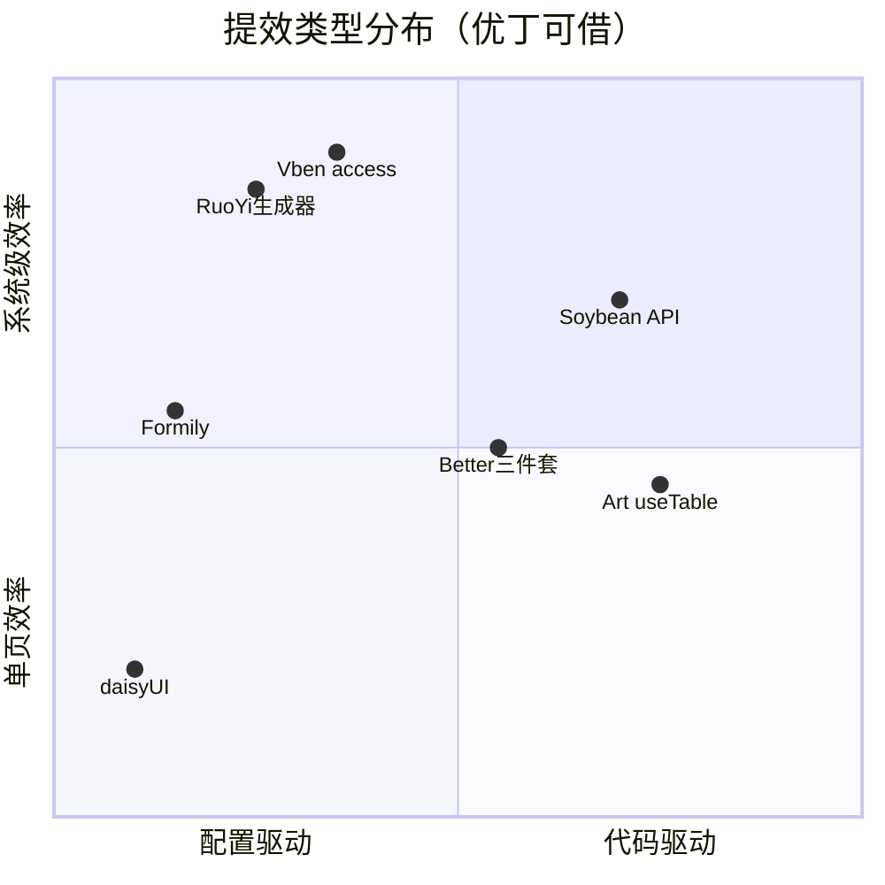

# 98 · 十二源库「高效性范式」对照 — 每家强在哪、优丁缺什么

> **补 99 汇总盲区**：99 文档回答「抽哪些文件」；本文回答 **「每家用什么办法提效、属于哪类效率、优丁怎么借」**。  
> **依据**：Phase 0 深读 01–03、06、10–13 + `_ref/` 源码与 README  
> **更新**：2026-06-01

---

## 一、总览 — 五种提效流派

| 流派 | 代表 | 核心思想 | 优丁对应 Wave |
|------|------|----------|---------------|
| **① 协议 / 轻代码** | **Formily（阿里）**、现网 drag-module（假） | JSON Schema 描述 UI，后端存协议、前端渲染 | W3 试点 |
| **② 代码生成** | **RuoYi 代码生成**、Better 商业版 | 表结构 → 模板 → 前后端 CRUD 一套 | W3 自建 OpenAPI 生成器 |
| **③ 壳 + 权限脚手架** | **Vben**、Element Admin | 动态路由/权限/Layout 一次配好，页面只填业务 | W1 |
| **④ 列表页工厂** | **Art Edge** | 一个 hook 管搜索/分页/缓存/列设置/刷新 | W2 kit |
| **⑤ 工程规范 + Mock** | **Soybean**、Pure、Better Mock | API 分层、路由扫描、Mock 热更，多人并行开发 | W1–W2 |

---

## 二、逐家高效性总结

### 1 · 阿里 Formily + antdv-x3 — **协议驱动 · 轻代码 · 后端可配**

| 维度 | 内容 |
|------|------|
| **高效模式** | **JSON Schema 驱动渲染** — 表单结构存 JSON，不写/少写 template；字段级响应式，联动用 side effect，不全树重渲染 |
| **轻代码栈** | `@formily/core` 表单引擎 → `@formily/json-schema` 协议 → `SchemaField` / `RecursionField` 递归渲染 → `antdv-x3` 组件映射 |
| **可视化** | 阿里 **Designable** + Form Builder（[designable-antd.formilyjs.org](https://designable-antd.formilyjs.org/)）拖拽出 Schema，**运营/实施可配表单**，研发只维护组件库 |
| **前后端分工** | README 明确：**JSON Schema 给 Backend**、JSchema/Markup 给 Frontend，**两种范式可互转** — BFF 存 Schema 版本即可下发 |
| **复杂场景组件** | `FormStep` 分步、`FormTab` 多 Tab、`ArrayTable` 动态行表格、`FormDialog` 弹窗表单 — **一个 Schema 顶 hundreds 行 Vue** |
| **性能** | 字段独立订阅，解决受控表单大数据联动卡顿（阿里开源动机） |
| **维护风险** | antdv-x3 最后活跃 ~2023，**局部用、不全站替换 `a-form`** |

**优丁怎么借**

| 借 | 不借 |
|----|------|
| site-editor / SEO schema 等 **1 页试点** | 全站 Formily 化 |
| BFF `GET/PUT /admin-bff/schema/{key}` 存版本 | 未评估就上 Designable 生产设计器 |
| 替代现网 **drag-module 内存假数据** — 真 Schema API | 把 drag-module 当低代码宣传 |

**与现网对比**：现网 `drag-module.vue` 是 **HTML5 拖拽 + 内存**，像低代码但 **无持久化**；Formily 是 **真协议驱动**，需 BFF Schema 存储才成立。

---

### 2 · RuoYi-Plus-Soybean — **库表 → 代码生成 · 多租户后端清单**

| 维度 | 内容 |
|------|------|
| **高效模式** | Java **代码生成器**（`tool/gen` + Velocity 模板）：连库选表 → 生成 Controller/Service/Mapper/Vue 页/SQL 菜单 |
| **提效点** | 标准 CRUD **分钟级**；字典、操作日志、部门、文件、租户套餐 **后台能力开箱** |
| **多租户** | 完整 SaaS 租户模型（README 主打），与优丁四壳 **能力对照表**，非代码搬迁 |
| **前端** | 复用 Soybean 壳 — **后端生成效率 > 前端创新** |

**优丁怎么借**

| 借 | 不借 |
|----|------|
| **能力路线图**：`/dict`、`/audit/logs`、租户套餐字段 | Java Spring Boot 后端 |
| Better + OpenAPI 自建 **`gen-crud-from-openapi.mjs`** 对标 RuoYi 生成器 | RuoYi 的 Velocity 模板原样 |

**效率定位**：RuoYi = **数据层驱动代码**；Formily = **Schema 驱动 UI**；优丁 FastAPI 侧应对标 RuoYi 的 **生成器 + 字典**，UI 侧对标 Formily 的 **Schema 页**。

---

### 3 · Vue Vben Admin 5 — **Monorepo 壳 · 权限路由一次生成**

| 维度 | 内容 |
|------|------|
| **高效模式** | **packages 拆分**（access / layouts / request / stores）— 改权限不改业务页；`generateAccessible` **backend 模式** 从 API 一次性生成菜单+路由+按钮码 |
| **提效点** | 登录链 `authLogin → userInfo + accessCodes → push(homePath)` 标准化；`preferences.ts` 集中主题/布局/accessMode；`backend-mock` 当契约样例 |
| **开发体验** | Turbo monorepo、多 UI 变体（antd/ele/naive）共用 effects 层 — **换皮不换权限逻辑** |
| **边界** | Layout 是 Tailwind/shadcn 壳，**不是** Ant Design Layout；业务页仍要手写或用生成器 |

**优丁怎么借**：整库 fork W1；**最高 ROI** 是 `accessMode: backend` + BFF 菜单，消灭 234 路由单文件维护。

---

### 4 · Art Design Pro Edge — **列表页工厂 · 734 行 useTable**

| 维度 | 内容 |
|------|------|
| **高效模式** | **一个 composable 包办列表页**：请求 + AbortController 防重复 + 分页双轨 adapter + **LRU 缓存** + **5 种刷新**（增删改/软刷）+ 列显隐/拖拽 |
| **页面公式** | `ArtSearchBar → ElCard → ArtTableHeader(列拖拽) → ArtTable` — **复制 4 行结构即新 CRUD 列表** |
| **多租户链** | `tenant_code → login → info → menu → 动态路由` — 与 UAC BFF 设计一致 |
| **提效量化** | 平台/系统/租户等 **10+ 页同构**，改 hook 一处全局受益 |

**优丁怎么借**：移植 `utils/table/*` + `useTableColumns` 到 kit（现 **108 行 vs 734 行**，差距 = 列表页效率差距）。

---

### 5 · Soybean Admin — **API 三层 · 路由扫描 · Token 刷新队列**

| 维度 | 内容 |
|------|------|
| **高效模式** | `service/api` → `service/request`（业务码 `0000`、登出码、**refresh 队列**）→ `packages/axios`；**并行请求不重复 refresh** |
| **路由** | **Elegant Router**：Vite 插件 **扫描 `views/` 生成** `router/elegant/routes.ts` — 新页放目录即注册（优丁 234 路由 **不适用一次性扫描**） |
| **Guard 两阶段** | `initConstantRoute` → `initAuthRoute` → `addRoute` — 清晰拆分公共/动态 |
| **表格** | 自带 `use-table` ~136 行，**轻量**，复杂场景不如 Art |

**优丁怎么借**：HTTP 状态机 + `Api.*` 命名 + 菜单纯函数；**禁止** UnoCSS/Naive 整库；分页 `current/size` 需 adapter。

---

### 6 · Vue-Admin-Better — **CRUD 三件套约定 · Mock 热挂载**

| 维度 | 内容 |
|------|------|
| **高效模式** | **API + index.vue + Edit.vue** 三件套；`getList` POST + `doEdit` + `doDelete` 命名统一 |
| **代码生成** | 开源 **无** 生成脚本 — `setting.config.js` 指向 **商业版** templateFolder；优丁需 **自建** OpenAPI 生成器 |
| **Mock 效率** | `mock/controller/*.js` **自动扫描** + chokidar **热更新** — 前端不等后端 |

**优丁怎么借**：三件套结构 → `gen-crud-from-openapi.mjs`；Mock 扫描思路 → 本地 BFF stub 开发。

---

### 7 · Vue Element Admin — **权限 meta · 角色路由生成**

| 维度 | 内容 |
|------|------|
| **高效模式** | `v-permission` 指令 + **`generateRoutes(roles)`** 按角色过滤 asyncRoutes；`meta` 白名单（title/icon/roles） |
| **提效点** | 2018 年定型的 **「后端给菜单 / 前端静态池过滤」** 双模式 — 优丁 BFF **backend 模式** 的直接前辈 |
| **边界** | Vue2 + Element UI，**只借流程不借组件** |

**优丁怎么借**：BFF `meta` 白名单对照表；`hideInMenu` / `planGate` 扩展。

---

### 8 · Pure Admin — **Mock 生态 · Schema 表单示例 · 组件超市**

| 维度 | 内容 |
|------|------|
| **高效模式** | 大量 **独立 demo 页**（schema-form、virtual table、vue-flow）— **抄一页上一页**；Mock 与 views 并行 |
| **提效点** | 移动侧栏、主题粒度、虚拟滚动表格 — **参考实现库**，非统一工厂 |
| **Schema** | `views/schema-form/` 多套表单范式 — 与 Formily **不同**（手写 schema 组件，非 JSON Schema 引擎） |

**优丁怎么借**：Mock 目录结构、Client 移动侧栏；**不** fork 整库。

---

### 9 · Naive UI Admin — **极简 SaaS 视觉 · 快速出登录/Dashboard 皮**

| 维度 | 内容 |
|------|------|
| **高效模式** | **视觉模板效率** — 分屏登录、留白 Dashboard、空状态；组件少而精 |
| **提效点** | 用 Naive 默认审美 **快速像 SaaS**；无复杂 table 工厂 |
| **边界** | Naive 组件库 **禁止** 进优丁 Admin 主壳 |

**优丁怎么借**：`TenantLogin.vue` / `YdEmpty` **抄布局不抄库**。

---

### 10 · Art Design Pro（上游）— Edge 的视觉与规范源

| 维度 | 内容 |
|------|------|
| **高效模式** | Edge 的上游；**设计规范 + 表格 UX 约定** 先于 Edge 代码 |
| **优丁** | 深读 ⏳；Edge 已够 — Pro 作 **视觉 diff** 即可 |

---

### 11 · daisyUI — **语义 class · 零写 CSS 拼营销页**

| 维度 | 内容 |
|------|------|
| **高效模式** | Tailwind **语义组件 class**（`btn` `card` `modal`）— HTML 拼页面，**不写 SCSS** |
| **提效点** | 营销/活动/注册页 **小时级** 出稿；主题换色 `data-theme` |
| **边界** | **不进** Vben Admin Layout |

**优丁怎么借**：`frontend/marketing` + 注册漏斗与 Admin 视觉同源。

---

### 12 · HTMLrev — **模板选型效率 · 非代码库**

| 维度 | 内容 |
|------|------|
| **高效模式** | 在线 **SaaS Landing / Astro** 模板 moodboard — **0.5–1 人日** 定视觉方向 |
| **优丁** | 设计资源，不增加第 13 个 npm 依赖 |

---

## 三、优丁现网 vs 百家 — 效率缺口

| 能力 | 百家谁最强 | 优丁现网 | 差距 |
|------|-----------|----------|------|
| 动态菜单/权限 | Vben + Element | 234 路由单文件 + emoji 硬编码 | **系统级** |
| 列表页开发 | Art useTable | kit 108 行 | **单页级** |
| 复杂表单/配置 | **Formily 轻代码** | `a-form` 手写 + drag-module 假低代码 | **配置级** |
| CRUD 批量产出 | RuoYi 生成 + Better 三件套 | 无生成器 | **批量级** |
| API 并行开发 | Soybean refresh + Pure/Better Mock | 部分 Mock 回退 | **协作级** |
| 对外出稿 | daisyUI + HTMLrev + Naive 皮 | 分散 | **视觉级** |

---

## 四、ECC 建议 — 按效率类型排 Wave

| 优先级 | 效率类型 | 动作 | 来源 |
|--------|----------|------|------|
| P0 | 系统级壳 | Vben fork + BFF backend 菜单 | Vben |
| P0 | 协作级 HTTP | Soybean request 状态机进 admin-vben | Soybean |
| P1 | 单页级列表 | Art table 734 行 → kit | Art Edge |
| P1 | 视觉级 SaaS | TenantLogin + 四支柱（R4 纪要） | Naive + SaaS 专家 |
| P2 | **配置级轻代码** | Formily **1 页** + BFF Schema API | **阿里 Formily** |
| P2 | 批量级 CRUD | `gen-crud-from-openapi.mjs` | Better 模式 + RuoYi 对标 |
| P3 | 后端能力 | 字典/审计 BFF | RuoYi 清单 |
| P3 | 营销出稿 | daisyUI landing | daisyUI + HTMLrev |

---

## 五、Formily 与 drag-module — 别混为一谈

| | 现网 drag-module | 阿里 Formily |
|--|------------------|--------------|
| 本质 | 前端 DnD 玩积木 | **JSON Schema 协议引擎** |
| 持久化 | ❌ 内存 | ✅ BFF 存 Schema |
| 联动/校验 | ❌ | ✅ side effects + validator |
| 可视化设计 | 假 | ✅ Designable |
| 优丁策略 | Kill 或 Lab Flag | W3 试点 **真轻代码** |

---

## 六、相关文档

- 文件级抽取：[99-synthesis-for-uac.md](./99-synthesis-for-uac.md)  
- SaaS 改造：[ecc-round4-meeting-minutes-saas-composite-20260601.md](../ecc-round4-meeting-minutes-saas-composite-20260601.md)  
- Formily 深读：[13-formily-antdv-x3.md](./13-formily-antdv-x3.md)  
- Art 深读：[02-art-design-pro-edge.md](./02-art-design-pro-edge.md)  

---

*2026-06-01 · 补 99 汇总 · 十二源库高效性范式*
