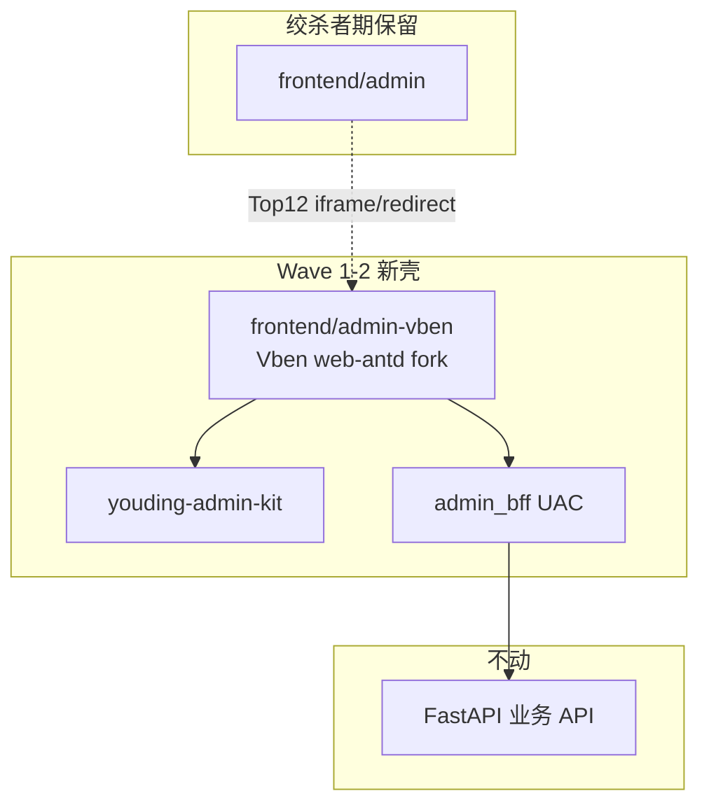

# 99 · 优丁 UAC 百家汇总 — 深读合成 v1

> **Phase 0 产出** · 编码门禁文档  
> **前提**：12 库已 clone 至 `_ref/` · 现网/BFF/Art/Soybean/Vben 已深读  
> **解锁条件**：本文档 v1 评审通过后，方可启动 Wave 1 `frontend/admin-vben`

---

## 一、我们要造什么（一句话）

**一套** 看起来像付费 SaaS 的四壳后台：Vben 壳 + Art 表格体验 + Soybean API 规范 + BFF 统一契约 + kit 抽取层；Formily 管复杂表单；daisyUI/HTMLrev 管对外颜值；**不**混第二 UI 库、**不**换 FastAPI。

---

## 二、12 源库 — 深读结论总表

| 源 | 本地 `_ref/` | 深读 | 对优丁角色 | 抽取度 |
|----|-------------|------|------------|--------|
| **Vben 5 web-antd** | `vue-vben-admin-full` | ✅ 本地 | **唯一 Admin 壳** | 整库 fork |
| **Art Edge** | `art-design-pro-edge` | ✅ | 表格/登录/列拖拽 | 逻辑+kit |
| Art Pro | `art-design-pro` | ⏳ | 视觉上游 | 参考 |
| **Soybean** | `soybean-admin` | ✅ | API 分层/refresh | 逻辑 only |
| Element Admin | `vue-element-admin` | ⏳ | 守卫 meta | 模式 |
| **Better** | `vue-admin-better` | ✅ | CRUD 三件套模式 | 模式→生成器 |
| **Naive Admin** | `naive-ui-admin` | 浅读 | 登录分屏视觉 | 皮肤 only |
| Pure | `vue-pure-admin` | ⏳ | Mock/主题 | 参考 |
| RuoYi-Soybean | `ruoyi-plus-soybean` | ⏳ | 字典/审计清单 | 能力路线图 |
| **Formily** | `formily` + `antdv-x3` | ✅ 结构 | Schema 复杂表单 | 局部 W3 |
| daisyUI | `daisyui` | ⏳ | 营销 Tailwind | landing |
| HTMLrev | 在线 | — | landing moodboard | 设计 |

---

## 三、优丁现网诊断（深读 10/11）

| 发现 | 影响 |
|------|------|
| **234** 叶子路由在 **1** 个文件 | 无法大爆炸迁移 |
| **0** BFF / **0** kit 引用 | UAC 未接线 |
| Client **emoji 硬编码菜单** | 不像 SaaS |
| **~80+** Stub/实验室路由 | 租户可见=掉价 |
| BFF **agent homePath 错误** | 动态路由会 404 |
| kit **108 行** vs Art **734 行** useTable | 表格体验远未到位 |

---

## 四、目标架构（绞杀者）



---

## 五、Vben → BFF 接线图（Wave 1 必改 5 处）

| Vben 文件 | 现默认 | 改为优丁 BFF |
|-----------|--------|--------------|
| `api/core/auth.ts` | `POST /auth/login` | `POST /api/v1/admin-bff/auth/login` |
| `api/core/user.ts` | `GET /user/info` | `GET /api/v1/admin-bff/user/info` |
| `api/core/auth.ts` codes | `GET /auth/codes` | `GET /api/v1/admin-bff/menu/permissions` → 取 `codes` |
| `api/core/menu.ts` | `GET /menu/all` | `GET /api/v1/admin-bff/menu/routes?shell=` |
| `preferences` | `accessMode: frontend` | **`backend`** |

**响应适配**（`api/request.ts`）：

- Vben 期望：`{ code: 0, data: T }`
- 优丁 FastAPI：对齐 `code`/`data` 或加 responseInterceptor adapter

**登录流**（`store/auth.ts` 已验证本地）：

```
loginApi → setAccessToken → parallel(fetchUserInfo, getAccessCodesApi) → router.push(homePath)
```

---

## 六、文件级抽取清单（按优先级）

### P0 — Wave 1（底座 + 接线）

| 动作 | 源 | 目标 |
|------|-----|------|
| Fork 整库 | `_ref/vue-vben-admin-full` | `frontend/admin-vben` |
| 改 5 个 API + accessMode | `apps/web-antd/src/api/*` | BFF |
| 修 BFF bug | `menu_adapter.py` | agent→`/agent/performance` |
| AGENT/OPS seed | `menu_adapter.py` | 四壳最小菜单 |
| Client 登录皮肤 | Naive login 布局参考 | `kit/layouts/TenantLogin.vue` |

### P1 — Wave 2（好用 + 颜值）

| 动作 | 源 | 目标 |
|------|-----|------|
| 移植 table 逻辑 | Art `utils/table/*` + `useTableColumns` | `kit/composables/` |
| 列拖拽 UI | Art `art-table-header` + `vue-draggable-plus` | `kit/components/YdTableHeader.vue` |
| 搜索条 | Art `ArtSearchBar` | 扩展 `YdSearchBar.vue` |
| API 规范 | Soybean `service/api` 分层 | `admin-vben/src/api/modules/` |
| 水印 | Art Edge | `kit/components/YdWatermark.vue` |
| Top12 页 | 现网 `views/client/*` | 迁入 Vben views |

### P2 — Wave 3（模块化 + 扩展）

| 动作 | 源 | 目标 |
|------|-----|------|
| OpenAPI 生成器 | Better 三件套模式 | `scripts/gen-crud-from-openapi.mjs` |
| Formily 试点 | `formily-antdv-x3` ArrayTable/FormStep | `tenants/site-editor` 或 SEO schema |
| drag-module 持久化 | 现网 prototype | Schema API + 非内存 |
| RuoYi 字典/审计 | ruoyi-plus-soybean | BFF `/dict` `/audit` |

### P3 — 对外

| 动作 | 源 | 目标 |
|------|-----|------|
| Landing | HTMLrev + daisyUI | `frontend/marketing` |

---

## 七、禁止清单（ECC 定案）

- ❌ Element / Naive **组件库**进 Admin 主壳  
- ❌ 234 路由一次性 rewrite  
- ❌ Java RuoYi 替换 FastAPI  
- ❌ 未 adapter 的 Soybean `0000` 码 / `current/size`  
- ❌ 把 `drag-module` 当生产低代码（无 API）  
- ❌ 继续开发 `_ref/` 内代码  

---

## 八、路由迁移策略（234 → 绞杀者）

| 阶段 | 范围 | 方式 |
|------|------|------|
| W1 | Platform 空壳 + 登录 | Vben 跑通 BFF |
| W2 | Client **Top12** | 复制 view + BFF 菜单 seed |
| W2 | Stub **隐藏** | `meta.hideInMenu` + 产品矩阵 |
| W3 | Platform 8 主干 | 同上 |
| W4 | 旧 admin redirect | Nginx / 路由别名 |
| 长期 | 实验室 80+ | Feature Flag 关 |

**Top12 Client（Wave 2 硬清单）**：

1. dashboard 2. products 3. inquiries 4. content 5. seo-matrix/publish  
6. billing 7. onboarding 8. tokens 9. invoices 10. settings 11. assistant 12. login  

---

## 九、BFF 修复清单（Wave 1 前）

- [ ] `resolve_home_path('agent')` → `/agent/performance`  
- [ ] `AGENT_SEED` 6 路由、`OPS_SEED` 最小集  
- [ ] `get_user_info` 填充 `tenant`  
- [ ] `bff_tenant_search` 接 tenants 表  
- [ ] login 响应字段与 Vben `accessToken` 对齐  
- [ ] menu `component` 路径白名单  

---

## 十、kit 补齐清单（相对 MANIFEST）

| 文件 | 状态 |
|------|------|
| `useYoudingTable` 扩展（Art 逻辑） | 待移植 |
| `YdTableHeader.vue`（列拖拽） | 待建 |
| `YdWatermark.vue` | 待建 |
| `layouts/TenantLogin.vue` | 待建 |
| `gen-crud-from-openapi.mjs` | 待建 |

---

## 十一、Wave 1 任务切片（可执行）

| ID | 任务 | 依赖 |
|----|------|------|
| W1-1 | copy `vue-vben-admin-full` → `frontend/admin-vben` | 本文档 ✅ |
| W1-2 | BFF 修复 §九 | — |
| W1-3 | 改 Vben API 5 处 + `accessMode: backend` | W1-2 |
| W1-4 | `pnpm dev:antd` + BFF 登录 E2E | W1-3 |
| W1-5 | Client shell 动态菜单 ≤6 项 smoke | W1-4 |
| W1-6 | 双前端 runbook（10min 回滚） | W1-4 |

---

## 十二、审计文档索引

| 文档 | 内容 |
|------|------|
| **[98-efficiency-paradigms](./98-efficiency-paradigms-by-vendor.md)** | **十二源库高效性 / 轻代码范式（补本文盲区）** |
| [00-methodology](./00-methodology-and-index.md) | 方法论 |
| [01-vben](./01-vben-web-antd.md) | Vben 本地 |
| [02-art-edge](./02-art-design-pro-edge.md) | useTable/拖拽 |
| [03-soybean](./03-soybean-admin.md) | API 分层 |
| [06-better](./06-vue-admin-better.md) | CRUD 模式 |
| [10-现网](./10-youding-admin-current.md) | 234 路由 |
| [11-bff](./11-youding-admin-bff.md) | BFF |
| [12-kit-gap](./12-youding-admin-kit-gap.md) | 差距 |
| [PHASE0-STATUS](./PHASE0-STATUS.md) | 进度 |

---

## 十三、Phase 0 完成度

```
克隆 12/12 ✅
深读核心 7/12 ✅（Vben/Art/Soybean/Better/Formily结构/现网/BFF）
汇总 v1 ✅ ← 本文档
编码门禁：Wave 1 可启动（建议先 W1-2 BFF 修复）
```

---

*2026-06-01 · UAC 百家汇总 v1 · 好饭不怕晚*
