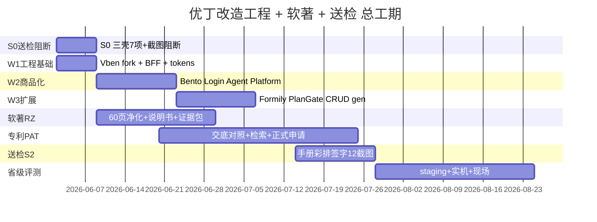

# PM 总任务分派 · 工期进度与部门 KPI 考核表

> **签发**：产品经理  
> **生效**：2026-06-02  
> **范围**：SaaS 三壳改造 + Wave 1–2 工程 + 软著 2026 合规 + **发明专利** + 省级评测送检  
> **一次性总方案**：[`pm-one-shot-ip-ux-masterplan.md`](./pm-one-shot-ip-ux-masterplan.md) · **SaaS 价值框架** [`ecc-saas-enterprise-value-framework.md`](./ecc-saas-enterprise-value-framework.md) · **全员思维导图** [`思维导图-优丁SaaS改造全员对齐.md`](./思维导图-优丁SaaS改造全员对齐.md) · 仓库链接清单 [`open-source-audit/00-repo-link-inventory.md`](./open-source-audit/00-repo-link-inventory.md)  
> **考核周期**：按 **阶段里程碑** 验收；Weekly ECC 周一 standup 通报  
> **权威仓**：`Desktop/上线网站`

> **人工任务策略（2026-06-02）**：签字、彩排、手抄承诺 **统一置后**；研发优先 W3 + CERT。  
> **会议 / SaaS 专家 / 百家仓库总索引**：[`ecc-meeting-saas-repo-master-index.md`](./ecc-meeting-saas-repo-master-index.md)  
> **任务统计**：[`pm-task-statistics-20260602.md`](./pm-task-statistics-20260602.md) · **看板**：[`ecc-delivery-tracker.md`](./ecc-delivery-tracker.md)

---

**基准日**：2026-06-02（D0）  
**总跨度**：约 **12 周**（至 2026-08-24 送检窗口目标，Owner 可调）

### 阶段定义

| 阶段 | 日历 | 主题 | 阶段出口（Gate） |
|------|------|------|------------------|
| **S0** | D0–D7 · 6/2–6/8 | 送检阻断 · 三壳止血 | 代理无超管链；Platform 送检菜单；Stub Hide v1 |
| **W1** | D0–D7 · 6/2–6/8 | 工程壳 + BFF + tokens + 软著目录 | Vben 可 dev；BFF 登录；RZ-01 目录定稿 |
| **W2** | D8–D21 · 6/9–6/22 | SaaS 商品化 + 软著 60 页 v1 | Bento/Login；RZ-02 60 页签字 |
| **W3** | D22–D35 · 6/23–7/6 | 扩展 + 软著提交包 + 专利实施例 | Formily 试点；RZ-03/04/06；PAT-03~05 |
| **S2** | D36–D49 · 7/7–7/20 | 送检材料包 + 专利递交复核 | 脚本 v2 彩排；12 截图；PM L3 签字；PAT-06 |
| **CERT** | D50–D84 · 7/21–8/24 | 省级评测 staging + 现场 | preflight 0 fail；手册 PDF |

---

## 二、总任务清单（分部门 · 全量 ID）

> 状态：`⏳` 待办 · `🔄` 进行中 · `✅` 完成 · `🔴` 逾期 · `⛔` 阻塞

### 2.1 产品经理部（PM）

| ID | 任务 | 阶段 | 截止 | 状态 | 依赖 |
|----|------|------|------|------|------|
| PM-01 | Stub 可见性矩阵 v1（与 SaaS 联签） | S0 | 6/6 | ✅ | — |
| PM-02 | 四支柱 ↔ Top12 路由映射表 | S0 | 6/8 | ✅ | PM-01 |
| PM-03 | 送检脚本 v2 彩排组织（30min） | S2 | 7/15 | 🔄 |
| PM-04 | L3 六项人工走查 + `l3-signoff.json` | S2 | 7/18 | ⏳ | PM-03 |
| PM-05 | 用户操作手册-送检版 PDF | S2 | 7/20 | 🔄 |
| PM-06 | Owner Blocked 项书面跟进（Brand/Trial/送检窗口） | W1 | 6/8 | 🔄 | Owner |
| PM-07 | 每周更新本表 + 统计表 + tracker | 全程 | 每周一 | 🔄 | — |
| PM-08 | 阶段 Gate 验收签字（S0/W2/S2） | 各阶段 | 见上 | ⏳ | 各部门 KPI |

### 2.2 SaaS 产品策略部

| ID | 任务 | 阶段 | 截止 | 状态 |
|----|------|------|------|------|
| SAAS-01 | Stub 四级策略写入矩阵（Hide/PlanGate/Lab/Kill） | S0 | 6/6 | ✅ |
| SAAS-02 | Client 四支柱 BFF seed 验收标准 | S0 | 6/8 | ✅ |
| SAAS-03 | Plan Gate 字段定义（对齐 marketing copy deck） | W2 | 6/15 | ✅ |
| SAAS-04 | SaaS 五问验收（每阶段末） | 全程 | 各 Gate | ✅ |
| SAAS-05 | 送检现场 30s 话术培训（研发+销售） | S2 | 7/14 | ✅ |
| SAAS-06 | 行业痛点↔产品部件对照表签字（见 [`ecc-saas-enterprise-value-framework.md`](./ecc-saas-enterprise-value-framework.md) §3） | S0 | 6/8 | ✅ |
| SAAS-07 | 效果复盘表 v1（有效线索定义 + 询盘导出字段） | W2 | 6/22 | ✅ |
| SAAS-08 | 销售话术：卖结果不卖功能（6980 对比 + 三轨计费） | S2 | 7/14 | ✅ |

### 2.3 前端部

| ID | 任务 | 阶段 | 截止 | 状态 |
|----|------|------|------|------|
| FE-01 | `admin-vben` fork + `pnpm dev:antd` | W1 | 6/8 | ✅ |
| FE-02 | BFF 五 API + `accessMode:backend` | W1 | 6/8 | ✅ |
| FE-03 | S0-2 删 Agent「查看全平台」 | S0 | 6/4 | ✅ |
| FE-04 | S0-3 Agent KPI 去渐变 → 白底色条 | S0 | 6/6 | ✅ |
| FE-05 | S0-4 hierarchy 删 hero-glass | S0 | 6/6 | ✅ |
| FE-06 | S0-6 三壳 emoji→Lucide | S0 | 6/8 | ✅ |
| FE-07 | Client 四支柱菜单接线（BFF） | W2 | 6/15 | ✅ |
| FE-08 | kit：YdOnboardingCard / TodayQueue / UsageMeter | W2 | 6/22 | ✅ |
| FE-09 | TenantLogin + YdWorkspaceHeader 实现 | W2 | 6/22 | ✅ |
| FE-10 | Platform 送检模式菜单（仅鉴定面） | S0 | 6/8 | ✅ |
| FE-11 | Formily site-editor 试点页 | W3 | 7/6 | ✅ |
| FE-12 | 配合 RZ-02：自研前端 60 页文件清单导出 | W2 | 6/18 | ✅ |

### 2.4 后端部

| ID | 任务 | 阶段 | 截止 | 状态 |
|----|------|------|------|------|
| BE-01 | BFF W1-2：tenant/info/captcha/token 对齐 | W1 | 6/8 | ✅ |
| BE-02 | CLIENT/AGENT/PLATFORM seed 四支柱起草 | S0 | 6/8 | ✅ |
| BE-03 | `user/info` 增 onboarding_steps + plan_usage | W2 | 6/22 | ✅ |
| BE-04 | planGate 服务端校验 | W2 | 6/22 | ✅ |
| BE-05 | `/admin-bff/dict/plan_features` 路线图 | W3 | 7/6 | ✅ |
| BE-06 | 配合 RZ-02：backend 60 页导出 + 研发 readability 签字 | W2 | 6/18 | 🔄 |

### 2.5 视觉部

| ID | 任务 | 阶段 | 截止 | 状态 |
|----|------|------|------|------|
| UX-01 | design-tokens v2 + Lucide icon-map | W1 | 6/8 | ✅ |
| UX-02 | Agent KPI 白底色条组件稿 | S0 | 6/5 | ✅ |
| UX-03 | hierarchy 标准页线框 | S0 | 6/5 | ✅ |
| UX-04 | TenantLogin + Header 高保真 | W2 | 6/15 | ✅ |
| UX-05 | Plan Gate 升级页 mock | W3 | 6/29 | ✅ |
| UX-06 | 空状态 3 套（询盘/产品/onboarding） | W2 | 6/22 | ✅ |
| UX-07 | 三壳对比图（现网 vs 目标）×3 | S0 | 6/6 | ✅ |
| UX-08 | 送检 12 截图美术规范（S0 后重拍） | S2 | 7/12 | ✅ |

### 2.6 营销部

| ID | 任务 | 阶段 | 截止 | 状态 |
|----|------|------|------|------|
| MKT-01 | plan-copy-deck 维护（套餐唯一源） | W1 | ✅ | ✅ |
| MKT-02 | 送检手册目录（仅鉴定面 12 模块） | S0 | 6/6 | ✅ |
| MKT-03 | 注册页 + Login 左栏文案（同源） | W2 | 6/15 | ✅ |
| MKT-04 | 投流脚本 3 条（W2 真实截图） | W2 | 6/22 | ✅ |
| MKT-05 | Landing 骨架 `frontend/marketing` | W3 | 7/6 | ✅ |
| MKT-06 | 操作手册正文（人类撰写，500–1300 字/模块） | S2 | 7/18 | 🔄 |

### 2.7 架构 / DevOps 部

| ID | 任务 | 阶段 | 截止 | 状态 |
|----|------|------|------|------|
| ARCH-01 | Postgres staging preflight **0 fail** | CERT | 7/25 | ⏳ |
| ARCH-02 | 双 admin 10min 回滚 runbook + 演练 | W2 | 6/22 | ✅ |
| ARCH-03 | Wave 并行调度（BFF∥Vben∥视觉∥RZ） | W1 | 6/2 | ✅ |
| ARCH-04 | HTTPS 送检域名 + compose 实跑记录 | CERT | 7/28 | ⏳ |
| ARCH-05 | OPEN-SOURCE-NOTICES.md 定稿 | W2 | 6/18 | ✅ |

### 2.8 QA / 合规部

| ID | 任务 | 阶段 | 截止 | 状态 |
|----|------|------|------|------|
| QA-01 | S0 后 E2E：三壳各 1 条冒烟 | S0 | 6/8 | ✅ |
| QA-02 | cert:gate 每周回归 | 全程 | 每周五 | ✅ |
| QA-03 | 送检用例矩阵 ↔ 鉴定面路径对齐 | S2 | 7/12 | ✅ |
| QA-04 | 72h / Locust 报告归档 | CERT | 8/10 | ⏳ |
| COMP-01 | 软著 RZ-01：2 件代码目录清单 | W1 | 6/8 | ✅ |
| COMP-02 | 软著 RZ-02：60 页 v1 + 研发签字 | W2 | 6/18 | 🔄 |
| COMP-03 | 软著 RZ-03：人类说明书（非 AI） | W2 | 6/22 | 🔄 |
| COMP-04 | 软著 RZ-04：证据包（git/PRD/开源声明） | W2 | 6/22 | ✅ |
| COMP-05 | 软著 RZ-06：经办人手抄承诺提交 | W3 | 7/6 | ⏳ |
| COMP-06 | 律师/合规复审申请表（建议） | W3 | 7/10 | 🔄 |
| COMP-07 | 专利与软著代码范围 **不冲突** 复核 | S2 | 7/28 | 🔄 |

### 2.9 IP/软著合规专家部（`ip-compliance-expert`）

> 2026 新规：**手写承诺未使用 AI**；失信 → 征信。本部门与 QA 分工：QA 测功能，IP 审材料真实性。

| ID | 任务 | 阶段 | 截止 | 状态 |
|----|------|------|------|------|
| IP-01 | 统筹 RZ + PAT 材料边界（对照 [`00-repo-link-inventory`](./open-source-audit/00-repo-link-inventory.md)） | W1 | 6/8 | ✅ |
| IP-02 | 60 页 **禁止清单**（Vben 整库/Stub/_ref）签字 | W2 | 6/18 | 🔄 |
| IP-03 | 经办人手抄承诺培训 + 模板存档 | W3 | 7/1 | 🔄 |
| IP-04 | 每周 COMP-K3 失信风险扫描 | 全程 | 每周五 | ✅ |

### 2.10 专利部（发明 · 多模型调度）

| ID | 任务 | 阶段 | 截止 | 状态 | 依赖 |
|----|------|------|------|------|------|
| PAT-01 | 交底书 ↔ 现网代码 **权利要求对照表** | W2 | 6/20 | ✅ |
| PAT-02 | 新颖性检索 memo / 代理机构对接 | W2 | 6/25 | 🔄 |
| PAT-03 | 多租户配额 + 失败切换 **可复现 demo** | W3 | 7/5 | ✅ |
| PAT-04 | 发明人/申请人定稿（Owner 签字） | W3 | 7/10 | ⏳ | Owner |
| PAT-05 | **正式专利申请**（建议 RZ 材料稳定后） | S2 | 7/25 | ⏳ | PAT-02, COMP-02 |
| PAT-06 | 与软著②代码范围冲突复核 | S2 | 7/28 | ⏳ | COMP-07 |

### 2.11 后台页面搭建（表格/inbox）

| ID | 任务 | 阶段 | 截止 | 状态 |
|----|------|------|------|------|
| PAGE-01 | Art useTable → kit（734 行移植） | W2 | 6/22 | ✅ |
| PAGE-02 | 三队列：询盘 / 发布 / 履约 | W2 | 6/22 | ✅ |

### 2.12 文档部

| ID | 任务 | 阶段 | 截止 | 状态 |
|----|------|------|------|------|
| DOC-01 | sync 全部 PM 文档 → 出海计 | W1 | 6/8 | ✅ |
| DOC-02 | 维护本总表 + tracker 周报 | 全程 | 每周一 | 🔄 |
| DOC-03 | **全员思维导图**（SEO/PM/各团队） | S0 | ✅ | [`思维导图-优丁SaaS改造全员对齐.md`](./思维导图-优丁SaaS改造全员对齐.md) |

---

## 三、部门 KPI 考核表（严格）

> **计分**：每项满分 100；阶段 KPI = 加权平均。**<80 红灯** · **80–89 黄灯** · **≥90 绿灯**  
> **挂钩**：红灯部门下阶段 **不得新增需求**；连续 2 次红灯 → PM escalate Owner。

### 3.1 产品经理部

| KPI 编号 | 指标 | 目标值 | 权重 | 数据来源 |
|----------|------|--------|------|----------|
| PM-K1 | 阶段 Gate 按时签字率 | 100% | 25% | Gate 记录 |
| PM-K2 | Stub 矩阵 + 路由映射按时交付 | D+7 完成 | 20% | PM-01/02 |
| PM-K3 | 送检彩排一次通过率 | ≥1 次无重大返工 | 20% | 彩排纪要 |
| PM-K4 | L3 签字 + 手册 PDF 按时 | S2 截止前 | 20% | l3-signoff |
| PM-K5 | Blocked 项 Owner 书面回复率 | 100% W1 内 | 15% | 邮件/纪要 |

### 3.2 SaaS 产品策略部

| KPI 编号 | 指标 | 目标值 | 权重 |
|----------|------|--------|------|
| SA-K1 | 阶段末 SaaS 五问通过率 | 5/5 | 25% |
| SA-K2 | 租户侧 Stub 零可见（抽检） | 0 违规 | 20% |
| SA-K3 | Client 一级菜单 ≤5（W2 起） | 100% | 20% |
| SA-K4 | Plan Gate 与 copy-deck 一致 | 0 冲突 | 15% |
| SA-K5 | 内部角色一句话说清 3 个行业痛点（抽检） | W2 Gate 3/3 人 | 10% |
| SA-K6 | 效果复盘表 v1 与 inquiries 导出对齐 | SAAS-07 签字 | 10% |

### 3.3 前端部

| KPI 编号 | 指标 | 目标值 | 权重 |
|----------|------|--------|------|
| FE-K1 | S0 七项 FE 任务按时完成 | 6/6 项 | 25% |
| FE-K2 | W1 Vben+BFF E2E 登录 smoke | Pass | 25% |
| FE-K3 | W2 Bento+Login 按 spec 实现 | 视觉双签 | 20% |
| FE-K4 | 构建零破坏（cert:gate） | 每周绿 | 15% |
| FE-K5 | 软著前端 60 页清单可读性签字 | 100% 经办人认可 | 15% |

### 3.4 后端部

| KPI 编号 | 指标 | 目标值 | 权重 |
|----------|------|--------|------|
| BE-K1 | BFF W1-2 清单完成 | 6/6 项 | 25% |
| BE-K2 | planGate 服务端校验（无仅前端 hide） | 100% 覆盖 | 25% |
| BE-K3 | pytest 不回归 | ≥337 pass | 20% |
| BE-K4 | onboarding/usage 字段 W2 上线 | API 文档齐 | 15% |
| BE-K5 | 软著 backend 60 页 readability 签字 | 100% | 15% |

### 3.5 视觉部

| KPI 编号 | 指标 | 目标值 | 权重 |
|----------|------|--------|------|
| UX-K1 | **W1 交付率**（tokens+S0 线框） | 100% D+7 前 | **30%** |
| UX-K2 | 与 bento-spec 像素级一致（抽检 3 页） | ≥90 分 | 25% |
| UX-K3 | 三壳对比图按时 | 3/3 | 20% |
| UX-K4 | 送检截图美术规范执行 | 12/12 合规 | 25% |

**硬规则**：UX-K1 未完成 → **ECC 自动红灯**（masterplan O7）。

### 3.6 营销部

| KPI 编号 | 指标 | 目标值 | 权重 |
|----------|------|--------|------|
| MK-K1 | **W1 交付率**（手册目录+copy 维护） | 100% | **30% |
| MK-K2 | 套餐文案与 Admin 零不一致 | 0 处 | 25% |
| MK-K3 | 手册人类撰写（AI 检测/人工声明） | 合规签字 | 25% |
| MK-K4 | 投流素材用 W2 实拍非 stock | 3/3 | 20% |

**硬规则**：MK-K1 未完成 → **ECC 自动红灯**。

### 3.7 架构 / DevOps 部

| KPI 编号 | 指标 | 目标值 | 权重 |
|----------|------|--------|------|
| AR-K1 | staging preflight 0 fail | CERT 前 | 35% |
| AR-K2 | 回滚 runbook 演练成功 | ≤10min | 25% |
| AR-K3 | OPEN-SOURCE-NOTICES 定稿 | W2 | 20% |
| AR-K4 | 送检 HTTPS 环境实跑 | 有记录 | 20% |

### 3.8 QA / 合规部

| KPI 编号 | 指标 | 目标值 | 权重 |
|----------|------|--------|------|
| QA-K1 | S0 三壳 E2E smoke | 3/3 Pass | 20% |
| QA-K2 | cert:gate 每周绿 | 连续绿 | 20% |
| COMP-K1 | 软著 60 页按时 + 无 Stub 页 | RZ-02 | 25% |
| COMP-K2 | 证据包完整度 checklist | 100% | 20% |
| COMP-K3 | 失信风险项清零（AI 代写材料） | 0 | 15% |

### 3.9 IP/软著合规专家部

| KPI 编号 | 指标 | 目标值 | 权重 |
|----------|------|--------|------|
| IP-K1 | 60 页禁止清单零违规 | 0 项 | 30% |
| IP-K2 | 经办人承诺培训完成 | 100% W3 前 | 25% |
| IP-K3 | 专利/软著代码范围冲突 | 0 | 25% |
| IP-K4 | 每周失信风险扫描记录 | 连续 12 周 | 20% |

### 3.10 专利部

| KPI 编号 | 指标 | 目标值 | 权重 |
|----------|------|--------|------|
| PAT-K1 | PAT-01 对照表覆盖核心权利要求 | ≥90% | 40% |
| PAT-K2 | 正式申请按时（或 Owner 书面延期） | 7/25 目标 | 35% |
| PAT-K3 | 实施例 demo 可复现 | 1 套录屏 | 25% |

### 3.11 后台页面搭建

| KPI 编号 | 指标 | 目标值 | 权重 |
|----------|------|--------|------|
| PG-K1 | useTable 移植完成度 | ≥核心 6 能力 | 50% |
| PG-K2 | 三队列页 W2 可用 | 3/3 API 200 | 50% |

---

## 四、阶段 Gate 验收（PM 主持 · 不通过不进入下一阶段）

### Gate-S0 · 2026-06-09（D+7）

| # | 验收项 | 必过 |
|---|--------|------|
| 1 | Agent 无 `/admin/*` 链接 | ✅ |
| 2 | hierarchy 无 hero-glass | ✅ |
| 3 | Stub 矩阵 v1 签字 | ✅ |
| 4 | Platform 送检菜单 ≤鉴定面+2 | ✅ |
| 5 | UX-07 三壳对比图 | ✅ |
| 6 | QA-01 三壳 smoke | ✅ |
| 7 | COMP-01 软著目录定稿 | ✅ |

### Gate-W2 · 2026-06-23

| # | 验收项 |
|---|--------|
| 1 | Client Bento Dashboard 可演示 |
| 2 | TenantLogin + Header 工作区 |
| 3 | COMP-02 60 页 v1 签字 |
| 4 | COMP-03 说明书人类稿 |
| 5 | SA-K3 一级菜单 ≤5 |

### Gate-S2 · 2026-07-21

| # | 验收项 |
|---|--------|
| 1 | 12 张 cert 截图归档 |
| 2 | PM-04 L3 签字 |
| 3 | PM-05 手册 PDF |
| 4 | 脚本 v2 彩排 ≤30min |
| 5 | COMP-05 软著提交（或 Owner 定窗口） |

### Gate-CERT · 2026-08-24（目标）

| # | 验收项 |
|---|--------|
| 1 | ARCH-01 preflight 0 fail |
| 2 | QA-04 性能/72h 报告 |
| 3 | 省级评测中心现场材料齐 |

---

## 五、Weekly 节奏（PM 强制执行）

| 日 | 动作 |
|----|------|
| **周一 10:00** | ECC standup：各部门报 KPI 灯色 + 本周 ID |
| **周三** | PM 更新本表状态；视觉/营销 **必须有进展** |
| **周五 17:00** | QA cert:gate；PM 发 **周报**（灯色+风险） |
| **阶段末** | Gate 会议；SaaS 五问；PM 签字 |

---

## 六、风险登记（Top 5）

| 风险 | 影响 | 缓解 | 主责 |
|------|------|------|------|
| 视觉/营销再次空档 | S0 截图无法重拍 | UX-K1/MK-K1 红灯机制 | PM |
| 软著 AI 材料失信 | 个人征信 | COMP-K3 / IP-K2；人类说明书 | IP 合规专家 |
| 专利与软著代码撞车 | 二者其一被驳回 | COMP-07 / PAT-06 | IP + BE |
| `_ref/` 仅 5/12 clone | 浅读审计滞后 | 补跑 clone 脚本 | ARCH |
| Owner Blocked 不批 | Login/Plan Gate 卡住 | PM-06 书面催 | PM |
| staging 不过 | 省级 No-Go | ARCH-01 提前 4 周 | 架构 |
| Vben fork 占满 W1 | S0 延期 | FE/BE 分人并行 | 架构 |

---

## 七、任务统计与分配（PM 盘点 2026-06-02）

> **分配表（执行）**：[`pm-task-allocation-20260602.md`](./pm-task-allocation-20260602.md)  
> **统计表**：[`pm-task-statistics-20260602.md`](./pm-task-statistics-20260602.md)  
> **全量 115 项** = L1(79) + BJ(3) + MOD(8) + S2人类(17) + ENG已归档(8)

| 部门 | 任务数 | ✅ | 🔄 | ⏳ |
|------|--------|----|----|-----|
| PM | 8 | 2 | 4 | 2 |
| SaaS | 8 | 8 | 0 | 0 |
| 前端 | 12 | 12 | 0 | 0 |
| 后端 | 6 | 5 | 1 | 0 |
| 视觉 | 8 | 8 | 0 | 0 |
| 营销 | 6 | 5 | 1 | 0 |
| 架构 | 5 | 3 | 0 | 2 |
| QA | 4 | 3 | 0 | 1 |
| 合规 COMP | 7 | 2 | 4 | 1 |
| IP 合规 | 4 | 2 | 2 | 0 |
| 专利 PAT | 6 | 2 | 1 | 3 |
| 页面搭建 | 2 | 2 | 0 | 0 |
| 文档 | 3 | 2 | 1 | 0 |
| **L1 合计** | **79** | **54** | **14** | **11** |
| **+百家 BJ** | 3 | 0 | 0 | 3 |
| **+业务 MOD** | 8 | — | 8 | — |

> Sprint-R1 研发 **13 项** 见分配表 §二。

---

## 八、相关文档

- **`pm-task-allocation-20260602.md`** — **全量统计 + Sprint 分配（执行主文档）**
- **`pm-task-statistics-20260602.md`** — 数字盘点
- **`ecc-meeting-saas-repo-master-index.md`** — ECC 会议 / SaaS 条件 / 15 仓库
- `ecc-delivery-tracker.md` — 本周看板

---

*产品经理签发 · 2026-06-02 · 本表为工期与 KPI 唯一总清单*
