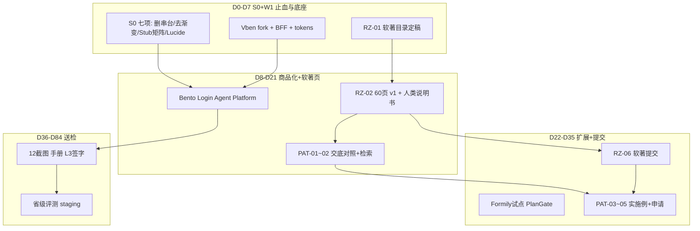

# PM 一次性总方案 · 改造 + 软著 + 专利 + 送检

> **签发**：产品经理 × SaaS 专家 × **IP/软著合规专家**  
> **生效**：2026-06-02  
> **读者**：Owner、各部门负责人  
> **配套**：[`pm-master-schedule-kpi-20260601.md`](./pm-master-schedule-kpi-20260601.md) · [`00-repo-link-inventory.md`](./open-source-audit/00-repo-link-inventory.md)

---

## 一、你问的三句话 — 直接回答

### 1. 链接都总结了吗？有没有遗漏？

**战略层：没有遗漏。** 你发过的 15 个 URL（8 Admin + RuoYi + Formily×3 + daisyUI + HTMLrev）均已解读。

**执行层：有缺口。**

- `_ref/` **只 clone 了 5/12**（见 `clone-manifest.json`）
- 浅读审计 **04–09、14–15 未完成**
- **琢磨先生**：原则已吸收，**具体视频 URL 未存档**（§五）
- **专利**：交底书在，此前 **未并入总工期**（本文件 §三 已补 PAT 轨道）

### 2. 系统这么丑、这么难用，怎么搞？

**不是再写文档，是三条线同时动：**

```
丑/难用 根因                    解法（12 周内）              谁负责
─────────────────────────────────────────────────────────────────
234 路由 + emoji + Stub 吓人     S0 止血 7 项 + Stub 矩阵      FE+PM+SaaS
没有「今日任务」北极星           W2 Bento Dashboard           FE+UX
壳层 2018 风、无设计系统         Vben fork + tokens v2        FE+UX
列表页各自为政                   Art useTable 工厂            PAGE
送检员看到 lab/渐变/串台         送检菜单 + 12 截图重拍        全员
```

**琢磨先生/抖音教过的不是特效，是：≤5 项导航、白底克制、3 秒读懂、像付费 SaaS。** 我们差在 **信息架构和 Stub**，其次才是 CSS。

### 3. 软著完了还要专利 — 能否一次性解决？

**能，但必须分「材料边界」：**

| 轨道 | 提交物 | 代码/材料来源 | 与改造关系 |
|------|--------|---------------|------------|
| **产品改造** | 可演示的三壳 + Vben 壳 | 现网迭代 + admin-vben | 送检 & 截图 & 手册 |
| **软著 ×2** | 各 60 页 + 人类说明书 | **FastAPI 自研 + BFF + kit**；不含 Vben 整库 | 改造同步「净化」目录 |
| **专利 ×1** | 技术交底书 → 正式申请 | `docs/专利/技术交底书-AI多模型调度.md` + 实现代码 | 软著② 稳定后递交 |

**关键**：改造用的 Vben/Art **是运行时依赖**；软著/专利 **登记的是优丁自研模块**（见 [`软著/AI合规与登记策略-2026.md`](./软著/AI合规与登记策略-2026.md)）。

---

## 二、ECC 新增席位：IP/软著合规专家

| 字段 | 内容 |
|------|------|
| **角色 ID** | `ip-compliance-expert` |
| **职责** | 2026 手写承诺、60 页净化、说明书人类撰写、证据包、专利交底与申请衔接、失信风险清零 |
| **不负责** | 写业务代码、替研发签字 |
| **KPI** | COMP-K1~K3 + PAT-K1~K2（见总表 §2.11） |
| **与 QA 关系** | QA 测功能；IP 专家审 **材料真实性** |

---

## 三、专利轨道（PAT-01~06）

> 发明名称：**一种基于多模型自适应调度的内容智能生成方法**  
> 交底书：[`docs/专利/技术交底书-AI多模型调度.md`](./专利/技术交底书-AI多模型调度.md)

| ID | 任务 | 阶段 | 截止 | 依赖 |
|----|------|------|------|------|
| PAT-01 | 现有实现与交底书 **权利要求对照表**（代码行号映射） | W2 | 6/20 | BE ai_engine |
| PAT-02 | 检索报告 / 新颖性 memo（可委托代理机构） | W2 | 6/25 | PAT-01 |
| PAT-03 | 实施例补充：多租户配额 + 失败切换 **可复现 demo** | W3 | 7/5 | PAT-01 |
| PAT-04 | 发明人/申请人信息定稿（Owner 签字） | W3 | 7/10 | Owner |
| PAT-05 | **正式申请**（建议软著①材料稳定后） | S2 | 7/25 | RZ-02, PAT-02 |
| PAT-06 | 专利与软著② **代码范围不冲突** 复核 | S2 | 7/28 | COMP-02, PAT-01 |

**顺序建议**：软著 60 页 v1（6/18）→ 专利 PAT-01~03（6/20–7/5）→ 软著提交（7/6）→ 专利正式递交（7/25 前后）。

---

## 四、12 周一张图（改造 ∥ 软著 ∥ 专利 ∥ 送检）



---

## 五、琢磨先生审美 · 10 条验收（SaaS 专家 + 视觉部）

送检前任意页面须满足：

1. 一级导航 ≤5（Client）/ ≤12（Platform 送检模式）
2. 无 emoji 作菜单 icon
3. 无全屏渐变 hero 在业务列表页
4. KPI 卡白底或浅灰，**最多 1 个品牌强调色**
5. 空状态有文案 + 单一 CTA
6. 租户 30 秒内能答：今日任务 / 店铺状态 / 套餐余量
7. 代理/Agent **零** Platform 超管链接
8. Stub 页租户不可见
9. 登录页像 SaaS 商品，不像内网 OA
10. 截图无 console 报错、无 toast「开发中」

---

## 六、Owner 仍需拍板（阻塞项）

| # | 事项 | 影响 |
|---|------|------|
| 1 | 软著 **经办人**（手抄承诺签字人） | RZ-06 |
| 2 | 送检 **时间窗口** | CERT 排期 |
| 3 | Brand Tier / Trial 规则 | Plan Gate 文案 |
| 4 | 是否重拍旧手册 | MKT-06 工作量 |
| 5 | 专利 **是否委托代理机构** | PAT-02/05 费用 |
| 6 | （可选）3 条琢磨先生视频 URL | UX-07 对标 |

---

## 七、本周必做（D0–D4）

| 优先级 | 动作 | ID |
|--------|------|-----|
| P0 | 删 Agent「查看全平台」 | FE-03 |
| P0 | Agent KPI 去渐变 | FE-04 |
| P0 | hierarchy 删 hero-glass | FE-05 |
| P0 | 补 clone 7 库到 `_ref/` | DOC + ARCH |
| P1 | Stub 矩阵 v1 | PM-01 + SAAS-01 |
| P1 | 软著目录清单 | COMP-01 |
| P1 | PAT-01 启动（BE 对照交底书） | PAT-01 |

---

*本方案与 `pm-master-schedule-kpi-20260601.md` 同步维护；Gate 不通过不进入下一阶段。*
