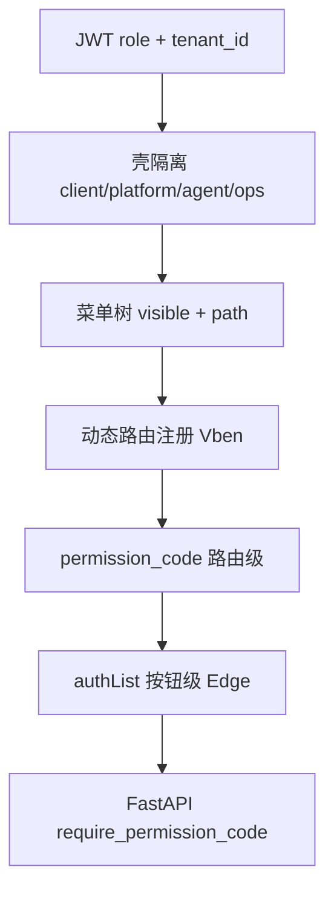

# 优丁 Admin 百家组装蓝图（UAC 1.0）

> **目标**：从 8 个开源仓库抽取「权限、菜单、Layout、表格、登录、主题、CRUD、审计」等要素，组装为 **一套** 可商用后台体系。  
> **底座**：Vue Vben Admin 5 `@vben/web-antd`（唯一 UI 壳，Ant Design Vue 与现网 270+ 页兼容）  
> **后端**：FastAPI 不动业务 API，新增 **Admin BFF** 统一契约  
> **治理**：对齐 `docs/四壳信息架构与菜单治理.md`（Client / Ops / Platform / Agent）

---

## 一、源仓库抽取矩阵

| 源仓库 | 抽取要素 | 落地位置 | 不抽取 |
|--------|----------|----------|--------|
| **Vben Admin** | Layout、多标签、动态路由、按钮权限、`effects/access`、主题 | `frontend/admin-vben` 主工程 | 整库 duplicate |
| **Art Design Pro / Edge** | `useTable` 交互、ArtSearchBar、统计卡、水印、表格 UX 约定、多租户登录 UX | `youding-admin-kit` + BFF 字段 | Element Plus 组件 |
| **Soybean Admin** | API 分层、路由模块化、类型命名 `Api.*`、目录规范 | `api/`、`router/modules/` 规范 | Element / UnoCSS 全量 |
| **Pure Admin** | Mock 目录、移动端侧栏、主题粒度 | `mock/`、Client 壳响应式 | 独立 Pure 工程 |
| **Vue-Admin-Better** | CRUD 三件套生成思路 | `scripts/gen-crud-from-openapi.mjs` | Better 页面模板 |
| **Naive UI Admin** | SaaS 登录分屏、极简统计卡、空状态 | Client Layout / Login 皮肤 | Naive 组件库 |
| **Vue Element Admin** | 路由守卫流程、`meta` 白名单、角色+权限码双层 | BFF + 守卫对照表 | Vue2 / Element UI |
| **RuoYi-Plus-Soybean** | 能力清单：字典、操作日志、部门、文件、租户套餐 | FastAPI 等价 API 路线图 | Java 后端 |

---

## 二、优丁统一契约 UAC（Admin Unified Contract）

前端（Vben / 未来壳）**只认** `/api/v1/admin-bff/*`，内部适配现有 `/auth`、`/client`、`/super-admin`。

### 2.1 认证

| 端点 | 来源灵感 | 说明 |
|------|----------|------|
| `POST /admin-bff/auth/login` | Edge + 现网 | 用户名/密码 → `access_token` + `refresh_token` |
| `POST /admin-bff/auth/refresh` | Vben | 刷新令牌 |
| `GET /admin-bff/auth/captcha` | Edge | 可选图形验证码（P1 stub） |
| `GET /admin-bff/auth/tenant/search?code=` | Edge | 登录页租户编码模糊查 |

### 2.2 用户与会话

| 端点 | 来源灵感 | 说明 |
|------|----------|------|
| `GET /admin-bff/user/info` | Vben + Edge | 用户、角色、租户、头像、homePath |
| `PUT /admin-bff/user/info` | Edge | 改资料 / 密码 |

### 2.3 菜单与路由（核心）

| 端点 | 来源灵感 | 说明 |
|------|----------|------|
| `GET /admin-bff/menu/routes?shell=` | Vben + Element Admin + Edge | 动态路由树；`shell=client\|platform\|agent\|ops` |
| `GET /admin-bff/menu/permissions` | Edge `authList` | 当前用户按钮权限码列表 |
| `GET /admin-bff/menu/platform/tree` | Edge 平台层 | super_admin 维护全局菜单定义 |
| `PUT /admin-bff/menu/platform/tenant-scope` | Edge | 租户菜单范围 |
| `PUT /admin-bff/menu/role/{role_id}` | Edge | 角色—菜单—元素权限 |

**菜单 meta 白名单**（禁止上游私有字段污染）：

```json
{
  "title": "string",
  "icon": "string",
  "order": 0,
  "keepAlive": false,
  "hideInMenu": false,
  "hideInTab": false,
  "affixTab": false,
  "shell": "client",
  "authList": [{ "title": "新增", "authMark": "add", "code": "product:add" }]
}
```

### 2.4 表格与 CRUD（Better + Art + RuoYi）

| 端点 | 说明 |
|------|------|
| 业务 API 不变 | `/api/v1/client/*`、`/products` 等 |
| `GET /admin-bff/dict/{type}` | RuoYi 字典 → 下拉选项 |
| `GET /admin-bff/audit/logs` | RuoYi 操作日志（P2） |

---

## 三、权限模型（五层组装）



| 层 | 来源 | 实现 |
|----|------|------|
| **壳** | 四壳文档 | JWT `role` → `shell`；菜单 API 带 `shell` 参数 |
| **路由** | Vben + Element Admin | 后端返回可注册路由；前端 `access` 守卫 |
| **菜单** | Edge + 现 `AdminMenu` | DB `admin_menus` + `build_menu_tree` |
| **按钮** | Edge `authList` | `meta_json` 或 `admin_permissions` 子码 |
| **数据** | RuoYi | 接口内 `require_permission_code`（已有） |

**角色 → 壳映射**（示例）：

| role | 默认 shell | homePath |
|------|------------|----------|
| tenant_admin / editor / viewer | client | `/client/dashboard` |
| sales | agent | `/agent/dashboard` |
| admin / super_admin | platform | `/admin/dashboard` |

---

## 四、前端组装结构

```
frontend/
├── admin/                    # 现网（绞杀者期保留）
├── admin-vben/               # P0 clone Vben web-antd
└── youding-admin-kit/        # 百家抽取的共享包（见 MANIFEST.md）
    ├── composables/          # useYoudingTable（Art）
    ├── components/           # YdStatsCard、YdSearchBar、AssistantFab
    ├── layouts/              # TenantShell（Naive+Art）、PlatformShell（Vben）
    ├── design-tokens/        # 扩展 design-tokens.scss
    └── schemas/              # menu-route.schema.json
```

### 4.1 四壳 Layout 分工

| 壳 | Layout 来源 | 视觉 |
|----|-------------|------|
| Client | Naive 留白 + Art 卡片 + 财旺 FAB | 对外 SaaS |
| Platform | Vben 默认 + Art 表格规范 | 企业治理 |
| Agent | Vben 精简侧栏 | 佣金/开户 |
| Ops | Vben + 现 Ops 菜单合并 | 内容/SEO |

### 4.2 组件抽取清单

| 组件 | 来源 | 用途 |
|------|------|------|
| `useYoudingTable` | Art `useTable` | 搜索+分页+刷新+列设置 |
| `YdSearchBar` | Art SearchBar | 列表顶栏 |
| `YdStatsCard` | Art + Naive | Dashboard 指标 |
| `YdWatermark` | Edge | 租户编码 \| 账号 |
| `YdEmpty` | Naive | 空状态 |
| `AssistantFab` | 现网 UBrain | 非菜单副驾 |

---

## 五、后端 BFF 模块

```
backend/app/api/v1/admin_bff/
├── router.py           # /admin-bff 路由挂载
├── auth_adapter.py     # → app.api.v1.routes.auth
├── user_adapter.py     # → JWT + User + tenant
├── menu_adapter.py     # → build_menu_tree + 四壳静态种子
├── permission_adapter.py
└── schemas.py          # UAC 响应模型
```

挂载：`/api/v1/admin-bff/*`（见 `routes/__init__.py`）

---

## 六、实施波次（绞杀者）

| 波次 | 交付 | 源 |
|------|------|-----|
| **W0** | 本文档 + kit 骨架 + BFF menu/info | ECC 合议 |
| **W1** | admin-vben 可登录 + Platform 空壳 | Vben |
| **W2** | Client Dashboard + 登录皮肤 + 财旺 | Art + Naive |
| **W3** | `useYoudingTable` + 5 CRUD 页 | Art + Better |
| **W4** | 菜单 BFF 接 DB + 角色权限抽屉 | Edge + RuoYi 清单 |
| **W5** | 超管 30 页迁入 + 审计日志 | RuoYi |
| **W6** | 旧 admin redirect + 下线 stub 菜单 | 四壳治理 |

---

## 七、验收标准

- [ ] 四套壳登录后 **零菜单泄漏**（代理不见超管项）
- [ ] Client 一级菜单 ≤5（四壳文档）
- [ ] 列表页统一：`YdSearchBar` + `useYoudingTable` + 空值 `--`
- [ ] 权限：路由不可达 + 按钮 `v-access` + API 403 一致
- [ ] 租户 Dashboard 30 秒内感知「正规 SaaS」
- [ ] 旧书签 redirect 不失效

---

## 八、参考链接

- Vben: https://github.com/vbenjs/vue-vben-admin
- Art Design Pro: https://github.com/Daymychen/art-design-pro
- Art Edge: https://github.com/ChnMig/art-design-pro-edge
- Soybean: https://github.com/soybeanjs/soybean-admin
- Pure: https://gitee.com/yiming_chang/vue-pure-admin
- Better: https://github.com/zxwk1998/vue-admin-better
- Naive Admin: https://github.com/jekip/naive-ui-admin
- Element Admin: https://github.com/PanJiaChen/vue-element-admin
- RuoYi-Soybean: https://github.com/m-xlsea/ruoyi-plus-soybean

配套：`frontend/youding-admin-kit/MANIFEST.md`  
安全：`docs/youding-admin-security.md`
