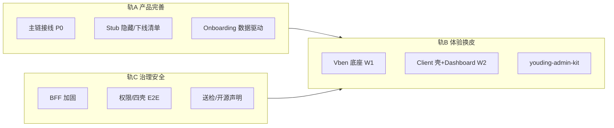

# 优丁 Admin 换皮与产品完善 · 总 PRD（早期版）

> **版本**：v0.1 · 2026-05-31  
> **阶段判断**：产品**初步功能刚写完**，尚处「可演示、未产品化」— 换 UI 与补产品应**并行**，不做 234 页大爆炸迁移。  
> **关联**：`四壳信息架构与菜单治理.md` · `youding-admin-composite-blueprint.md` · `youding-admin-security.md` · `未开发任务清单.md`
>
> **🔒 UI/壳层以锁定规格为准（2026-06-02）**：`docs/youding-omni-pro-design-LOCKED.md`  
> 本文 §三「Vben 唯一底座」已被 Omni Pro **绞杀现网 admin（C→A）** 取代；Vben 仅能力参考。OKR 与旅程仍有效。

---

## 一、为什么要现在做（时机）

| 现在做 | 若等到「功能全完再做」 |
|--------|------------------------|
| 壳与核心旅程一起定型，少返工 | 270+ 页绑死在丑壳上，迁移成本翻倍 |
| Stub 页可**隐藏或下线**，不丢人 | 全量页面已对外承诺，难收缩 |
| 送检/手册可与新 UI **同步一版** | 送检后大改 UI = 回归重来 |
| 租户第一印象与 onboarding 同源设计 | 先丑后美 = 口碑难挽回 |

**结论**：现在做 PM + 换皮，但范围是 **「核心卖货链 + 四壳骨架」**，不是全仓搬家。

---

## 二、产品目标（OKR 草案）

### O：租户与内部团队都认为「这是正经 SaaS，不是内部工具」

| KR | 指标 | 基线 | 目标（90 天） |
|----|------|------|----------------|
| KR1 | 新租户 7 日内完成 onboarding 核心 3 步 | 待测 | ≥ 50% |
| KR2 | Client 一级菜单 ≤5，用户 3 次点击到主任务 | 现 15+ | 达标 |
| KR3 | 「找不到功能」类支持工单 | 待统计 | 较基线 ↓30% |
| KR4 | 租户 Dashboard 首屏 LCP | 待测 | < 2.5s |

### 不做什么（范围外）

- ❌ 234 路由全量迁入 Vben  
- ❌ 换 Java / RuoYi 后端  
- ❌ 实验室模块对外展示（默认 Feature Flag 关）  
- ❌ 第二套 UI 库（Element/Naive 整库并进）  
- ❌ 送检前一次性重做全部超管页  

---

## 三、战略定案（技术 + 产品合一）

| 项 | 定案 |
|----|------|
| 前端底座 | **Vue Vben Admin 5 · `web-antd`** |
| 抽取包 | **`youding-admin-kit`**（Art 表格/卡片 + Soybean 规范 + Naive 租户视觉） |
| 后端 | **FastAPI 不动**；**UAC BFF** `/api/v1/admin-bff/*` |
| 四壳 | Client / Platform / Agent / Ops — **一套 Vben，分角色菜单** |
| 助手 | **财旺悬浮**保留，非菜单项 |
| 安全 | 六层纵深；详见 `youding-admin-security.md` |

---

## 四、用户与优先级（谁先做）

| 优先级 | 用户 | 为什么 |
|--------|------|--------|
| **P0** | 租户老板/运营（Client） | 付费感知、续费、口碑 |
| **P1** | 新注册 onboarding | 开通率 |
| **P2** | 代理（Agent） | 开户与佣金 |
| **P3** | 超管（Platform） | 内部效率；Stub 多，随功能接线再做 |
| **P4** | Ops 内容/SEO | 合并 Tab，非独立大迁 |

---

## 五、核心用户旅程（必须先通）

```
注册/登录 → 套餐生效 → Dashboard（今日该干什么）
    → onboarding 卡片（绑域/母版/首条发布/首条询盘）
    → 获客（询盘）· 发品（产品/内容）· 账户（套餐/流量）
    → 财旺问一句 → 必要时进 copilot 全页
```

**与「未开发任务清单」对齐**：先 **路由接线 + 主链 API 200**，再换皮；换皮只覆盖旅程上 **有真实数据的页**。

---

## 六、范围：三轨并行



---

## 七、页面迁移优先级（Top 25，非 234）

### Client（P0，12 页）

| # | 路径 | 说明 |
|---|------|------|
| 1 | `/client/login` | 登录皮肤 |
| 2 | `/client/dashboard` | 首页 + onboarding 卡片 |
| 3 | `/client/onboarding` | 开通向导 |
| 4 | `/client/inquiries` | 获客主链 |
| 5 | `/client/products` | 发品 |
| 6 | `/client/content` | 发品 |
| 7 | `/client/billing` | 套餐 |
| 8 | `/client/tokens` | AI 流量 |
| 9 | `/client/settings` | 账户 |
| 10 | `/client/copilot` | 飞轮全页（链从财旺） |
| 11 | `/client/invoices` | 开票 |
| 12 | `/client/referral` | 裂变 |

### Platform（P2，8 页）

租户总览、套餐、财务 index、AI 配置 Tab、用户/角色、菜单权限、审计、Dashboard。

### Agent（P2，5 页）

首页业绩、客户、佣金、开户、流失。

**其余路由**：redirect 或「开发中」+ **菜单不可见**（产品签字）。

---

## 八、PM 曾遗漏项 · 本 PRD 已纳入

| 类别 | 纳入方式 |
|------|----------|
| 商业 OKR | 第二节 |
| 变更管理 / 老用户 | 任务 T-PM-03 迁移地图 |
| Stub 当真实功能 | 任务 T-PM-02 可见性矩阵 |
| 送检/手册 | 任务 T-PM-05 |
| MIT 开源声明 | 任务 T-PM-06 |
| 双前端回滚 | 任务 T-OPS-01 |
| 品牌/白标 Tier | 任务 T-UX-02 |
| 移动端 Client | 任务 T-UX-03 验收标准 |
| 访问数据定优先级 | 任务 T-PM-01 |
| Copilot vs 财旺 | 定案：双入口，Dashboard 主推财旺 |
| 性能基线 | KR4 + 任务 T-QA-02 |

---

## 九、里程碑

| 里程碑 | 时间盒 | 交付 |
|--------|--------|------|
| **M0** | 第 1 周 | PRD 签字 + 任务板 + 访问日志方案 |
| **M1** | 第 2–3 周 | Vben 可登录 + BFF + Client Dashboard 样板 |
| **M2** | 第 4–6 周 | Client Top12 换皮 + onboarding 闭环 + 财旺 |
| **M3** | 第 7–10 周 | Agent/Platform 主干 + Stub 隐藏 + 安全 P1 |
| **M4** | 第 11–12 周 | 旧 admin 切换/回滚演练 + 指标复盘 |

---

## 十、风险与对策

| 风险 | 对策 |
|------|------|
| 功能未接线就换皮 | **轨 A 优先**；换皮页必须 API smoke 200 |
| 范围膨胀 | PM 维护「不做清单」；周会砍 scope |
| Vben 学习成本 | 仅 1 人专精壳，业务页复制 kit 模板 |
| 送检被打回 | M2 后同步手册截图；重大 UI 变更登记 |
| 安全 BFF 越权 | 已修 shell 参数；P1 captcha + component 白名单 |

---

## 十一、签字栏（产品负责人）

- [ ] 同意 OKR 与「不做什么」  
- [ ] 同意 Top25 页面范围  
- [ ] 同意三轨并行与 M0–M4  
- [ ] 指定项目 Owner：________  

任务分解见：**`docs/youding-admin-overhaul-tasks.md`**
