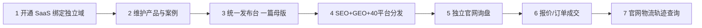
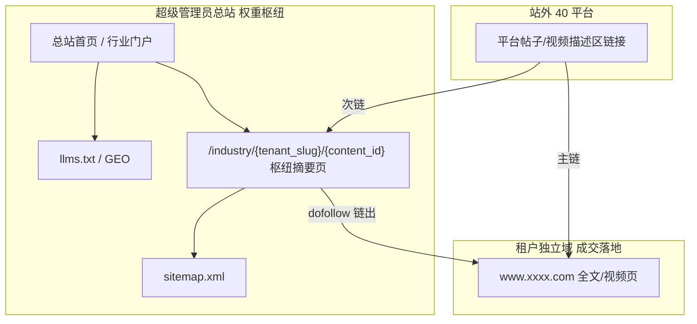

# 建材 AI 卖货 OS — 产品俯视、三轨计费与能力地图

> **文档版本**：V1.0  
> **更新日期**：2026-05-24  
> **读者**：产品经理、销售、研发、超管运营  
> **关联文档**：`docs/呼朋唤友-客户裂变营销方案.md`、`docs/0-项目概述与架构.md`、`C:\Users\97907\Desktop\汇总\开发文档\财务模块等.md`、`C:\Users\97907\Desktop\汇总\开发文档\谷歌排名机制_开发技术文档.md`

---

## 一、一句话产品定位

**建材 AI 卖货 OS**：租户拥有 **独立域名官网（www.xxxx.com）**，在 **国内统一发布台** 用 AI（Token）写好一篇内容，经 **SEO + GEO** 优化后分发到 **国内 20 + 国外 20** 平台；流量回到租户站 **询盘 → 成交 → 物流可查**。平台按 **SaaS 租户订阅 + AI Token + 静态 IP/指纹环境** 收费；并通过 **总站行业枢纽** 与 **呼朋唤友** 扩大租户池与主站权重。

---

## 二、公司收入三轨（卖什么）

| 售卖项 | 客户买到什么 | 系统实体（规划/已有） | 主要消费场景 |
|--------|--------------|----------------------|--------------|
| **SaaS 租户** | 独立后台、独立域、产品/内容、发布台、询盘订单 | `Tenant`、`TenantPlan`、`custom_domains` | 订阅月费/年费 |
| **Token** | 生成、改写、SEO、GEO、40 平台适配、多语言 | `ai_usage`、`ai-config`、AI 网关 | 按量或套餐含额度 |
| **静态 IP + 指纹环境** | 独享出口 IP、独立浏览器环境，防平台关联封号 | `egress_endpoint`、`browser_profile`（待建） | 按槽位/月 |

**可选套餐加购**：国内 20 通、海外 20 通、加入 **行业枢纽展示**、**呼朋唤友** 奖励折算 Token/月数。

---

## 三、租户卖货闭环（七步）



| 步骤 | 租户感知 | 平台能力 |
|------|----------|----------|
| 1 | 我的品牌站 `www.xxxx.com` | 域名绑定、Host 解析、SSL、租户数据隔离 |
| 2 | 产品/案例/新闻 | CMS、`building-wiki` 等 |
| 3 | 写一篇文章或视频脚本，点发布 | `content_master`（规划）、统一发布台 UI |
| 4 | 自动优化并发到各平台 | SEO 矩阵、GEO、发布队列、国内/海外 Worker + IP |
| 5 | 客户留言、WhatsApp 等进询盘 | `/inquiries`（建议合并 v2）、IM 按 IP/语种 |
| 6 | 报价、下单 | `quotes`、`orders`、`payment` |
| 7 | 客户查运单到哪了 | `frontend/pages/logistics` + 真实轨迹 API（待接） |

---

## 四、统一发布：一篇内容 → 40 平台

### 4.1 产品入口

- **唯一入口**：管理端「统一发布台」（合并现有 SEO 矩阵、多平台分发菜单叙事）。
- **母版**：`content_master_id` 关联图文/视频脚本、素材、租户 ID、canonical 域名（租户独立域）。

### 4.2 发布流水线

```text
content_master（一篇）
  ├─ ai_jobs[]              ← 扣 Token（母版 + SEO + GEO + 40 份平台变体 + 枢纽摘要）
  ├─ variants[]             ← 每平台标题/标签/封面比例/语言
  ├─ hub_summary            ← 总站枢纽摘要（短，见第六节）
  └─ publish_tasks[]        ← 每平台账号一条
        ├─ region=cn        → 国内 Worker + 国内 static_ip_id + browser_profile_id
        └─ region=global    → 海外 Worker + 当地 static_ip_id（租户无需自备翻墙）
```

### 4.3 平台主数据（待固化）

| 区域 | 数量 | 说明 |
|------|------|------|
| 国内 | 20 | 微信生态、抖音、快手、小红书、B 站、微博、知乎、百家号等（PM 定稿清单） |
| 国外 | 20 | YouTube、TikTok、LinkedIn、Facebook、Instagram 等（PM 定稿清单） |

表字段建议：`platforms.region` = `cn` | `global`，`content_type` = 图文 | 短视频 | 长视频。

### 4.4 与总站枢纽、租户域的链接策略（发布时）

| 链接目标 | 用途 | 出现在哪 |
|----------|------|----------|
| **租户独立域落地页** | 成交、询盘、品牌 | 40 平台帖 **主 CTA** |
| **总站枢纽专题页** | 主站权重、行业聚合 | 40 平台帖 **次链**（站外，不在租户站内） |

---

## 五、呼朋唤友（租户裂变）+ 小计划

> **说明**：此前全景扫描遗漏；代码与方案均已存在，属 **拉新 SaaS 租户**，与「40 平台拉终端询盘」并行。

### 5.1 产品定义

- **活动名称**：呼朋唤友（Friend Referral Program）
- **Slogan**：推荐好友，双双有礼
- **完整方案**：`docs/呼朋唤友-客户裂变营销方案.md`

### 5.2 「小计划」= 三级成就 + 季度排行榜

| 等级 | 累计有效邀请 | 奖励（方案） |
|------|--------------|--------------|
| **L1 初识好友** | 1 人 | 15% 月费折扣券 |
| **L3 人气好友** | 3 人 | 免费 1 个月 |
| **L5 铁杆好友** | 5 人 | 套餐升级/延长 |

- **季度排行榜**：前 10 名京东卡 + 徽章（人工发放）。
- **被邀请人**：试用延长至 30 天、首月 5 折等（见方案文档）。

**有效邀请**：注册 + 企业认证 + 首笔付费（与方案一致）。

### 5.3 系统实现现状

| 模块 | 路径 | 状态 |
|------|------|------|
| 数据模型 | `backend/app/models/referral.py` | ✅ |
| 服务 | `backend/app/services/referral_service.py`（含 tier、排行榜） | ✅ |
| API | `backend/app/api/v1/routes/referral.py` | ✅ 已实现 |
| API 挂载 | `routes/__init__.py` | ⚠️ **已 import 未 `include_router`，需 P0 接线** |
| 管理端 | `frontend/admin` → `/referral`、`/referral/rules` | ✅ |
| 注册带码 | `/tenants/register?ref=` | ✅ 前端注册页 |

### 5.4 与三轨计费关系

- 邀请奖励可配置为：**延长套餐天数 / 折扣 / 赠送 Token 额度**（与财务中台打通待做）。
- 排行榜奖励走 **线下人工 + 财务核销**（方案已写）。

---

## 六、总站权重枢纽（行业展示计划）

> **产品设想**：租户发的文章/帖子/视频，在 **不于租户官网前台展示友链** 的前提下，仍能让 **超级管理员总站** 获得 SEO/GEO 收益，并与 40 平台外链形成 **站外 + 站内（总站侧）** 链接网络，加快总站与各租户收录。**禁止**在租户站使用隐藏链接等作弊手段。

### 6.1 目标与边界

| 目标 | 边界 |
|------|------|
| 提升总站 Google / 百度 收录与行业词覆盖 | 不损害租户独立域 canonical 与排名 |
| 40 平台外链可指向总站专题页 | 租户站内 **不展示** 总站友情链接 |
| 租户无感或仅协议授权 | 服务协议默认「行业展示计划」，敏感客户可关闭 |

### 6.2 架构示意



### 6.3 技术手段（合规清单）

| # | 手段 | 租户站是否可见 | 作用 |
|---|------|----------------|------|
| 1 | **枢纽摘要页** | 否 | 总站增加可索引 URL、更新频率、行业长尾词 |
| 2 | **发布文案双链** | 否（仅站外平台） | 外链进入总站 |
| 3 | **canonical 分离** | 否 | 租户页 canonical=租户域；枢纽页 canonical=总站 URL |
| 4 | **总站 sitemap** | 否 | 加快总站抓取；提交 GSC / 百度普通收录 |
| 5 | **总站「供应商/案例」列表链向租户** | 否 | 总站 → 租户，帮租户外链；不构成租户站偷链总站 |
| 6 | **GEO** | 否 | 总站 LLMs.txt 引用入驻工厂（链向租户域） |
| 7 | **禁止** | — | 租户页隐藏链接、透明字、强制 canonical 指总站 |

### 6.4 URL 与 SEO 规范

#### 枢纽页 URL（总站域名下）

```text
https://{HUB_DOMAIN}/industry/{tenant_slug}/{content_id}/
https://{HUB_DOMAIN}/industry/{tenant_slug}/          # 租户专题列表（可选）
https://{HUB_DOMAIN}/cases/                             # 全局案例聚合（可选）
```

#### 页面元素

| 元素 | 规则 |
|------|------|
| `<title>` | `{文章标题} \| {租户品牌名} \| {总站品牌}行业案例` |
| `<meta description>` | 摘要 120～160 字，含行业词 |
| **正文** | 摘要 + 「查看完整内容」链向租户 canonical URL |
| `link rel="canonical"` | 枢纽页自身 URL（总站域） |
| `link rel="alternate"` | 可标注租户原文 URL 为 alternate（可选） |
| JSON-LD | `Article` + `publisher`（总站）+ `url`（租户原文） |

#### 租户独立域页面

| 元素 | 规则 |
|------|------|
| `canonical` | **必须**指向租户自己域名下的正文 URL |
| 页面内链接 | **不出现**总站友链（除非租户主动开启「互推」高级选项） |
| sitemap | 仅包含租户域 URL，**不包含**总站枢纽 URL |

#### 40 平台发布文案模板（示例）

```text
主链：{tenant_canonical_url}?utm_source={platform}&utm_campaign={content_id}
次链：{hub_url}?utm_source={platform}&utm_campaign={content_id}
```

### 6.5 数据模型建议

```text
content_master
  - id, tenant_id, title, body, media_urls
  - tenant_canonical_url
  - hub_slug, hub_published_at
  - show_on_hub (bool, default true)   # 依服务协议授权
  - hub_summary (text)               # AI 生成短摘要

publish_task
  - content_master_id
  - platform_id, account_id
  - primary_url, secondary_url (hub)
```

### 6.6 计费与套餐

- 枢纽摘要生成：计 **Token**。
- 「加入行业枢纽展示」：可纳入 **专业版及以上** 默认开启；关闭后不生成枢纽页。

### 6.7 研发任务（枢纽）

- [ ] 总站 Nuxt/静态路由：`/industry/...`
- [ ] 发布服务：创建/更新枢纽页、刷新总站 sitemap
- [ ] 40 平台适配器：写入主链/次链
- [ ] 超管看板：枢纽页数量、收录状态（不必对租户展示「被聚合」）
- [ ] 百度/GSC 推送任务（可选）

---

## 七、AI 生产力与网络资源（内力）

| 能力 | 说明 |
|------|------|
| **AI 网关** | 第三方大模型统一接入；平台额度 + 租户自备密钥双模式 |
| **国内执行面** | 国内平台发布 + **国内静态 IP** + 指纹环境 |
| **海外执行面** | 国外平台发布 + **海外静态 IP**（平台托管，**不提供租户侧 v2ray 自助模块**） |
| **账号绑定** | `platform_account` → `egress_endpoint_id` + `browser_profile_id` |

---

## 八、全链路财务（文档重点，代码待建）

来源：`汇总/开发文档/财务模块等.md`

| 维度 | 要求 | 代码现状 |
|------|------|----------|
| 营收 | 套餐 + IP + Token + 增值 | 🟡 支付/订阅/发票片段 |
| 成本 | IP 采购、模型 API、公摊 | ❌ 成本台账 |
| 代理分润 | 省代/多级、待结算/已结算 | 🟡 `agent-tree` 有 revenue 统计，无结算 |
| 纯利润 | 营收 − 成本 − 分润 | ❌ |
| 分层看板 | 超管 / 代理 / 租户 | 🟡 碎片 |
| Excel 导出 | 对账 | ❌ |

**权限**：超级管理员 → 省级代理 → 普通租户（与 `agent-tree` L1～L5 应对齐产品口径）。

---

## 九、能力地图总表（俯视）

| 板块 | 状态 | 备注 |
|------|------|------|
| SaaS 租户 + 独立域 | 🟡 | `/domains` 已有；Host/SSL 待完善 |
| Token / 双模式 AI | 🟡 | 超管 `ai-cost` 等需挂路由 |
| 静态 IP + 指纹 | ❌ | 替代 v2ray 菜单 |
| 统一发布 40 平台 | 🟡 | 缺平台清单与 content_master |
| SEO 矩阵 + GEO | 🟡 | GEO 服务有；路由需挂 |
| **呼朋唤友 + 小计划** | 🟡 | **前后端有；API 需 include_router** |
| **总站权重枢纽** | ❌ | 本文第六节；合规方案 |
| 询盘 / 订单 / 支付 | 🟡 | inquiries 双版本待合并 |
| 物流查询 | 🟡 | 前台有；后端轨迹待接 |
| 全链路财务 | ❌ | 见第八节 |
| 海外养号周期 | ❌ | 文档有，作增值包 P3 |

图例：**✅ 可用** · **🟡 有骨架** · **❌ 未做/未挂路由**

---

## 十、研发优先级（汇总）

### P0 — 不接线就无法卖/演示

1. `include_router(referral_router)` — 呼朋唤友上线  
2. 挂载 `super_admin`、`app/api/v1/seo/*` 子路由  
3. 租户独立域：Host 解析租户 + SSL  
4. `content_master` + 发布台 MVP（可先 5+5 平台试点）  
5. `egress_endpoint` / `browser_profile` 表 + 发布 Worker 骨架  

### P1 — 文档已写清、商业闭环关键

6. 总站权重枢纽（第六节）  
7. 财务中台四维（营收/成本/分润/利润）  
8. 付费 → 自动开户 → 配额/IP 槽位 → 到期冻结  
9. Token 账本与余额不足停服  

### P2 — 差异化与合规

10. 12 语种 + IP 动态 IM（谷歌文档）  
11. 物流真实轨迹 + 订单联动  
12. 租户级 RAG（建材 TDS、禁止 AI 乱报价）  

### P3 — 增值

13. 海外社媒养号周期（财务模块等文档）  
14. 呼朋唤友奖励与财务自动核销打通  

---

## 十一、对外 SKU（销售极简）

| SKU | 包含 |
|-----|------|
| **建材 SaaS 基础** | 租户、独立域、官网、发布台、询盘 |
| **AI Token 包** | 生成 / SEO / GEO / 分平台适配 |
| **渠道安全包** | 静态 IP 槽位 + 指纹环境 + 国内或海外发布 |
| **全渠道增长包** | 国内 20 + 国外 20 平台权限 |
| **行业枢纽展示** | 总站摘要页 + 站外次链（租户站内不展示友链） |
| **呼朋唤友** | 老带新奖励（折扣 / 月数 / Token） |

---

## 十二、修订记录

| 日期 | 说明 |
|------|------|
| 2026-05-24 | 初版：三轨计费、七步闭环、40 平台、呼朋唤友补录、总站权重枢纽、财务与优先级 |

---

## 附录 A：呼朋唤友 API 接线（研发一键）

在 `backend/app/api/v1/routes/__init__.py` 末尾增加：

```python
router.include_router(referral_router)  # 前缀已在 router 内: /referral
```

验证：`GET /api/v1/referral/leaderboard`、`GET /api/v1/referral/my-code`（需登录）。

---

## 附录 B：枢纽页与租户页 canonical 对照

| 页面 | canonical | 是否链向总站 |
|------|-----------|--------------|
| 租户独立域正文 | `https://www.xxxx.com/...` | 否 |
| 总站枢纽摘要 | `https://hub.example.com/industry/...` | 枢纽页内链出到租户 |
| 40 平台帖 | 无 canonical | 主链租户、次链枢纽（站外） |

---

## 附录 C：相关代码索引

| 功能 | 路径 |
|------|------|
| 呼朋唤友 API | `backend/app/api/v1/routes/referral.py` |
| 呼朋唤友服务 | `backend/app/services/referral_service.py` |
| 管理端呼朋唤友 | `frontend/admin/src/views/referral/` |
| 租户域名 | `backend/app/api/v1/routes/domain.py` |
| 多平台发布 | `backend/app/services/publish_service.py` |
| SEO 矩阵 | `backend/app/api/v1/routes/seo_matrix.py` |
| 租户套餐 | `backend/app/models/tenant.py` |
