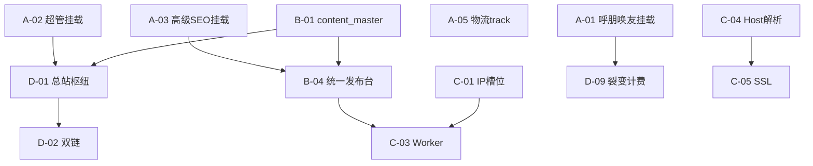

# 开发任务下发清单（团队版）

> **下发日期**：2026-05-24  
> **产品负责人**：待定  
> **技术负责人**：待定  
> **目标版本**：**MVP-卖货闭环 v1.0**（可对外演示：独立域 + 一篇发布 + 询盘/订单 + 呼朋唤友 + 超管可用）  
> **依据文档**：`docs/产品俯视-租户旅程与三轨计费.md` · `docs/未开发任务清单.md` · `docs/呼朋唤友-客户裂变营销方案.md`  
> **机器可读 backlog**：`docs/dev-backlog-sprint.json`（可导入任务板 / 蜂群调度）

---

## 一、给全队的三句话

1. **先接线再造功能**：超管 138 端点、高级 SEO 72 端点、呼朋唤友 6 端点已在代码里，**Sprint A 必须挂载**，否则管理端大面积 404。  
2. **主链只有一条**：租户独立域 → `content_master` 一篇 → 发布队列 → 询盘/订单 → 物流查询；其它模块默认 **实验室**，不挡主链。  
3. **不做租户 v2ray**：静态 IP + 指纹 + 平台托管海外 Worker；v2ray 菜单 Sprint D 下架或改内部运维。

---

## 二、里程碑与日历（建议）

| 里程碑 | 目标 | 建议周期 | 出口演示 |
|--------|------|----------|----------|
| **M1** | API 接线 + 物流 track | 第 1～2 周 | 管理端 SEO/超管/呼朋唤友不再 404 |
| **M2** | 母版 + 发布台 + 平台清单 | 第 3～5 周 | 选一篇内容 → 创建 5+5 平台发布任务 |
| **M3** | 独立域 + IP 槽位 + Worker 骨架 | 第 5～7 周 | 绑定域访问租户站；任务进队列 |
| **M4** | 枢纽 + 财务 + 计费闭环 | 第 8～12 周 | 付费开户、Token 扣费、枢纽页上线 |

---

## 三、角色与领取池

| 领取池 `owner_pool` | 职责 | 典型任务 |
|-------------------|------|----------|
| **backend** | FastAPI、模型、迁移、Worker | P0-01～04、05～09、12 |
| **frontend** | `frontend/admin`、租户 Nuxt | P0-06 UI、P0-10～11、P0-13 |
| **fullstack** | 前后端联调、发布台 | P0-06、P1-01～03、P1-12～13 |
| **devops** | 域名、SSL、队列、部署 | P0-09、P0-11、双栈决策 |
| **qa** | 用例、回归、路由探测 | 每 Sprint 末 |
| **pm** | 40 平台清单定稿、SKU | P0-07、套餐字段 |

**领取规则**：在 `dev-backlog-sprint.json` 中将 `assignee` 从 `null` 改为姓名；`status`：`pending` → `in_progress` → `review` → `done`。

---

## 四、统一完成定义（DoD）

每条任务 **全部满足** 方可标 `done`：

- [ ] 代码已合并到约定分支（`develop` 或团队约定分支）  
- [ ] 相关 API 在 `GET /docs` 或路由列表中可查到  
- [ ] 至少 1 条自动化或脚本验证（pytest / curl / Playwright 任选）  
- [ ] 无新增硬编码密钥；环境变量已写入 `.env.example`  
- [ ] 管理端/租户站相关页面手工点通 1 条 happy path  
- [ ] PR 描述含：任务 ID、验收截图或命令输出  

**Sprint A 额外门禁**：运行  
`cd backend && python -c "from app.main import app; print(len([r for r in app.routes if '/super-admin' in getattr(r,'path','')]))"`  
输出 **> 0**；`referral`、`/seo/site-audit` 同理。

---

## 五、Sprint A — API 接线周（M1）

> **目标**：消灭「页面在、API 404」；物流可查询。  
> **建议人力**：后端 1～2 人 × 5 人日；QA 1 人 × 2 人日。

| 任务 ID | 标题 | 池 | 估时 | 依赖 | 关键改动 | 验收 |
|---------|------|-----|------|------|----------|------|
| **A-01** | 挂载呼朋唤友路由 | backend | 0.5d | — | `routes/__init__.py` 增加 `include_router(referral_router)` | `curl` 登录后 `GET /api/v1/referral/leaderboard` → 200 |
| **A-02** | 挂载 super_admin 整包 | backend | 1d | — | `from app.api.v1.super_admin import router as super_admin_router` + include | `/api/v1/super-admin/auth/me` 可访问 |
| **A-03** | 挂载高级 SEO 并解决路径冲突 | backend | 1.5d | A-02 可选 | 将 `app/api/v1/seo` 挂到 `/api/v1/seo`；**下线或重命名** `routes/seo.py` stub | `/api/v1/seo/site-audit` 存在；stub 不再返回假 150 关键词 |
| **A-04** | 管理端冒烟清单 | qa | 1d | A-01～03 | 按 `docs/管理端路由与功能映射表.md` 抽 15 个 URL | 缺陷单关联任务 ID |
| **A-05** | 物流 track API | backend | 2d | — | `logistics.py` 新增 `GET /track`；可先对接 1 家快递沙箱 | 租户站输入运单返回 `events[]` |
| **A-06** | 物流前台 API 基址 | frontend | 0.5d | A-05 | `logistics/index.vue` 用 `runtimeConfig.public.apiBase` | 非 localhost 环境可查询 |
| **A-07** | 路由探测 CI 脚本 | backend | 1d | A-01～03 | `scripts/check_mounted_routes.py` 断言关键前缀存在 | CI 失败则阻断合并 |

**Sprint A 交付物**：可演示的管理端 AI/GEO/呼朋唤友；租户站物流查询可用。

---

## 五附、登录与 OAuth 对接（E 补遗 · 2026-05-24 已完成）

> **专项文档**：[`docs/管理端统一登录与OAuth对接.md`](管理端统一登录与OAuth对接.md)  
> **说明**：登录页 UI 已集成密码 + QQ/微信/飞书/钉钉；本次补全回调解析、配置探测、管理端绑定策略。

| 任务 ID | 标题 | 池 | 状态 | 验收 |
|---------|------|-----|------|------|
| **E-01** | OAuth 回调从 state 解析 provider | fullstack | ✅ | 平台回调仅 `code`+`state` 仍可登录 |
| **E-02** | `GET /auth/oauth/providers` 登录页置灰 | fullstack | ✅ | 未配置渠道按钮禁用并提示 |
| **E-03** | 第三方登录绑定策略（禁止自动 viewer 进后台） | backend | ✅ | 未绑定返回 403 |
| **E-04** | 登录对接开发文档 | pm | ✅ | 专项文档 + 总册 §4.4 + API 定义 §1 |

**本地验证**：`OAUTH_DEV_BYPASS=true` → 打开 `http://localhost:5173/login` → 点 QQ → 进入 `/admin`。

---

## 六、Sprint B — 统一发布母版（M2）

> **目标**：产品叙事「一篇内容多发」可点击走通。  
> **建议人力**：全栈 2 人 × 10 人日；PM 定稿平台清单 1 人日。

| 任务 ID | 标题 | 池 | 估时 | 依赖 | 关键改动 | 验收 |
|---------|------|-----|------|------|----------|------|
| **B-01** | content_master 表与迁移 | backend | 2d | — | Alembic：`tenant_id, title, body, media_urls, tenant_canonical_url, status` | CRUD API `/api/v1/content-masters` |
| **B-02** | publish_task 扩展字段 | backend | 1d | B-01 | `content_master_id, primary_url, secondary_url, region, platform_id` | 创建任务带母版 ID |
| **B-03** | 平台主数据 40 清单 | pm+backend | 2d | — | seed：`region=cn|global`；与套餐 SKU 关联 | 库内 ≥40 条可发布平台 |
| **B-04** | 统一发布台页面 | fullstack | 3d | B-01～03 | 新菜单「统一发布台」或升级 `seo-matrix/publish` | 选母版 → 勾选平台 → 提交任务列表 |
| **B-05** | 对接 publish_service | backend | 2d | B-02 | 复用 `publish_service.py`，禁止仅写 Node 一侧 | 任务状态：pending/running/success/fail |
| **B-06** | 双栈决策纪要 | devops+backend | 1d | — | 文档：`docs/adr/seo-backend-vs-fastapi.md` | 团队确认主后端为 FastAPI |
| **B-07** | 试点 5+5 发布 | qa | 2d | B-04～05 | 国内 5 + 国外 5 平台各 1 条任务 | 截图 + 任务 ID 存档 |

**Sprint B 交付物**：销售可演示「一篇 → 多平台任务入队」。

---

## 七、Sprint C — 独立域与执行面（M3）

> **目标**：租户品牌站 + IP 槽位可卖。  
> **建议人力**：全栈 1 + 后端 1 + DevOps 1 × 8 人日。

| 任务 ID | 标题 | 池 | 估时 | 依赖 | 关键改动 | 验收 |
|---------|------|-----|------|------|----------|------|
| **C-01** | egress_endpoint 表 | backend | 1.5d | — | 字段：`region, ip, port, provider, slot_status, tenant_id` | 超管可分配槽位 |
| **C-02** | browser_profile 表 | backend | 1.5d | C-01 | 指纹 JSON、绑定 `platform_account` | 账号绑定页可选 IP+环境 |
| **C-03** | 发布 Worker 骨架 | backend+devops | 3d | B-05, C-01 | Redis/RQ 或 Celery 消费 `publish_task` | 本地起 worker 能改状态 |
| **C-04** | Nuxt Host 租户解析 | fullstack | 2d | — | middleware 读 Host → tenant context | `www.demo.com` 显示该租户首页 |
| **C-05** | SSL 自动签发 | devops | 2d | C-04 | Caddy/Traefik + ACME 或云厂商 API | HTTPS 绿锁 |
| **C-06** | v2ray 菜单改为「IP 槽位」 | frontend | 1d | C-01 | 隐藏租户自助 v2ray；超管保留运维入口可选 | 产品评审签字 |

**Sprint C 交付物**：独立域 HTTPS + IP 槽位 CRUD + Worker 跑通 1 条任务。

---

## 八、Sprint D — 商业闭环（M4）

> **目标**：三轨计费与枢纽可卖。  
> **建议人力**：全栈 2 + 后端 1 × 15 人日。

| 任务 ID | 标题 | 池 | 估时 | 依赖 | 验收摘要 |
|---------|------|-----|------|------|----------|
| **D-01** | 总站枢纽页 `/industry/...` | fullstack | 4d | B-01 | Nuxt 路由 + 摘要 CMS；canonical 正确 |
| **D-02** | 发布双链写入 | backend | 2d | D-01, B-02 | 平台文案含主链租户 + 次链枢纽 |
| **D-03** | 枢纽 sitemap | backend | 1d | D-01 | 总站 sitemap 含枢纽 URL |
| **D-04** | 财务营收台账 | backend | 3d | — | 订单/订阅入账可查 |
| **D-05** | 成本台账 | backend | 2d | C-01 | IP/模型 API 成本录入 |
| **D-06** | 代理分润结算单 | fullstack | 3d | D-04 | `agent/commission` 接真实结算状态 |
| **D-07** | Token ledger + 余额不足停服 | backend | 3d | — | 扣费后余额≤0 拒绝 AI 调用 |
| **D-08** | 付费自动开户 Provisioning | fullstack | 3d | D-07 | 支付 webhook → 租户 active + 配额 |
| **D-09** | 呼朋唤友奖励接计费 | backend | 2d | A-01, D-08 | 有效邀请触发券/延长天数 |
| **D-10** | 合并 inquiries v1/v2 | fullstack | 2d | — | 单一管理端入口 + 单一 API 前缀 |

---

## 九、Backlog（Sprint F 及以后，按需领取）

> **说明**：`dev-backlog-sprint.json` 中 **sprint-e / E-01～E-04** 已用于「登录与 OAuth 对接」（见 **五附**，已完成）。下列为后续产品 backlog，编号改用 **F-** 避免冲突。

| ID | 标题 | 优先级 | 池 |
|----|------|--------|-----|
| F-01 | 12 语种 + IP 动态 IM | P2 | fullstack |
| F-02 | 租户 RAG 禁乱报价规则 | P2 | backend |
| F-03 | 物流轨迹回填订单 | P2 | fullstack |
| F-04 | SEO 报告 PDF 导出 | P2 | backend |
| F-05 | 海外养号周期状态机 | P3 | backend |
| F-06 | 实验室模块默认折叠 | P3 | frontend |

**Sprint F 状态（2026-05-24）**：F-01～F-06 已实现并记入 `dev-backlog-sprint.json`（sprint-f）。

---

## 九附、演示验收与商用准备（Sprint G · 2026-05-24 已完成）

> **专项文档**：[`docs/演示验收清单.md`](演示验收清单.md)  
> **一键脚本**：`python scripts/run_demo_acceptance.py`

| 任务 ID | 标题 | 池 | 状态 | 验收 |
|---------|------|-----|------|------|
| **G-01** | 5+5 试点平台 seed + `GET /platforms/pilot` | backend | ✅ | 10 个试点平台 |
| **G-02** | B7 母版 → ≥10 publish_task + worker | backend | ✅ | `b7_pilot_acceptance.py` |
| **G-03** | 一键演示验收 | qa | ✅ | `demo-acceptance-latest.json` ok=true |
| **G-04** | 演示验收清单文档 | pm | ✅ | 人工彩排表 + 签字项 |

---

## 九附二、商用上线（Sprint H · 2026-05-24 已完成）

> **专项文档**：[`docs/Sprint-H-商用上线.md`](Sprint-H-商用上线.md)

| 任务 ID | 标题 | 池 | 状态 |
|---------|------|-----|------|
| **H-01** | 40 平台 seed + `/platforms/catalog` | backend | ✅ |
| **H-02** | 快递100 物流适配器 | backend | ✅ |
| **H-03** | SSL 状态机 + domain API | backend | ✅ |
| **H-04** | `migrate_production.py` | devops | ✅ |
| **H-05** | 配置与单元测试 | qa | ✅ |

---

## 九附三、上线运维（Sprint I · 2026-05-24 已完成）

> **专项文档**：[`docs/Sprint-I-上线运维.md`](Sprint-I-上线运维.md)

| 任务 ID | 标题 | 池 | 状态 |
|---------|------|-----|------|
| **I-01** | `production_readiness_service` | backend | ✅ |
| **I-02** | `/ops/readiness` + public 探针 | backend | ✅ |
| **I-03** | `/ops/backup/run` + status | backend | ✅ |
| **I-04** | `GET /health/ready` 增强 | backend | ✅ |
| **I-05** | `run_production_preflight` + 测试 | qa | ✅ |

---

## 九附四、体验补全（Sprint J · 2026-05-24 已完成）

> **专项文档**：[`docs/Sprint-J-体验补全.md`](Sprint-J-体验补全.md)

| 任务 ID | 标题 | 池 | 状态 |
|---------|------|-----|------|
| **J-01** | 邮箱验证码登录 UI | frontend | ✅ |
| **J-02** | OAuth 账号绑定 | fullstack | ✅ |
| **J-03** | 就绪飞书告警 | backend | ✅ |
| **J-04** | 开发环境验证码透出 | backend | ✅ |
| **J-05** | 测试与文档 | qa | ✅ |

---

## 九附五、商业闭环深化（Sprint K · 2026-05-24 已完成）

> **专项文档**：[`docs/Sprint-K-商业闭环.md`](Sprint-K-商业闭环.md)

| 任务 ID | 标题 | 池 | 状态 |
|---------|------|-----|------|
| **K-01** | Token 耗尽停服 | backend | ✅ |
| **K-02** | 财务 summary 增强 | backend | ✅ |
| **K-03** | 财务 CSV 导出 | backend | ✅ |
| **K-04** | 枢纽 GSC 清单 | backend | ✅ |
| **K-05** | 管理端财务中台 | frontend | ✅ |

---

## 九附六、生产化（Sprint L · 2026-05-24 已完成）

> **专项文档**：[`docs/Sprint-L-生产化.md`](Sprint-L-生产化.md)

| 任务 ID | 标题 | 池 | 状态 |
|---------|------|-----|------|
| **L-01** | SMTP 邮箱验证码 | backend | ✅ |
| **L-02** | Nuxt API 基址环境化 | frontend | ✅ |
| **L-03** | 询盘 portal API | backend | ✅ |
| **L-04** | 物流页 composable | frontend | ✅ |
| **L-05** | 测试与文档 | qa | ✅ |

---

## 九附七、槽位产品化（Sprint M · 2026-05-24 已完成）

> **专项文档**：[`docs/Sprint-M-槽位产品化.md`](Sprint-M-槽位产品化.md)

| 任务 ID | 标题 | 池 | 状态 |
|---------|------|-----|------|
| **M-01** | egress overview API | backend | ✅ |
| **M-02** | 槽位分配/释放 API | backend | ✅ |
| **M-03** | `/admin/egress` 可分配 | frontend | ✅ |
| **M-04** | 实验室移除 V2Ray 入口 | frontend | ✅ |
| **M-05** | 测试与文档 | qa | ✅ |

---

## 九附八、双栈集成与 IP 槽位售卖（Sprint N · 2026-05-24 已完成）

> **专项文档**：[`docs/Sprint-N-双栈与槽位售卖.md`](Sprint-N-双栈与槽位售卖.md) · ADR：[`docs/ADR-seo-dual-stack.md`](ADR-seo-dual-stack.md)

| 任务 ID | 标题 | 池 | 状态 |
|---------|------|-----|------|
| **N-01** | `GET /integrations/status` | backend | ✅ |
| **N-02** | 套餐 IP 槽位配额 | backend | ✅ |
| **N-03** | 租户 `/egress/my` + `request-slot` | backend | ✅ |
| **N-04** | 支付后自动分配槽位 | backend | ✅ |
| **N-05** | 测试与文档 | qa | ✅ |

---

## 九附九、商用收尾与统一入口（Sprint O · 2026-05-24 已完成）

> **专项文档**：[`docs/Sprint-O-商用收尾.md`](Sprint-O-商用收尾.md)

| 任务 ID | 标题 | 池 | 状态 |
|---------|------|-----|------|
| **O-01** | ACME SSL 委托签发 | backend | ✅ |
| **O-02** | 询盘 unified 统一 | backend | ✅ |
| **O-03** | IP 槽位加购 API | backend | ✅ |
| **O-04** | 集成栈管理页 | frontend | ✅ |
| **O-05** | 测试与文档 | qa | ✅ |

---

## 十、依赖关系（排期用）

---

## 十一、风险与升级路径

| 风险 | 影响 | 缓解 |
|------|------|------|
| `routes/seo.py` 与 `api/v1/seo` 路径冲突 | A-03 延期 | 先删 stub 再挂新路由，一次性 PR |
| seo-backend 与 FastAPI 双写 | B 发布逻辑分裂 | B-06 必须出 ADR，禁止双端各改一套 |
| 40 平台清单未定 | B-03 阻塞 | PM 先出 5+5 试点，余量迭代 |
| SSL/备案 | C-05 阻塞演示 | 演示先用平台二级域，客户域走人工工单 |
| 财务规则复杂 | D 延期 | D-04～06 分三期：先营收可见，再成本，再分润 |

**升级路径**：阻塞超过 2 天 → 技术负责人在每日站会升级 → 产品决定砍 scope 或加人。

---

## 十二、仓库与分支约定

| 项 | 约定 |
|----|------|
| 仓库根目录 | `website CodeBuddy` |
| 后端 | `backend/`，Python 3.11，迁移用 Alembic |
| 管理端 | `frontend/admin/` |
| 租户站 | `frontend/`（Nuxt 3） |
| PR 标题 | `[任务ID] 简短说明`，例：`[A-01] 挂载 referral 路由` |
| 关联文档 | PR 正文链接本文件任务 ID |

---

## 十三、快速领取表（打印用）

| 本周建议领取 | ID | 池 | 状态 |
|--------------|-----|-----|------|
| 后端一号 | A-01, A-02, A-03 | backend | ⬜ |
| 后端二号 | A-05, A-07 | backend | ⬜ |
| 前端一号 | A-06 | frontend | ⬜ |
| QA | A-04 | qa | ⬜ |
| 全员只读 | `docs/产品俯视-租户旅程与三轨计费.md` | — | — |

---

## 十四、修订记录

| 日期 | 版本 | 说明 |
|------|------|------|
| 2026-05-24 | v1.0 | 首版下发：Sprint A～D + JSON backlog |
| 2026-05-24 | v1.1 | 增补「五附」登录与 OAuth 对接（E-01～E-04 已完成） |
