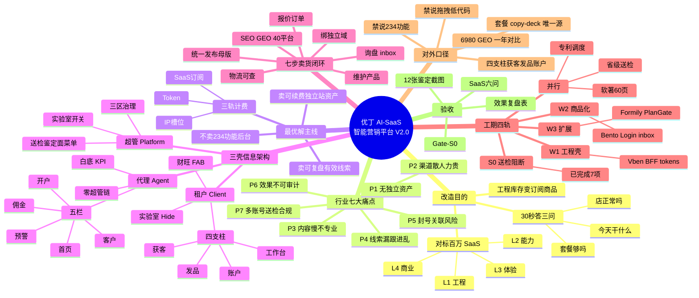
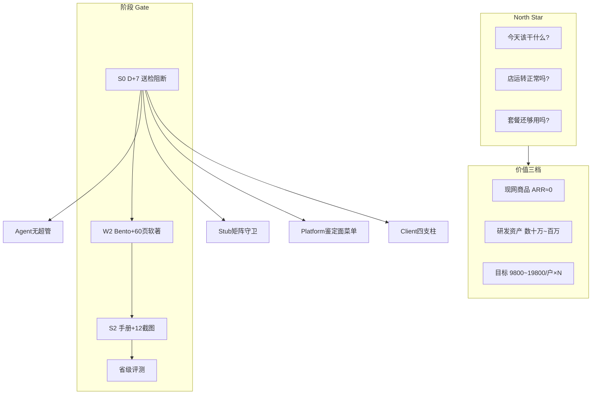
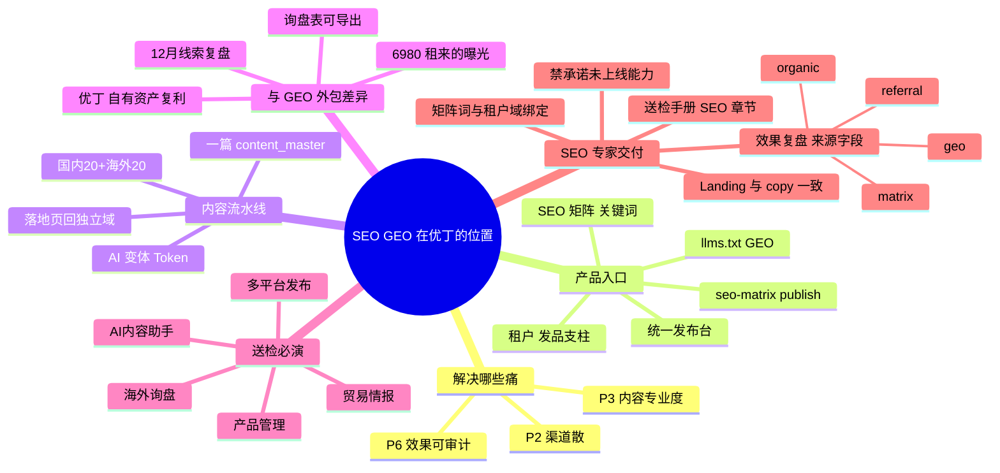
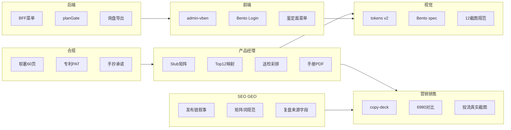
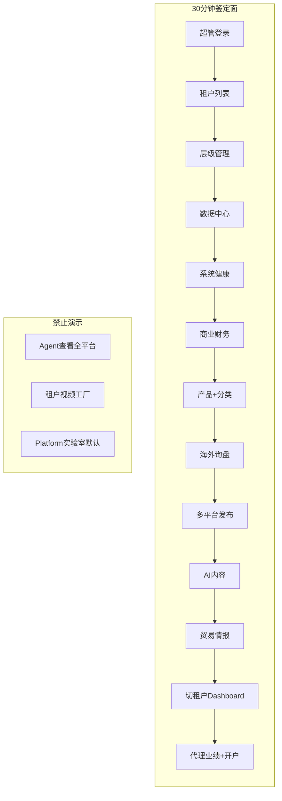

# 优丁 AI-SaaS 改造 · 全员思维导图

> **用途**：SEO 专家 · 产品经理 · 营销/销售/视觉/研发/合规 **一图对齐**  
> **更新**：2026-06-02  
> **详文**：[`ecc-saas-enterprise-value-framework.md`](./ecc-saas-enterprise-value-framework.md) · [`pm-one-shot-ip-ux-masterplan.md`](./pm-one-shot-ip-ux-masterplan.md) · [`送检演示脚本-v2-鉴定面.md`](./送检演示脚本-v2-鉴定面.md)

---

## 怎么用这张图

| 角色 | 先看分支 | 你要带走的一句话 |
|------|----------|------------------|
| **产品经理** | 中心 → 三壳 → 工期 Gate → 验收六问 | 卖结果不卖 234 功能 |
| **SEO/GEO 专家** | 行业痛点 P2/P3/P6 → 七步闭环 → 送检业务链 | 一篇母版多发，线索回独立站可审计 |
| **营销/销售** | 商业定位 → 套餐 copy → 6980 对比 | 比 GEO 贵的前提是可复盘有效电话 |
| **视觉/UX** | 三壳 IA → 设计宪法 → 禁止项 | Linear 克制，禁 emoji/渐变/Stub |
| **前端/后端** | S0 已完成 → W1–W3 → BFF/Vben | 鉴定面菜单 + Stub 守卫已落地 |
| **合规/IP** | 软著 → 专利 → 送检 | 登记自研模块，不含 Vben/Stub |
| **代理/商务** | 代理五栏 → 禁止超管链 | 代理只看业绩，不看全平台 |

---

## 总图（Mermaid · 复制到支持 Mermaid 的编辑器可展开）



---

## 分图 1 · 产品经理 × SaaS 专家（战略与 Gate）



| Gate | 日期目标 | PM 签字项 |
|------|----------|-----------|
| **S0** | D+7 | Stub 矩阵 · 三壳 smoke · 送检菜单 |
| **W2** | D+21 | Bento · Login · 软著 60 页 v1 |
| **S2** | D+49 | 手册 PDF · L3 · 脚本彩排 30min |
| **CERT** | ~8/24 | staging 0 fail · 现场材料 |

**PM 任务板**：[`pm-master-schedule-kpi-20260601.md`](./pm-master-schedule-kpi-20260601.md)

---

## 分图 2 · SEO / GEO 专家（内容与线索）



### SEO 专家 checklist（W2 前）

- [ ] 对外只讲 **「绑域 → 发品 → 分发 → 询盘」**，不讲实验室菜单名  
- [ ] 手册/落地页与 [`plan-copy-deck.md`](./marketing/plan-copy-deck.md) **套餐名零冲突**  
- [ ] 送检截图含 **`/seo-matrix/publish`**，不含 Stub 页  
- [ ] 6980 对比话术：**第 365 天谁电话多**，不是第 15 天  
- [ ] 协助定义 **有效线索** 字段（手机/企微/可跟进）→ SAAS-07 复盘表  

---

## 分图 3 · 各团队职责（一眼分工）



---

## 分图 4 · 三壳 + 送检路径（给评测/演示）



**脚本详表**：[`送检演示脚本-v2-鉴定面.md`](./送检演示脚本-v2-鉴定面.md)

---

## 分图 5 · S0 已完成 vs 下一步（研发/全员）

| 模块 | S0 已完成 ✅ | 下一步 W1–W2 |
|------|-------------|--------------|
| Agent | 删超管链 · 白底 KPI · 五栏菜单 | inbox 深化 |
| Client | 四支柱 · Stub 直链拦截 | Bento Dashboard |
| Platform | 鉴定面菜单 · hierarchy 标准页 | Vben 壳 fork |
| 守卫 | `stubVisibility.ts` | Plan Gate 服务端 |
| 文档 | 价值框架 · Stub 矩阵 v1 | 效果复盘表 v1 |

**送检开关**：`/admin/platform-zones` → 「送检模式」（默认开）

---

## 文本版树状图（不支持 Mermaid 时）

```text
优丁 AI-SaaS 改造
├── 目的：订阅商品 + 可复盘线索 + 送检敢演示
├── 痛点 P1~P7（资产/渠道/内容/线索/封号/效果/合规）
├── 最优解
│   ├── 卖：有效电话 + 独立站资产（非 234 功能）
│   ├── 三轨：SaaS + Token + IP
│   └── 对标：6980 GEO → 365 天线索可导出
├── 三壳
│   ├── 租户：工作台|获客|发品|账户 + 财旺
│   ├── 代理：首页|客户|开户|佣金|预警
│   └── 超管：送检鉴定面 + 实验室开关
├── 七步闭环：绑域→产品→母版→分发→询盘→订单→物流
├── 工期：S0✅ → W1工程 → W2商品化 → W3扩展 ∥ 软著专利送检
├── 团队
│   ├── PM：Gate / 手册 / 彩排
│   ├── SEO：发布链 / 矩阵 / 复盘来源
│   ├── 营销：copy-deck / 6980 对比
│   ├── 视觉：tokens / Bento / 截图
│   └── 合规：60页 / 专利 / 承诺
└── 验收：SaaS 六问 + 12 截图 + 效果复盘表
```

---

## 相关文档索引

| 文档 | 读者 |
|------|------|
| [`ecc-saas-enterprise-value-framework.md`](./ecc-saas-enterprise-value-framework.md) | 全员战略 |
| [`ecc-saas-expert-training-20260601.md`](./ecc-saas-expert-training-20260601.md) | 什么是 SaaS |
| [`pm-stub-visibility-matrix-v1.md`](./pm-stub-visibility-matrix-v1.md) | 研发/QA |
| [`marketing/plan-copy-deck.md`](./marketing/plan-copy-deck.md) | 营销/SEO/销售 |
| [`design/client-dashboard-bento-spec.md`](./design/client-dashboard-bento-spec.md) | 视觉/前端 |
| [`open-source-audit/00-repo-link-inventory.md`](./open-source-audit/00-repo-link-inventory.md) | 前端/架构 |
| [`软著/AI合规与登记策略-2026.md`](./软著/AI合规与登记策略-2026.md) | 合规 |

---

*全员对齐用 · 会议可投屏 Mermaid 总图或分图 2（SEO）*
