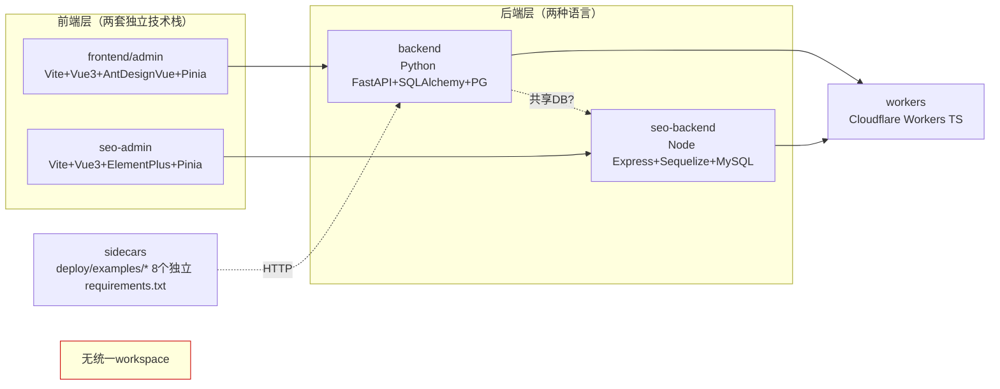

# UJ 轻集料混凝土官网 — 架构与代码组织评估报告

> 评估人：架构师 高见远 · 日期 2026-07-15 · 仅评估，不改代码

## 0. 关键事实更正（实证，先纠正 PRD 描述偏差）

| PRD/任务描述 | 实证结果 | 证据 |
|---|---|---|
| 前端 Nuxt 3 | **实际是 Vite + Vue 3 SPA**（非 Nuxt） | `frontend/admin/vite.config.ts` 存在，无 `nuxt.config.ts`；`package.json` 依赖 `vite@^5.2.8` 无 `nuxt` |
| 后端统一 FastAPI | **存在第二个后端：Node.js + Express** | `seo-backend/package.json` → `express@^4.18.2` + `sequelize@^6.35.2`，`src/` 含 controllers/models/routes |
| monorepo 无统一管理 | **确认无任何 workspace 配置** | 根目录无 `pnpm-workspace.yaml`/`lerna.json`/`turbo.json`/`nx.json`；根 `package.json` 仅 `playwright` 一个依赖，无 `workspaces` 字段 |

## 1. 模块依赖与拓扑图

**核心问题**：5 个子包分属 3 种构建体系（Vite/Node/Python/CF Workers），却无 workspace 统一编排，依赖各自 `package.json`/`requirements.txt` 独立管理。

## 2. 评估维度逐项结论

### 2.1 前后端架构合理性
后端 `backend/app` 分层清晰：`api → services → repositories → models` + `schemas`，符合 DDD-lite。**但存在层间越界**：`services/forum_webhook_service.py`、`services/plan_gate_service.py` 反向 `import app.api`（service→api），构成潜在循环依赖。前端 `api/` 层与 `stores/` 解耦良好（10 个 store，职责单一）。**结论：分层框架在，边界守不住。P1。**

### 2.2 前端模块化
- **380 组件 / 40 个 views 子目录**，已按角色壳（`admin/`、`agent/`、`client/`）+ 功能域（`seo-matrix/`、`tenants/`、`sales/`）组织，**组织方式合理**。
- **路由 `router/index.ts` 75KB 单文件**，虽已抽出 `generated-crud-routes`，仍将全部角色路由混在一个数组里。**建议按角色壳拆为 `router/admin.ts`/`client.ts`/`agent.ts` + `index.ts` 聚合。P1。**
- **上帝组件**：`copilot.vue` 2095 行、`site-editor.vue` 1766 行、`trade-tools.vue` 1572 行、`publish.vue` 1520 行。**P0。**

### 2.3 后端模块化
- `services/` **456 个文件**，过度碎片化（如 `ai_engine.py`+`ai_invocation_service.py`+`ai_key_probe.py`+`ai_learning_service.py`… 十余个 AI 相关 service 平铺）。
- `api/v1/routes/__init__.py` 单文件 **105 个 `include_router`**，是"胖路由注册表"。
- **上帝路由文件**：`seo_matrix.py` 1986 行、`hermes.py` 1784 行、`media_factory.py` 1508 行、`tenants.py` 1441 行。
- `main.py` 610 行（含 Sentry/中间件/WAF/lifespan 全堆入口）。**P1。**

### 2.4 monorepo 治理
**无统一 workspace**，5 个子包各自 `package.json`/`requirements.txt`。**依赖漂移实证**：`frontend/admin` 用 `vue@^3.4.21`，`seo-admin` 用 `vue@^3.4.15`，版本与 UI 库（Ant Design Vue vs Element Plus）双不一致；后端有 `backend/requirements.txt` + `requirements_temp.txt` + 8 个 sidecar 各自 `requirements.txt`。**无 lockfile 统一，无批量构建/批量 lint 脚本。P0。**

## 3. 技术债 TOP 5

| # | 技术债 | 定位（证据） | 严重度 | 修复方向 | 工作量 |
|---|---|---|---|---|---|
| 1 | **monorepo 无 workspace，依赖漂移** | 根 `package.json` 仅 playwright；vue 两版本；8 份 sidecar requirements | P0 | 引入 pnpm workspace + 统一 lockfile；后端用 pip-tools/uv 锁版本 | M |
| 2 | **技术栈双轨**：前端两套 UI 库 + 后端两种语言 | `seo-admin` ElementPlus vs `admin` AntDesignVue；`seo-backend` Express vs `backend` FastAPI | P0 | 明确边界或收敛为一套；短期至少统一 UI 库版本 | L |
| 3 | **上帝文件（前后端各 4+ 个 >1000 行）** | `copilot.vue`2095、`seo_matrix.py`1986、`hermes.py`1784、`main.py`610 | P0 | 按子功能拆 composable/service；路由按资源拆 sub-router | L |
| 4 | **后端根目录脚本污染** | `backend/` 根 32 个 `test_*/check_*/find_*.py` + 9 个 `.db` + 22 个 `.txt/.log` | P1 | 迁入 `scripts/`、`tests/`；`.db`/日志加入 `.gitignore` | S |
| 5 | **胖路由注册表 + 路由单文件** | `routes/__init__.py` 105 个 include；`router/index.ts` 75KB | P1 | 路由按模块分文件聚合；前端按角色壳拆分 | M |

## 4. 架构风险

1. **双后端数据一致性风险**：`backend`(PG) 与 `seo-backend`(MySQL/SQLite) 分库，`docker-compose.yml` 仅配 PostgreSQL，seo-backend 库未纳入主编排，跨库事务/一致性无保障。**P0，影响上线。**
2. **可维护性拐点**：456 service + 172 api 文件已超出单人认知负荷，无 module boundary（无 Python 包级 `__init__` 聚合 API），新人定位成本高。
3. **构建不可复现**：无统一 lockfile + 无 CI 批量构建证据，sidecar 依赖各自漂移，部署一致性靠人工。

## 5. 总评

**架构成熟度：2.5 / 5 分。**

> 分层骨架尚可但边界失守，monorepo 形聚神散——5 个子包三套技术栈、零统一编排、依赖漂移、上帝文件遍地，处于"能跑但难维护"的临界点；上线前必须先收敛技术栈双轨与补齐 workspace 治理，否则技术债将随迭代加速堆积。
